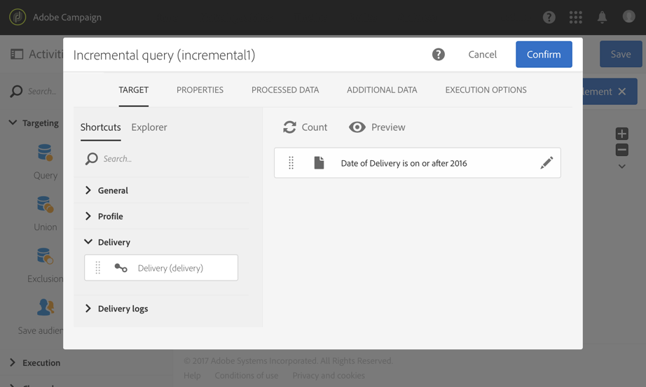

# Esportazione dei registri{#exporting-logs}

I dati di registro, relativi alle consegne o alle iscrizioni, possono essere esportati tramite un semplice flusso di lavoro. Consente di analizzare i risultati delle campagne con il proprio strumento di reporting o BI.

>[!CAUTION]
>
>Solo gli amministratori [funzionali](../../administration/using/users-management.md#functional-administrators), con il ruolo **[!UICONTROL Administration]** e l&#39;accesso alle unità **All** possono accedere ai registri di invio, ai log dei messaggi, ai registri di monitoraggio, ai registri di esclusione o ai registri di iscrizione. Un utente non amministratore può eseguire il targeting di questi registri ma iniziare da una tabella collegata (profili, consegna).

Utilizzando un **[!UICONTROL Incremental query]** che recupera nuovi registri solo ogni volta che il flusso di lavoro viene eseguito e una semplice attività **[!UICONTROL Extract file]** per definire le colonne di output, è possibile ottenere un file con il formato e tutti i dati necessari. Quindi utilizzate un&#39;attività **[!UICONTROL Transfer file]** per recuperare il file finale. Ogni esecuzione del flusso di lavoro è pianificata da un **[!UICONTROL Scheduler]**.

L’operazione dei registri di esportazione può essere eseguita dagli utenti standard. Risorse private come: i registri di trasmissione, i registri di monitoraggio, i registri di esclusione delle iscrizioni e i registri di cronologia delle iscrizioni su **Profili** possono essere gestiti solo dall&#39;amministratore funzionale.

1. Create un nuovo flusso di lavoro come descritto in [questa sezione](../../automating/using/building-a-workflow.md#creating-a-workflow).
1. Aggiungete un&#39;attività **[!UICONTROL Scheduler]** e impostatela in base alle vostre esigenze. Di seguito è riportato un esempio di esecuzione mensile.

   

1. Aggiungete un&#39;attività **[!UICONTROL Incremental query]** e configuratela in modo che selezioni i registri necessari. Ad esempio, per selezionare tutti i log di trasmissione nuovi o aggiornati (log di distribuzione dei profili):

   * Nella scheda **[!UICONTROL Properties]**, modificare la risorsa di destinazione in **Registri di consegna** (wideLogRcp).

      

   * Nella scheda **[!UICONTROL Target]**, imposta una condizione per recuperare tutti i registri di consegna corrispondenti alle consegne inviate nel 2016 o dopo. Per ulteriori informazioni, fare riferimento alla sezione [Editing query](../../automating/using/editing-queries.md#creating-queries).

      

   * Nella scheda **[!UICONTROL Processed data]**, selezionare **[!UICONTROL Use a date field]** e scegliere il campo **lastModified**. Nelle esecuzioni successive del flusso di lavoro, verranno recuperati solo i registri che saranno stati modificati o creati dopo l&#39;ultima esecuzione.

      

      Dopo la prima esecuzione del flusso di lavoro, in questa scheda puoi vedere l’ultima data di esecuzione che verrà utilizzata per l’esecuzione successiva. Viene aggiornata automaticamente ogni volta che il flusso di lavoro viene eseguito. Puoi comunque ignorare questo valore immettendone manualmente uno nuovo in modo tale che sia adatto alle tue esigenze.

1. Aggiungete un&#39;attività **[!UICONTROL Extract file]** per esportare i dati interrogati in un file:

   * Nella scheda **[!UICONTROL Extraction]**, specificare il nome del file.

      Se selezionate l&#39;opzione **[!UICONTROL Add date and time to the file name]**, questo nome verrà completato automaticamente con la data dell&#39;esportazione per garantire che tutti i file estratti siano univoci. Selezionate le colonne da esportare nel file. È possibile selezionare qui i dati provenienti da risorse correlate, ad esempio le informazioni sulla consegna o sul profilo.

      >[!NOTE]
      >
      >Per esportare un identificatore univoco per ciascun registro, selezionate l&#39;elemento **[!UICONTROL Delivery log ID]**.

      Per organizzare il file finale, potete applicare un ordinamento. Ad esempio nella data del registro, come illustrato nell’esempio seguente.

      

   * Nella scheda **[!UICONTROL File structure]**, definire il formato del file di output in base alle esigenze.

      Seleziona l’opzione **[!UICONTROL Export labels instead of internal values of enumerations]** nel caso dell’esportazione di valori di enumerazione. Questa opzione ti consente di recuperare etichette più brevi che sono più facili da comprendere rispetto agli ID.

1. Aggiungete un&#39;attività **[!UICONTROL Transfer file]** e configuratela per trasferire il file appena creato dal server Adobe Campaign  a un&#39;altra posizione in cui potete accedervi, ad esempio un server SFTP.

   * Nella scheda **[!UICONTROL General]**, selezionare **[!UICONTROL File upload]** per inviare il file da  Adobe Campaign a un altro server.
   * Nella scheda **[!UICONTROL Protocol]**, specificare i parametri di trasferimento e selezionare il [account esterno](../../administration/using/external-accounts.md#creating-an-external-account) da utilizzare.

1. Aggiungete un&#39;attività **[!UICONTROL End]** per assicurarvi che termini correttamente e salvate il flusso di lavoro.

   

Ora potete eseguire il flusso di lavoro e recuperare il file di output sul server esterno.

**Argomento correlato:**

[Flussi di lavoro](../../automating/using/get-started-workflows.md)
