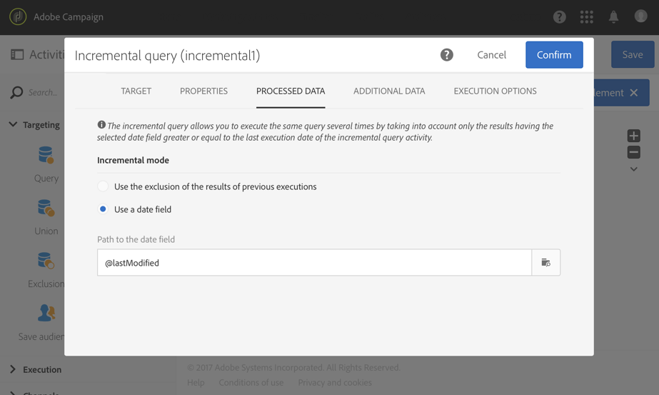

# Esportazione dei registri{#exporting-logs}

I dati di registro, siano essi relativi a consegne o abbonamenti, possono essere esportati tramite un semplice flusso di lavoro. Consente di analizzare i risultati delle campagne nel proprio strumento di reporting o BI.

>[!CAUTION]
>
>Solo funzionale [amministratori](../../administration/using/users-management.md#functional-administrators), con **[!UICONTROL Administration]** ruolo e accesso a **Tutti** Le unità possono accedere ai registri di invio, ai registri dei messaggi, ai registri di tracciamento, ai registri di esclusione o di abbonamento. Un utente che non è amministratore può eseguire il targeting di questi registri ma a partire da una tabella collegata (profili, consegna).

Utilizzando un **[!UICONTROL Incremental query]** che recupera i nuovi registri solo ogni volta che il flusso di lavoro viene eseguito e una semplice **[!UICONTROL Extract file]** attività per definire le colonne di output, puoi ottenere un file con il formato e tutti i dati necessari. Quindi utilizza un **[!UICONTROL Transfer file]** per recuperare il file finale. Ogni esecuzione del flusso di lavoro è pianificata da un **[!UICONTROL Scheduler]**.

L’operazione di esportazione dei registri può essere eseguita da utenti standard. Risorse private come: registri di trasmissione, registri di tracciamento, registri di esclusione, registri di abbonamento e registri della cronologia degli abbonamenti **Profili** può essere gestito solo da un amministratore funzionale.

1. Crea un nuovo flusso di lavoro come descritto in [questa sezione](../../automating/using/building-a-workflow.md#creating-a-workflow).
1. Aggiungi un **[!UICONTROL Scheduler]** e impostarla in base alle proprie esigenze. Di seguito è riportato un esempio di esecuzione mensile.

   

1. Aggiungi un **[!UICONTROL Incremental query]** e configurarlo in modo da selezionare i registri necessari. Ad esempio, per selezionare tutti i broadLog nuovi o aggiornati (log di consegna profilo):

   * In **[!UICONTROL Properties]** , modificare la risorsa di destinazione in **Registri di consegna** (broadLogRcp).

     

   * In **[!UICONTROL Target]** , imposta una condizione per recuperare tutti i registri di consegna corrispondenti alle consegne inviate nel 2016 o successivamente. Per ulteriori informazioni, consulta [Modifica delle query](../../automating/using/editing-queries.md#creating-queries) sezione.

     

   * In **[!UICONTROL Processed data]** , seleziona **[!UICONTROL Use a date field]** e scegli la **lastModified** campo. Nelle esecuzioni successive del flusso di lavoro, verranno recuperati solo i registri che saranno stati modificati o creati dopo l’ultima esecuzione.

     

     Dopo la prima esecuzione del flusso di lavoro, in questa scheda puoi vedere l’ultima data di esecuzione che verrà utilizzata per l’esecuzione successiva. Viene aggiornata automaticamente ogni volta che il flusso di lavoro viene eseguito. Puoi comunque ignorare questo valore immettendone manualmente uno nuovo in modo tale che sia adatto alle tue esigenze.

1. Aggiungi un **[!UICONTROL Extract file]** attività che esporta i dati su cui viene eseguita la query in un file:

   * In **[!UICONTROL Extraction]** , specificare il nome del file.

     Se si seleziona la **[!UICONTROL Add date and time to the file name]** , questo nome verrà automaticamente completato con la data dell&#39;esportazione per garantire che tutti i file estratti siano univoci. Seleziona le colonne da esportare nel file. Puoi selezionare qui i dati provenienti dalle risorse correlate, ad esempio le informazioni sulla consegna o sul profilo.

     >[!NOTE]
     >
     >Per esportare un identificatore univoco per ciascun registro, selezionare **[!UICONTROL Delivery log ID]** elemento.

     Per organizzare il file finale, potete applicare un ordinamento. Ad esempio sulla data del registro, come illustrato nell’esempio seguente.

     

   * In **[!UICONTROL File structure]** , definisci il formato del file di output in base alle tue esigenze.

     Seleziona l’opzione **[!UICONTROL Export labels instead of internal values of enumerations]** nel caso dell’esportazione di valori di enumerazione. Questa opzione ti consente di recuperare etichette più brevi che sono più facili da comprendere rispetto agli ID.

1. Aggiungi un **[!UICONTROL Transfer file]** e configuralo per trasferire il file appena creato dal server Adobe Campaign a un’altra posizione in cui puoi accedervi, ad esempio un server SFTP.

   * In **[!UICONTROL General]** , seleziona **[!UICONTROL File upload]** poiché lo scopo è quello di inviare il file da Adobe Campaign a un altro server.
   * In **[!UICONTROL Protocol]** , specificare i parametri di trasferimento e selezionare [account esterno](../../administration/using/external-accounts.md#creating-an-external-account) da utilizzare.

1. Aggiungi un **[!UICONTROL End]** per assicurarti che termini correttamente e salva il flusso di lavoro.

   

Ora puoi eseguire il flusso di lavoro e recuperare il file di output sul server esterno.

**Argomento correlato:**

[Flussi di lavoro](../../automating/using/get-started-workflows.md)
