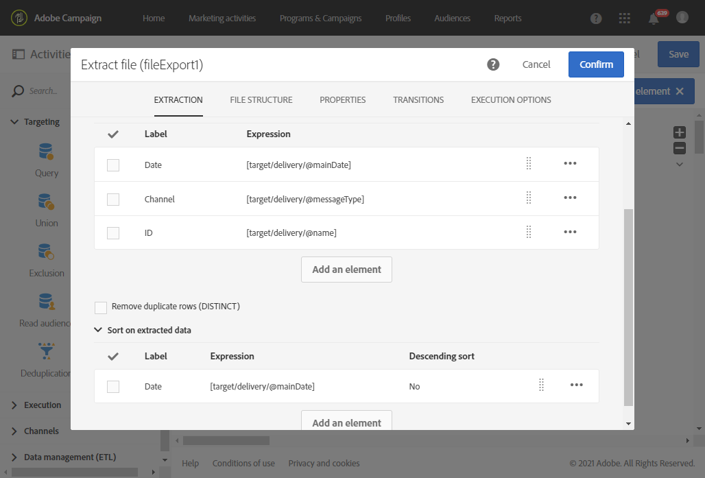

# Esportazione dei registri{#exporting-logs}

I dati di registro, relativi alle consegne o alle iscrizioni, possono essere esportati tramite un semplice flusso di lavoro. Consente di analizzare i risultati delle campagne con il proprio strumento di reporting o BI.

Utilizzando un file **[!UICONTROL Incremental query]** che recupera nuovi registri solo ogni volta che il flusso di lavoro viene eseguito e una semplice **[!UICONTROL Extract file]** attività per definire le colonne di output, potete ottenere un file con il formato e tutti i dati necessari. Quindi utilizzate un' **[!UICONTROL Transfer file]** attività per recuperare il file finale. Ogni esecuzione del flusso di lavoro è pianificata da un **[!UICONTROL Scheduler]**.

L’operazione dei registri di esportazione può essere eseguita dagli utenti standard. Risorse private come: i registri di trasmissione, i registri di monitoraggio, i registri di esclusione dei registri di iscrizione e i registri della cronologia di iscrizione nei **profili** possono essere gestiti solo dall'amministratore funzionale.

1. Create un nuovo flusso di lavoro come descritto in [questa sezione](../../automating/using/building-a-workflow.md#creating-a-workflow).
1. Aggiungete un' **[!UICONTROL Scheduler]** attività e impostatela in base alle vostre esigenze. Di seguito è riportato un esempio di esecuzione mensile.

   

1. Aggiungete un' **[!UICONTROL Incremental query]** attività e configuratela in modo da selezionare i registri necessari. Ad esempio, per selezionare tutti i log di trasmissione nuovi o aggiornati (log di distribuzione dei profili):

   * Nella **[!UICONTROL Properties]** scheda, imposta la risorsa di destinazione sui registri **di** consegna (wideLogRcp).

      

   * Nella **[!UICONTROL Target]** scheda, imposta una condizione per recuperare tutti i registri di consegna corrispondenti alle consegne inviate nel 2016 o successivamente. Per ulteriori informazioni, vedere la sezione [Modifica delle query](../../automating/using/editing-queries.md#creating-queries) .

      

   * Nella **[!UICONTROL Processed data]** scheda, selezionare **[!UICONTROL Use a date field]** e scegliere il campo **lastModified** . Nelle esecuzioni successive del flusso di lavoro, verranno recuperati solo i registri che saranno stati modificati o creati dopo l'ultima esecuzione.

      

      Dopo la prima esecuzione del flusso di lavoro, in questa scheda puoi vedere l'ultima data di esecuzione che verrà utilizzata per l'esecuzione successiva. Viene aggiornato automaticamente ogni volta che viene eseguito il flusso di lavoro. Potete comunque ignorare questo valore immettendo manualmente un nuovo valore in modo che sia adatto alle vostre esigenze.

1. Aggiungete un' **[!UICONTROL Extract file]** attività che esporterà i dati interrogati in un file:

   * Nella **[!UICONTROL Extraction]** scheda, specificate il nome del file. Questo nome verrà completato automaticamente con la data dell'esportazione per garantire che tutti i file estratti siano univoci.

      Selezionate le colonne da esportare nel file. È possibile selezionare qui i dati provenienti da risorse correlate, ad esempio le informazioni sulla consegna o sul profilo. Per organizzare il file finale, potete applicare un ordinamento. Ad esempio nella data del registro, come illustrato nell’esempio seguente.

      

      >[!NOTE]
      >
      >Non è possibile esportare identificatori univoci (chiavi primarie) delle risorse di registro.

   * Nella **[!UICONTROL File structure]** scheda, definire il formato del file di output in base alle esigenze.

      Selezionare l' **[!UICONTROL Export labels instead of internal values of enumerations]** opzione nel caso in cui si esportino i valori di enumerazione. Questa opzione consente di recuperare etichette più brevi che possono essere facilmente comprensibili al posto degli ID.

1. Aggiungi un' **[!UICONTROL Transfer file]** attività e configurala per trasferire il file appena creato dal server Adobe Campaign a un'altra posizione in cui puoi accedervi, ad esempio un server SFTP.

   * Nella **[!UICONTROL General]** scheda, seleziona **[!UICONTROL File upload]** come scopo l'invio del file da Adobe Campaign a un altro server.
   * Nella **[!UICONTROL Protocol]** scheda, specificate i parametri di trasferimento e selezionate l'account  esterno da utilizzare.

1. Aggiungete un' **[!UICONTROL End]** attività per assicurarvi che termini correttamente e salvate il flusso di lavoro.

   

Ora potete eseguire il flusso di lavoro e recuperare il file di output sul server esterno.

**Argomento correlato:**

[Flussi di lavoro](../../automating/using/discovering-workflows.md)
