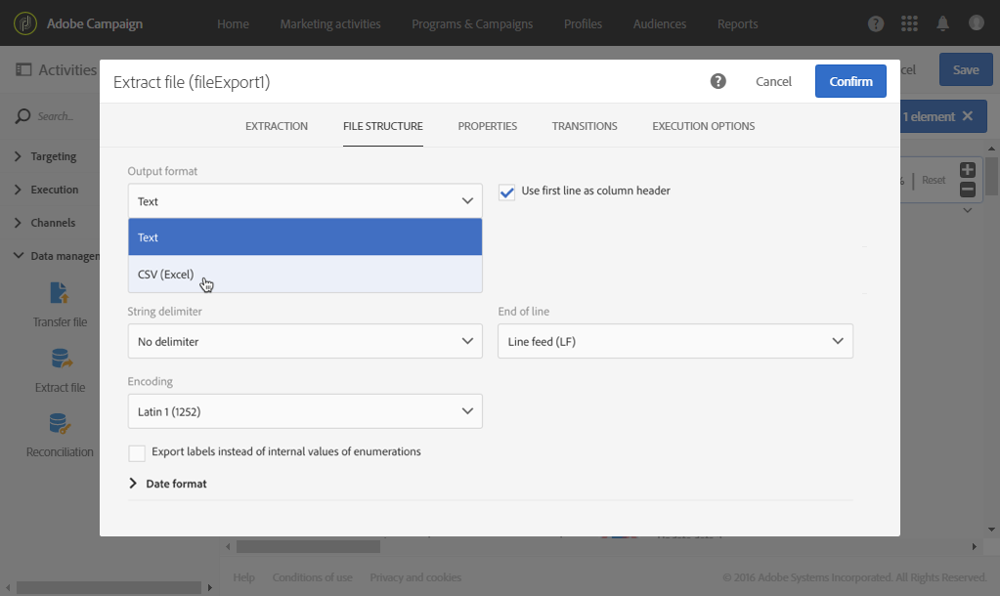

# Esportazione di profili in un file esterno {#exporting-profiles-external-file}

L&#39;esempio seguente illustra come configurare un&#39; **[!UICONTROL Extract file]** attività dopo un&#39; **[!UICONTROL Query]** attività.

Scopo di questo flusso di lavoro è esportare un elenco di profili sotto forma di file esterno in modo che i dati possano essere utilizzati al di fuori  Adobe Campaign.

1. Trascinate e rilasciate un’attività file  Extract nel flusso di lavoro e inseritela dopo l’attività [Query](../../automating/using/query.md) .

   In questo esempio, la query viene eseguita su tutti i profili di età compresa tra 18 e 30 anni.

1. Aprite l&#39; **[!UICONTROL Extract file]** attività per modificarla.
1. Denominate il file di output.
1. Aggiungere colonne di output.

   In questo esempio, l’e-mail, l’età, la data di nascita, il nome e il cognome dei profili vengono aggiunti come colonne di output.

   

1. Fare clic sulla **[!UICONTROL File structure]** scheda per definire:

   * Formato di output CSV

      

   * Formato data

      

1. Confermate l&#39;attività.
1. Trascinare e rilasciare un&#39;attività [Trasferisci file](../../automating/using/transfer-file.md) dopo l&#39; **[!UICONTROL Extract file]** attività per recuperare il file di estrazione su un account esterno.
1. Aprite l&#39;attività e scegliete l&#39; **[!UICONTROL File upload]** azione.

   

1. Selezionate l’account esterno e immettete il percorso della cartella sul server.

   

1. Confermate l&#39;attività e salvate il flusso di lavoro.
1. Avviate il flusso di lavoro.

   Quando il flusso di lavoro è stato eseguito correttamente, il file estratto è disponibile sull&#39;account esterno.
