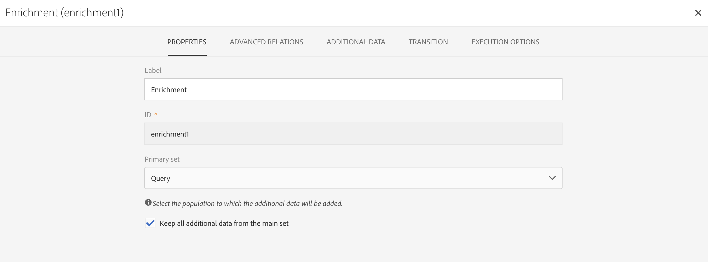

# API esterna {#external-api}

## Descrizione {#description}

L&#39; **[!UICONTROL External API]** attività porta i dati nel flusso di lavoro da un sistema **** esterno tramite una chiamata API **** REST.

Gli endpoint REST possono essere un sistema di gestione dei clienti, un&#39;istanza Runtime [I/O di](https://www.adobe.io/apis/experienceplatform/runtime.html) Adobe o un endpoint REST di Experience Cloud (Piattaforma dati, Target, Analytics, Campaign, ecc.).

>[!NOTE]
>
>Per motivi di sicurezza, l&#39;utilizzo di JSSP non è supportato in Campaign Standard. Se è necessario eseguire il codice, potete chiamare un&#39;istanza di runtime di I/O Adobe tramite l&#39;attività API esterna.

>[!IMPORTANT]
>
>Questa funzionalità è attualmente in versione beta. Prima di iniziare a utilizzare l&#39;attività API esterna, è necessario accettare l&#39;accordo di utilizzo. Nota: poiché la funzionalità beta non è ancora stata rilasciata in commercio da Adobe, non è supportata da Adobe Client Care, potrebbe contenere errori e potrebbe non funzionare così come altre funzionalità rilasciate.

Le principali caratteristiche di questa attività sono:

* Possibilità di trasmettere dati in formato JSON a un endpoint API REST di terze parti
* Possibilità di ricevere una risposta JSON indietro, mapparla alle tabelle di output e passare a valle ad altre attività del flusso di lavoro.
* Gestione degli errori con una transizione specifica in uscita

Per questa attività sono stati istituiti i seguenti presidi:

* Limite dimensione dati risposta HTTP 50 MB
* Timeout richiesta: 10 minuti
* I reindirizzamenti HTTP non sono consentiti
* Gli URL non HTTPS vengono rifiutati
* &quot;Accetta: header della richiesta application/json&quot; e &quot;Content-Type: l&#39;intestazione della risposta application/json&quot; è consentita

>[!CAUTION]
>
>L&#39;attività è destinata al recupero di dati a livello di campagna (ultimi set di offerte, ultimi punteggi ecc.) non per il recupero di informazioni specifiche per ciascun profilo, in quanto ciò può comportare il trasferimento di grandi quantità di dati. Se il caso d&#39;uso lo richiede, la raccomandazione consiste nell&#39;utilizzare l&#39;attività [Trasferisci file](../../automating/using/transfer-file.md) .

## Configurazione {#configuration}

Trascinate e rilasciate un&#39; **[!UICONTROL External API]** attività nel flusso di lavoro e aprite l&#39;attività per avviare la configurazione.

### Mapping in entrata

La mappatura in entrata è una tabella temporanea generata da un&#39;attività in entrata precedente che verrà visualizzata e inviata come JSON nell&#39;interfaccia utente.
In base a questa tabella temporanea, l&#39;utente può apportare modifiche ai dati in entrata.

Il menu a discesa delle risorse **** in entrata consente di selezionare l&#39;attività di query che creerà la tabella temporanea.

La casella di controllo **Aggiungi parametro** di conteggio fornirà un valore di conteggio per ogni riga proveniente dalla tabella temporanea. Questa casella di controllo è disponibile solo se l&#39;attività in entrata genera una tabella temporanea.

La sezione Colonne **** in entrata consente all&#39;utente di aggiungere qualsiasi campo dalla tabella di transizione in entrata. Le colonne selezionate saranno le chiavi nell&#39;oggetto dati. L&#39;oggetto dati nel JSON sarà un elenco di array contenente i dati per le colonne selezionate da ogni riga della tabella di transizione in entrata.

La casella di testo **Personalizza parametro** consente di aggiungere un JSON valido con dati aggiuntivi richiesti dall&#39;API esterna. Questi dati aggiuntivi verranno aggiunti all&#39;oggetto params nel JSON generato.

### Mapping in uscita

Questa scheda consente di definire la struttura **** JSON di esempio restituita dalla chiamata API.

Il pattern di struttura JSON è: `{“data”:[{“key”:“value”}, {“key”:“value”},...]}`

La definizione JSON di esempio deve avere le **seguenti caratteristiche**:

* **data** è un nome di proprietà obbligatorio nel JSON, il contenuto di &quot;data&quot; è un array JSON.
* **Gli elementi** array devono contenere proprietà di primo livello (i livelli più profondi non sono supportati).
   **I nomi** delle proprietà finirebbero per diventare nomi di colonna per lo schema di output della tabella temporanea di output.
* **La definizione del nome** della colonna è basata sul primo elemento dell&#39;array &quot;data&quot;.
La definizione delle colonne (aggiungere/rimuovere) e il valore del tipo della proprietà possono essere modificati nella scheda Definizione **** colonna.

Se l&#39; **analisi viene convalidata** , viene visualizzato un messaggio e si invita a personalizzare la mappatura dei dati nella scheda &quot;Definizione colonna&quot;. In altri casi, viene visualizzato un messaggio di errore.

### Esecuzione

Questa scheda consente di definire l&#39;endpoint **** HTTPS che invierà i dati ad ACS. Se necessario, potete immettere le informazioni di autenticazione nei campi seguenti.

### Proprietà

Questa scheda consente di controllare le proprietà **** generali dell&#39;attività API esterna, come l&#39;etichetta visualizzata nell&#39;interfaccia utente. L&#39;ID interno non è personalizzabile.

### Definizione colonna

>[!NOTE]
>
>Questa scheda viene visualizzata quando il formato **dei dati della** risposta viene completato e convalidato nella scheda Mappatura in uscita.

La scheda Definizione **** colonna consente di specificare con precisione la struttura di dati di ogni colonna al fine di importare dati che non contengono errori e di farli corrispondere ai tipi già presenti nel database Adobe Campaign per le operazioni future.

Ad esempio, è possibile modificare l&#39;etichetta di una colonna, selezionarne il tipo (stringa, numero intero, data, ecc.) o anche specificare l&#39;elaborazione degli errori.

Per ulteriori informazioni, vedere la sezione [Carica file](../../automating/using/load-file.md) .

### Transizione

Questa scheda consente di attivare la transizione **in uscita** e la relativa etichetta. Questa transizione specifica è utile in caso di **timeout** o se il payload supera il limite **di dimensione** dei dati.

### Opzioni di esecuzione

Questa scheda è disponibile nella maggior parte delle attività del flusso di lavoro. Per ulteriori informazioni, consulta la sezione Proprietà  attività.

## Risoluzione dei problemi

Esistono due tipi di messaggi di registro aggiunti a questa nuova attività del flusso di lavoro: informazioni ed errori. Possono essere utili per risolvere eventuali problemi.

### Informazioni

Questi messaggi di registro vengono utilizzati per registrare informazioni su punti di controllo utili durante l&#39;esecuzione dell&#39;attività del flusso di lavoro. In modo specifico, i messaggi di registro seguenti vengono utilizzati per registrare il primo tentativo e il tentativo di effettuare un nuovo tentativo (motivo del primo tentativo non riuscito) di accedere all&#39;API.

<table> 
 <thead> 
  <tr> 
   <th> Formato messaggio  </th> 
   <th> Esempio  </th> 
  </tr> 
 </thead> 
 <tbody> 
  <tr> 
   <td> Richiamo dell'URL API '%s'.</td> 
   <td> 
Richiamo dell'URL API 'https://example.com/api/v1/web-coupon?count=2'.
</td> 
  </tr> 
  <tr> 
   <td> Nuovo URL API '%s'. Tentativo precedente non riuscito ('%s').</td> 
   <td> 
Nuovo URL API 'https://example.com/api/v1/web-coupon?count=2', tentativo precedente non riuscito ('HTTP - 401').
</td>
  </tr> 
  <tr> 
   <td> Trasferimento del contenuto da '%s' (%s / %s).</td> 
   <td> 
Trasferimento di contenuti da 'https://example.com/api/v1/web-coupon?count=2' (1234 / 1234).
</td> 
  </tr>
 </tbody> 
</table>

### Errori

Questi messaggi di registro vengono utilizzati per registrare informazioni sulle condizioni di errore impreviste, che possono causare il fallimento dell&#39;attività del flusso di lavoro.

<table> 
 <thead> 
  <tr> 
   <th> Codice - Formato messaggio  </th> 
   <th> Esempio  </th> 
  </tr> 
 </thead> 
 <tbody> 
  <tr> 
   <td> WKF-560250: limite superato per il corpo della richiesta API (limite: '%d').</td> 
   <td> 
Limite superato del corpo della richiesta API (limite: '5242880').
</td> 
  </tr> 
  <tr> 
   <td> WKF-560239: limite di risposta API superato (limite: '%d').</td> 
   <td> 
Limite di risposta API superato (limite: 5242880').
</td> 
  </tr> 
  <tr> 
   <td> WKF-560245: impossibile analizzare l'URL API (errore: '%d').</td> 
   <td> 
Impossibile analizzare l'URL API (errore: '-2010').

   
 Nota: Questo errore viene registrato quando l'URL API non supera le regole di convalida.
</td>
  </tr> 
  <tr>
   <td> WKF-560244: l'host dell'URL API non deve essere 'localhost' o letterale di indirizzo IP (host URL: '%s').</td> 
   <td> 
L'host dell'URL API non deve essere 'localhost' o letterale di indirizzo IP (host URL: 'localhost').

    
L'host dell'URL API non deve essere 'localhost' o letterale di indirizzo IP (host URL: '192.168.0.5').

    
L'host dell'URL API non deve essere 'localhost' o letterale di indirizzo IP (host URL: "[2001]").
</td>
  </tr> 
  <tr> 
   <td> WKF-560238 - L'URL API deve essere un URL protetto (https) (URL richiesto: '%s').</td> 
   <td> 
L'URL API deve essere un URL protetto (https) (URL richiesto: "https://example.com/api/v1/web-coupon?count=2').
</td> 
  </tr> 
  <tr> 
   <td> WKF-560249: impossibile creare il corpo della richiesta JSON. Errore durante l'aggiunta di '%s'.</td> 
   <td> 
Impossibile creare il corpo della richiesta JSON. Errore durante l'aggiunta di 'params'.

    
Impossibile creare il corpo della richiesta JSON. Errore durante l'aggiunta di 'data'.
</td>
  </tr> 
  <tr> 
   <td> WKF-560246 - Chiave di intestazione HTTP non valida (chiave di intestazione: '%s').</td> 
   <td> 
Chiave di intestazione HTTP non valida (chiave di intestazione: '%s').

   
 Nota: Questo errore viene registrato quando la chiave di intestazione personalizzata non supera la convalida secondo <a href="https://tools.ietf.org/html/rfc7230#section-3.2.html">RFC</a>
</td> 
  </tr>
 <tr> 
   <td> WKF-560248 - Chiave di intestazione HTTP non consentita (chiave di intestazione: '%s').</td> 
   <td> 
La chiave di intestazione HTTP non è consentita (chiave di intestazione: 'Accetto').
</td> 
  </tr> 
  <tr> 
   <td> WKF-560247 - Il valore dell'intestazione AHTTP è errato (valore dell'intestazione: '%s').</td> 
   <td> 
Il valore dell'intestazione HTTP è errato (valore dell'intestazione: '%s'). 

    
Nota: Questo errore viene registrato quando il valore dell'intestazione personalizzata non supera la convalida secondo <a href="https://tools.ietf.org/html/rfc7230#section-3.2.html">RFC</a>
</td> 
  </tr> 
  <tr> 
   <td> WKF-560240 - Il payload JSON ha una proprietà non valida '%s'.</td> 
   <td> 
Il payload JSON ha una proprietà "blah" non valida.
</td>
  </tr> 
  <tr>
   <td> WKF-560241 - JSON non valido o formato inaccettabile.</td> 
   <td> 
JSON non valido o formato non valido.

   
Nota: Questo messaggio si applica solo all'analisi del corpo della risposta dall'API esterna e viene registrato quando si tenta di convalidare la conformità del corpo della risposta al formato JSON richiesto da questa attività.
</td>
  </tr>
  <tr> 
   <td> WKF-560246 - Attività non riuscita (motivo: '%s').</td> 
   <td> 
Quando l'attività non riesce a causa di una risposta di errore HTTP 401 - Attività non riuscita (motivo: 'HTTP - 401')

        
Quando l'attività non riesce a causa di una chiamata interna non riuscita - Attività non riuscita (motivo: 'iRc - -Nn').

        
Quando l'attività non riesce a causa di un'intestazione Content-Type non valida. - Attività non riuscita (motivo: 'Content-Type - application/html').
</td> 
  </tr>
 </tbody> 
</table>

<!--
## Example: Managing coupons with External API Activity

This example illustrates how to **add coupon value** retrieving by a REST call to profiles and then sending an email containing these coupon values.

The workflow is presented as follows:

1. Drag and drop an **External API** activity
    1. Parse the JSON sample responsa as {"data":[{"code":"value"}]}.
    1. Add the **Rest endpoint URL** and define authentication setting if needed
    
    1. In the **column definition** tab, add a new column called **code** that will store the code value.
        
    1. Enabled an **outbound transition** to manage request failures.
1. Drag and drop a **Query** activity
    1. Configure the **Target** tab to query all the **@adobe.com** email. For different Query samples, refer to the [Query](../../automating/using/query.md) section.
    1. In the **additional data** tab, add a new column based on **rowId()** function. This additional column allows you to reconciliate coupon code with the profile ID..
        

        >[!NOTE]
        >
        >This reconciliation approach means that the profile query number is equal to the number of coupon values returned by the REST call.
1. Once this two activities are configured, drag and drop an **Enrichment** activity to associate coupon values with profiles.
    1. Select the previous Query activity in the **primarySet** field.
        
    1. Create a new relation in the **Advanced relations** tab, and add the following reconciliation criteria:
    1. **@expr1** coming grom the Query activity in the source expression field.
    1. **@lineNum** as an expression that returns the line number for each coupon value in the destination field.
        
        More information on the enrichment activity are available [here](../../automating/using/enrichment.md)

    1. The transition **Data Structure** will contain:
        
1. Finally drag and drop a **Send via Email** activity.
    You can modify your email template by adding the **code** personnalized field.

-->
