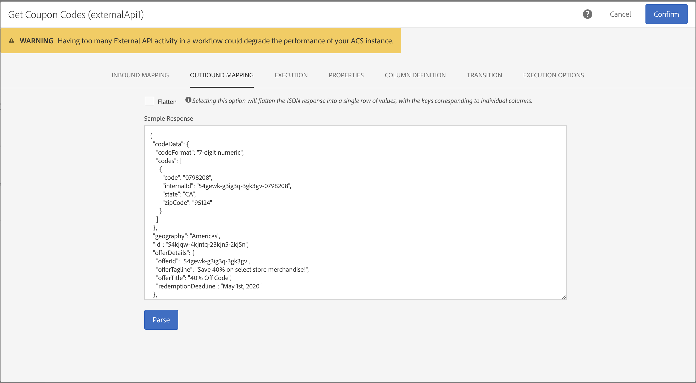

# External API {#external-api}

## Descrizione {#description}

L’attività **[!UICONTROL External API]** porta dati nel flusso di lavoro da un **sistema esterno** tramite una chiamata **API HTTP**.

Gli endpoint di sistema esterni possono essere endpoint API pubblici, sistemi di gestione dei clienti o istanze di applicazioni senza server (ad esempio, [Adobe I/O Runtime](https://www.adobe.io/apis/experienceplatform/runtime.html)), per citare alcune categorie.

>[!NOTE]
>
>Per motivi di sicurezza, l’utilizzo di JSSP non è supportato in Campaign Standard. Se devi eseguire del codice, puoi richiamare un’istanza Adobe I/O Runtime tramite l’attività External API.

Le principali caratteristiche di questa attività sono:

* Possibilità di trasmettere dati in formato JSON a un endpoint REST API di terze parti
* Possibilità di ricevere una risposta JSON, mapparla sulle tabelle di output e passare a valle ad altre attività del flusso di lavoro.
* Gestione degli errori con una transizione specifica in uscita

### Transizione da Beta a GA {#from-beta-to-ga}

Con la versione 20.3 di Campaign Standard, la funzionalità External API è passata da Beta a Disponibilità generale (GA).

>[!CAUTION]
>
>Di conseguenza, se stavi utilizzando delle attività External API in versione beta, devi sostituirle con attività External API in versione GA in tutti i flussi di lavoro.  I flussi di lavoro che utilizzano la versione beta di External API cesseranno di funzionare a partire dalla versione 20.3.

Durante la sostituzione delle attività External API, aggiungi la nuova attività External API al flusso di lavoro, copia manualmente i dettagli di configurazione, quindi elimina la vecchia attività.

>[!NOTE]
>
>Non potrai copiare i valori di intestazione poiché sono nascosti all’interno dell’attività.

Successivamente, riconfigura altre attività nel flusso di lavoro che indicano e/o utilizzano i dati dell’attività External API in versione beta per indicare e/o utilizzare i dati della nuova attività External API. Esempi di attività: consegna e-mail (campi di personalizzazione), attività di arricchimento, ecc.

### Limitazioni e protezioni {#guardrails}

A questa attività si applicano le seguenti tutele:

* Limite di dimensione dati risposta HTTP 50 MB (consigliato: 5 MB)
* Il timeout di richiesta è di 10 minuti
* I reindirizzamenti HTTP non sono consentiti
* Gli URL non HTTPS vengono rifiutati
* L’intestazione di richiesta &quot;Accept: application/json&quot; e l’intestazione di risposta &quot;Content-Type: application/json&quot; sono consentite

>[!NOTE]
>
>A partire dalla release Campaign 20.4, il limite di dimensione dei dati della risposta HTTP e i controlli di timeout della risposta verranno ridotti rispettivamente a 5 MB e 1 minuto.  Anche se questa modifica interesserà solo le nuove attività API esterne, si consiglia vivamente che le implementazioni correnti dell&#39;attività API esterna si allineino con queste nuove garanzie per seguire le best practice.

Sono state istituite protezioni specifiche per il JSON:

* **Profondità massima JSON**: limita la profondità massima di un JSON nidificato personalizzato che può essere elaborato a 10 livelli.
* **Lunghezza massima chiave JSON**: limita a 255 la lunghezza massima della chiave interna generata. Questa chiave è associata all’ID di colonna.
* **Numero massimo di chiavi duplicate JSON consentite**: limita a 150 il numero totale massimo di nomi di proprietà JSON duplicati, utilizzati come ID di colonna.

L’attività non è supportata dalla struttura JSON come:

* Combinazione di un oggetto array con altri elementi non array
* L’oggetto array JSON è nidificato all’interno di uno o più oggetti array intermedi.

>[!CAUTION]
>
>L&#39;attività API esterna è destinata al recupero di dati a livello di campagna (più recente serie di offerte, punteggi più recenti, ecc.), non al recupero di informazioni specifiche per ciascun profilo, in quanto ciò può comportare il trasferimento di grandi quantità di dati. Se il caso di utilizzo lo richiede, si consiglia di utilizzare l’attività [Transfer file](../../automating/using/transfer-file.md).

## Configurazione {#configuration}

Trascina e rilascia un’attività **[!UICONTROL External API]** nel flusso di lavoro e apri l’attività per avviare la configurazione.

### Inbound Mapping

Inbound Mapping è una tabella temporanea generata da un’attività in entrata precedente che verrà visualizzata e inviata come JSON nell’interfaccia utente.
In base a questa tabella temporanea, l’utente può apportare modifiche ai dati in entrata.

Il menu a discesa **Inbound resource** ti consente di selezionare l’attività di query che creerà la tabella temporanea.

La casella di controllo **Add count parameter** aggiungerà un valore di conteggio per ogni riga proveniente dalla tabella temporanea. Tieni presente che questa casella di controllo è disponibile solo se l’attività in entrata genera una tabella temporanea.

La sezione **Inbound Columns** consente all’utente di aggiungere qualsiasi campo dalla tabella di transizione in entrata. Le colonne selezionate saranno le chiavi nell’oggetto dati. L’oggetto dati nel JSON sarà un elenco array contenente dati per le colonne selezionate da ogni riga della tabella di transizione in entrata.

La casella di testo **Customize parameter** ti consente di aggiungere un JSON valido con dati aggiuntivi richiesti dall’API esterna. Questi dati aggiuntivi verranno aggiunti all’oggetto params nel JSON generato.

### Outbound Mapping

Questa scheda ti consente di definire la **struttura JSON** campione restituita dalla chiamata API.

Il parser JSON è progettato per accogliere tipi di pattern di struttura JSON standard, con alcune eccezioni. Un esempio di pattern standard è:`{“data”:[{“key”:“value”}, {“key”:“value”},...]}`

La definizione JSON campione deve avere le **seguenti caratteristiche**:

* Gli **elementi array** devono contenere proprietà di primo livello (i livelli più profondi non sono supportati).
   I **nomi delle proprietà** finiranno per diventare nomi di colonna per lo schema di output della tabella temporanea di output.
* Gli **elementi JSON** da acquisire devono essere a 10 o meno livelli di nidificazione nella risposta JSON.
* La definizione del **nome della colonna** si basa sul primo elemento dell’array &quot;dati&quot;.
La definizione delle colonne (aggiungere/rimuovere) e il valore del tipo della proprietà possono essere modificati nella scheda **Column definition**.

Comportamento della **casella di controllo Flatten**:

La casella di controllo Flatten (impostazione predefinita: deselezionata) viene fornita per indicare se appiattire o meno il JSON a una mappa chiave/valore.

* Quando la **casella di controllo è disattivata** (deselezionata), il JSON campione viene analizzato per cercare un oggetto array. L’utente dovrà fornire una versione ridotta del formato JSON campione della risposta API in modo tale che Adobe Campaign possa determinare esattamente quale array gli utenti sono interessati a utilizzare. Al momento dell’authoring del flusso di lavoro, il percorso dell’oggetto array nidificato verrà determinato e registrato, in modo tale che possa essere utilizzato al momento dell’esecuzione per accedere all’oggetto array dal corpo della risposta JSON ricevuto dalla chiamata API.

* Quando la **casella di controllo è attivata** (selezionata), il JSON campione verrà appiattito e tutte le proprietà specificate nel JSON campione fornito verranno utilizzate per creare colonne della tabella temporanea di output e visualizzate nella scheda Column definitions. Tieni presente che se nel JSON campione sono presenti oggetti array, anche tutti gli elementi di tali oggetti array verranno appiattiti.

Se l’**analisi viene convalidata**, viene visualizzato un messaggio che ti invita a personalizzare la mappatura dei dati nella scheda &quot;Column definition&quot;. In altri casi, viene visualizzato un messaggio di errore.

### Execution

Questa scheda ti consente di definire l’**endpoint HTTPS** che invierà i dati ad ACS. Se necessario, puoi immettere le informazioni di autenticazione nei campi seguenti.

### Properties

Questa scheda ti consente di controllare le **proprietà generali** dell’attività External API, come l’etichetta visualizzata nell’interfaccia utente. L’ID interno non è personalizzabile.

### Column definition

>[!NOTE]
>
>Questa scheda viene visualizzata quando il **formato dei dati di risposta** viene completato e convalidato nella scheda Outbound Mapping.

La scheda **Column definition** ti consente di specificare con precisione la struttura dati di ogni colonna al fine di importare dati che non contengono errori e di farli corrispondere ai tipi già presenti nel database di Adobe Campaign per le operazioni future.

Ad esempio, puoi modificare l’etichetta di una colonna, selezionarne il tipo (stringa, numero intero, data, ecc.) o anche specificare l’elaborazione degli errori.

Per ulteriori informazioni, consulta la sezione [Load file](../../automating/using/load-file.md).

### Transition

Questa scheda ti consente di attivare la **transizione in uscita** e la relativa etichetta. Questa transizione specifica è utile in caso di **timeout** o se il payload supera il **limite di dimensione dei dati**.

### Execution options

Questa scheda è disponibile nella maggior parte delle attività del flusso di lavoro. Per ulteriori informazioni, consulta la sezione [Proprietà delle attività](../../automating/using/activity-properties.md).

## Risoluzione dei problemi

Esistono due tipi di messaggi di log aggiunti a questa nuova attività del flusso di lavoro: informazioni ed errori. Possono essere utili per risolvere eventuali problemi.

### Informazioni

Questi messaggi di log vengono utilizzati per registrare informazioni su punti di controllo utili durante l’esecuzione dell’attività del flusso di lavoro. Nello specifico, i seguenti messaggi di log vengono utilizzati per registrare il primo tentativo e il primo nuovo tentativo (e il motivo dell’errore del primo tentativo) di accedere all’API.

<table> 
 <thead> 
  <tr> 
   <th> Formato del messaggio  </th> 
   <th> Esempio  </th> 
  </tr> 
 </thead> 
 <tbody> 
  <tr> 
   <td> Richiamo dell’URL API “%s”.</td> 
   <td> 
Richiamo dell’URL API “https://example.com/api/v1/web-coupon?count=2”.
</td> 
  </tr> 
  <tr> 
   <td> Nuovo tentativo URL API “%s”, tentativo precedente non riuscito (“%s”).</td> 
   <td> 
Nuovo tentativo URL API “https://example.com/api/v1/web-coupon?count=2”, tentativo precedente non riuscito (“HTTP - 401”).
</td>
  </tr> 
  <tr> 
   <td> Trasferimento di contenuto da “%s” (%s / %s).</td> 
   <td> 
Trasferimento di contenuto da “https://example.com/api/v1/web-coupon?count=2” (1234 / 1234).
</td> 
  </tr>
 </tbody> 
</table>

### Errori

Questi messaggi di log vengono utilizzati per registrare informazioni su condizioni di errore impreviste, che possono impedire il funzionamento dell’attività del flusso di lavoro.

<table> 
 <thead> 
  <tr> 
   <th> Codice - Formato del messaggio  </th> 
   <th> Esempio  </th> 
  </tr> 
 </thead> 
 <tbody> 
  <tr> 
   <td> WKF-560250 - Il corpo della richiesta API ha superato il limite (limite: “%d”).</td> 
   <td> 
Il corpo della richiesta API ha superato il limite (limite: “5242880”).
</td> 
  </tr> 
  <tr> 
   <td> WKF-560239 - La risposta API ha superato il limite (limite: “%d”).</td> 
   <td> 
La risposta API ha superato il limite (limite: “5242880”).
</td> 
  </tr> 
  <tr> 
   <td> WKF-560245 - Impossibile analizzare l’URL API (errore: “%d”).</td> 
   <td> 
Impossibile analizzare l’URL API (errore: “-2010”).

   
 Nota: questo errore viene registrato quando l’URL API non rispetta le regole di convalida.
</td>
  </tr> 
  <tr>
   <td> WKF-560244 - L’host dell’URL API non deve essere “localhost” o indirizzo IP letterale (Host URL: “%s”).</td> 
   <td> 
L’host dell’URL API non deve essere “localhost” o indirizzo IP letterale (Host URL: “localhost”).

    
L’host dell’URL API non deve essere “localhost” o indirizzo IP letterale (Host URL: “192.168.0.5”).

    
L’host dell’URL API non deve essere “localhost” o indirizzo IP letterale (Host URL: “[2001]”).
</td>
  </tr> 
  <tr> 
   <td> WKF-560238 - L’URL API deve essere un URL protetto (https) (URL richiesto: “%s”).</td> 
   <td> 
L’URL API deve essere un URL protetto (https) (URL richiesto: “https://example.com/api/v1/web-coupon?count=2”).
</td> 
  </tr> 
  <tr> 
   <td> WKF-560249 - Impossibile creare il corpo della richiesta JSON. Errore durante l’aggiunta di “%s”.</td> 
   <td> 
Impossibile creare il corpo della richiesta JSON. Errore durante l’aggiunta di “params”.

    
Impossibile creare il corpo della richiesta JSON. Errore durante l’aggiunta di “data”.
</td>
  </tr> 
  <tr> 
   <td> WKF-560246 - Chiave di intestazione HTTP non valida (chiave di intestazione: “%s”).</td> 
   <td> 
Chiave di intestazione HTTP non valida (chiave di intestazione: “%s”).

   
 Nota: questo errore viene registrato quando la chiave di intestazione personalizzata non supera la convalida secondo la <a href="https://tools.ietf.org/html/rfc7230#section-3.2.html">RFC</a>
</td> 
  </tr>
 <tr> 
   <td> WKF-560248 - Chiave di intestazione HTTP non consentita (chiave di intestazione: “%s”).</td> 
   <td> 
Chiave di intestazione HTTP non consentita (chiave di intestazione: “Accept”).
</td> 
  </tr> 
  <tr> 
   <td> WKF-560247 - Valore di intestazione AHTTP non valido (valore di intestazione: “%s”).</td> 
   <td> 
Valore di intestazione HTTP non valido (valore di intestazione: “%s”). 

    
Nota: questo errore viene registrato quando il valore di intestazione personalizzato non supera la convalida secondo la <a href="https://tools.ietf.org/html/rfc7230#section-3.2.html">RFC</a>
</td> 
  </tr> 
  <tr> 
   <td> WKF-560240 - Il payload JSON ha una proprietà non valida “%s”.</td> 
   <td> 
Il payload JSON ha una proprietà non valida “blah”.
</td>
  </tr> 
  <tr>
   <td> WKF-560241 - JSON malformato o formato non accettabile.</td> 
   <td> 
JSON malformato o formato non accettabile.

   
Nota: questo messaggio si applica solo all’analisi del corpo della risposta dall’API esterna e viene registrato quando si tenta di convalidare la conformità del corpo della risposta al formato JSON richiesto da questa attività.
</td>
  </tr>
  <tr> 
   <td> WKF-560246 - Attività non riuscita (motivo: “%s”).</td> 
   <td> 
Quando l’attività non riesce a causa di una risposta di errore HTTP 401 - Attività non riuscita (motivo: “HTTP - 401”)

        
Quando l’attività non riesce a causa di una chiamata interna non riuscita - Attività non riuscita (motivo: “iRc - -Nn”).

        
Quando l’attività non riesce a causa di un’intestazione Content-Type non valida. - Attività non riuscita (motivo: “Content-Type - application/html”).
</td> 
  </tr>
 </tbody> 
</table>

<!--
## Example: Managing coupons with External API Activity

This example illustrates how to **add coupon value** retrieving by a REST call to profiles and then sending an email containing these coupon values.

The workflow is presented as follows:

1. Drag and drop an **External API** activity
    1. Parse the JSON sample responsa as {"data":[{"code":"value"}]}.
    1. Add the **Rest endpoint URL** and define authentication setting if needed
    
    1. In the **column definition** tab, add a new column called **code** that will store the code value.
        
    1. Enabled an **outbound transition** to manage request failures.
1. Drag and drop a **Query** activity
    1. Configure the **Target** tab to query all the **@adobe.com** email. For different Query samples, refer to the [Query](../../automating/using/query.md) section.
    1. In the **additional data** tab, add a new column based on **rowId()** function. This additional column allows you to reconciliate coupon code with the profile ID..
        

        >[!NOTE]
        >
        >This reconciliation approach means that the profile query number is equal to the number of coupon values returned by the REST call.
1. Once this two activities are configured, drag and drop an **Enrichment** activity to associate coupon values with profiles.
    1. Select the previous Query activity in the **primarySet** field.
        
    1. Create a new relation in the **Advanced relations** tab, and add the following reconciliation criteria:
    1. **@expr1** coming grom the Query activity in the source expression field.
    1. **@lineNum** as an expression that returns the line number for each coupon value in the destination field.
        
        More information on the enrichment activity are available [here](../../automating/using/enrichment.md)

    1. The transition **Data Structure** will contain:
        
1. Finally drag and drop a **Send via Email** activity.
    You can modify your email template by adding the **code** personnalized field.

-->
