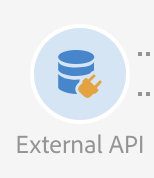

# External API {#external-api}

## Description {#description}

The **[!UICONTROL External API]** activity brings data into the workflow from an **external system** via a **REST API** call.

The REST endpoints can be a customer management system, an [Adobe I/O Runtime](https://www.adobe.io/apis/experienceplatform/runtime.html) instance or an Experience Cloud REST endpoints (Data Platform, Target, Analytics, Campaign, etc).

>[!CAUTION]
>
>Questa funzionalità è attualmente in versione beta pubblica. È necessario accettare il contratto di utilizzo prima di iniziare a utilizzare l'attività API esterna. Poiché questa funzionalità beta pubblica non è stata ancora rilasciata commercialmente da Adobe, non è supportata da Adobe Client Care, può contenere errori e potrebbe non funzionare nonché altre funzionalità rilasciate.

Le caratteristiche principali di questa attività sono:

* Possibilità di trasmettere dati in un formato JSON a un endpoint REST API di terze parti
* Possibilità di ricevere una risposta JSON, mapparla sulle tabelle di output e passare a altre attività del flusso di lavoro.
* Gestione non riuscita con transizione in uscita in uscita

Per questa attività sono stati inseriti i seguenti controlli:

* Limite dimensione dati risposta http 5 MB
* Timeout richiesta 60 secondi
* I reindirizzamenti HTTP non sono consentiti
* Gli URL non HTTPS vengono rifiutati
* " Accetta: application/json "headheader e" Content-Type: application/json» è consentita l'intestazione della risposta

>[!CAUTION]
>
>Tieni presente che l'attività è destinata al recupero dei dati su vasta campagna (serie più recente di offerte, valutazioni più recenti e così via) non per il recupero di informazioni specifiche per ogni profilo, in quanto può causare grandi quantità di dati da trasferire. If the use case requires this, the recommendation is to use the [Transfer File](../../automating/using/transfer-file.md) activity.

## Configuration {#configuration}

Drag and drop an **[!UICONTROL External API]** activity into your workflow and open the activity to start the configuration.

### Mappatura in entrata

La mappatura in entrata è una tabella temporanea generata da una precedente attività in entrata che verrà visualizzata e inviata come JSON nell'interfaccia utente.
In base a questa tabella temporanea, l'utente può apportare modifiche ai dati in ingresso.

The **Inbound resource** dropdown lets you select the query activity that will create the temporary table.

The **Add count parameter** checkbox will a count value for each row coming from the temporary table. Questa casella di controllo è disponibile solo se l'attività in entrata genera una tabella temporanea.

The **Inbound Columns** section allow the user to add any fields from the inbound transition table. Le colonne selezionate saranno le chiavi nell'oggetto dati. L'oggetto dati nel JSON sarà un elenco array contenente dati per le colonne selezionate da ogni riga della tabella di transizione in entrata.

The **customize parameter** text box lets you add a valid JSON with additional data needed by the external API. Questi dati aggiuntivi saranno aggiunti all'oggetto params nel JSON generato.

### Mappatura in uscita

This tab lets you define the sample **JSON structure** returned by the API Call.

The JSON structure pattern is: `{“data”:[{“key”:“value”}, {“key”:“value”},...]}`

The sample JSON definition must have the **following characteristics**:

* **data** è un nome di proprietà obbligatorio in JSON, il contenuto di "dati" è un array JSON.
* **Gli elementi** Array devono contenere proprietà di primo livello (i livelli più dettagliati non sono supportati).
   **I nomi delle proprietà** terminerebbero a diventare nomi di colonna per lo schema di output della tabella temporanea di output.
* **La definizione del nome** della colonna si basa sul primo elemento dell'array "dati".
Columns definition (add/remove) and the type value of the property can be edited in the **Column definition** tab.

If the **parsing is validated** a message appears and invite you to customize the data mapping in the "Column definition" tab. In altri casi, viene visualizzato un messaggio di errore.

### Esecuzione

This tab lets you define the **HTTPS Endpoint** that will send data to ACS. If needed, you can enter authentication information in the fields below.

### Proprietà

This tab lets you control **general properties** on the external API activity like the displayed label in the UI. L'ID interno non è personalizzabile.

### Definizione colonna

>[!NOTE]
>
>This tab appears when the **response data format** is completed and validated in Outbound Mapping tab.

The **Column definition** tab allows you to precisely specify the data structure of each column in order to import data that does not contain any errors and make it match the types that are already present in the Adobe Campaign database for future operations.

Ad esempio, è possibile modificare l'etichetta di una colonna, selezionandone il tipo (stringa, numero intero, data, ecc.)oppure specifica anche l'elaborazione degli errori.

For more information, refer to the [Load File](../../automating/using/load-file.md) section.

### Transizione

This tab lets you activate the **outbound transition** and its label. This specific transition is useful in case of **timeout** or if the payload exceed the **data size limit**.

### Opzioni di esecuzione

Questa scheda è disponibile nella maggior parte delle attività del flusso di lavoro. For more information, consult the [Activity properties](../../automating/using/executing-a-workflow.md#activity-properties) section.

## Risoluzione dei problemi

Due tipi di messaggi di registro aggiunti a questa nuova attività del flusso di lavoro: informazioni ed errori. Possono aiutarti a risolvere eventuali problemi potenziali.

### Informazioni

Questi messaggi di registro vengono utilizzati per registrare informazioni su punti di controllo utili durante l'esecuzione dell'attività del flusso di lavoro. In modo specifico, i seguenti messaggi di registro vengono utilizzati per registrare il primo tentativo anche un tentativo di tentativi (e motivo per cui non si verificano precedenti tentativi) per accedere all'API.

<table> 
 <thead> 
  <tr> 
   <th> Message format  </th> 
   <th> Example  </th> 
  </tr> 
 </thead> 
 <tbody> 
  <tr> 
   <td> Richiamo dell'URL dell'API '% s '.</td> 
   <td> 
URL di richiamo APì https://example.com/api/v1/web-coupon?count=2'.
</td> 
  </tr> 
  <tr> 
   <td> Aggiornamento dell'URL dell'API '% s ', tentativo precedente non riuscito ('% s ').</td> 
   <td> 
Aggiornamento dell'URL dell'APì https://example.com/api/v1/web-coupon?count=2', tentativo precedente non riuscito ('HTTP - 401 ').
</td>
  </tr> 
  <tr> 
   <td> Trasferimento del contenuto da '% s '(% s/% s).</td> 
   <td> 
Trasferimento del contenuto dà https://example.com/api/v1/web-coupon?count=2' (1234/1234).
</td> 
  </tr>
 </tbody> 
</table>

### Errori

Questi messaggi di registro vengono utilizzati per registrare informazioni su condizioni di errore impreviste, che in ultima analisi possono causare errori nell'attività del flusso di lavoro.

<table> 
 <thead> 
  <tr> 
   <th> Code - Message format  </th> 
   <th> Example  </th> 
  </tr> 
 </thead> 
 <tbody> 
  <tr> 
   <td> WKF -560250 - API request body exceeded limit (limit: ' % d ').</td> 
   <td> 
Limite superato del corpo della richiesta API (limite: ' 5242880 ').
</td> 
  </tr> 
  <tr> 
   <td> WKF -560239 - Limite di risposta API superato (limite: ' % d ').</td> 
   <td> 
Limite superamento della risposta API (limite: 5242880 ').
</td> 
  </tr> 
  <tr> 
   <td> WKF -560245 - URL API non analizzato (errore: ' % d ').</td> 
   <td> 
Impossibile analizzare l'URL dell'API (errore: ' -2010 ').

   
 Nota: Questo errore viene registrato quando l'URL API non riesce a rispettare le regole di convalida.
</td>
  </tr> 
  <tr>
   <td> WKF -560244: l'host dell'URL API non deve essere «localhost» o letterale indirizzo IP (host URL: ' % s ').</td> 
   <td> 
L'host dell'URL API non deve essere «localhost» o letterale indirizzo IP (host URL: ' localhost ').

    
L'host dell'URL API non deve essere «localhost» o letterale indirizzo IP (host URL: ' 192.168.0.5 ').

    
L'host dell'URL API non deve essere «localhost» o letterale indirizzo IP (host URL: ' [2001]').
</td>
  </tr> 
  <tr> 
   <td> WKF -560238 - URL API deve essere un URL protetto (https) (URL richiesto: ' % s ').</td> 
   <td> 
L'URL API deve essere un URL protetto (https) (URL richiesto: ' https://example.com/api/v1/web-coupon?count=2').
</td> 
  </tr> 
  <tr> 
   <td> WKF -560249 - Impossibile creare il codice JSON del corpo della richiesta. Error when adding '% s '.</td> 
   <td> 
Impossibile creare il codice JSON del corpo della richiesta. Error when adding'params '.

    
Impossibile creare il codice JSON del corpo della richiesta. Errore durante l'aggiunta dì datì.
</td>
  </tr> 
  <tr> 
   <td> WKF -560246 - Chiave dell'intestazione HTTP non valida (chiave intestazione: ' % s ').</td> 
   <td> 
La chiave dell'intestazione HTTP è negativa (chiave intestazione: ' % s ').

   
 Nota: Questo errore viene registrato quando la chiave dell'intestazione personalizzata non riesce in base a [RFC] (https://tools.ietf.org/html/rfc7230#section-3.2.html)
</td> 
  </tr>
 <tr> 
   <td> WKF -560248: la chiave dell'intestazione HTTP non è consentita (chiave intestazione: ' % s ').</td> 
   <td> 
La chiave dell'intestazione HTTP non è consentita (chiave intestazione: ' Accetto ').
</td> 
  </tr> 
  <tr> 
   <td> WKF -560247 - Il valore dell'intestazione AHTTP è errato (valore dell'intestazione: ' % s ').</td> 
   <td> 
Il valore dell'intestazione HTTP è errato (valore dell'intestazione: ' % s '). 

    
Nota: Questo errore viene registrato quando il valore dell'intestazione personalizzato non riesce in base a [RFC] (https://tools.ietf.org/html/rfc7230#section-3.2.html)
</td> 
  </tr> 
  <tr> 
   <td> WKF -560240 - payload JSON non ha proprietà valida '% s '.</td> 
   <td> 
Payload JSON non ha proprietà valida "blah".
</td>
  </tr> 
  <tr>
   <td> WKF -560241 - JSON non formattato o formato non valido.</td> 
   <td> 
JSON non formattato o formato non valido.

   
Nota: Questo messaggio si applica solo all'analisi del corpo di risposta dall'API esterna e viene registrato quando si cerca di verificare se il corpo della risposta è conforme al formato JSON mandatato da questa attività.
</td>
  </tr>
  <tr> 
   <td> WKF -560246 - Attività non riuscita (motivo: ' % s ').</td> 
   <td> 
Quando l'attività non riesce a causa di risposta di errore HTTP 401 - Attività non riuscita (motivo: ' HTTP - 401 ')

        
Quando l'attività non riesce a causa di una chiamata interna non riuscita - Attività non riuscita (motivo: ' Irc - -nn ').

        
Quando l'attività non riesce a causa di un'intestazione Content-Type non valida. - Attività non riuscita (motivo: ' Content-Type - application/html ').
</td> 
  </tr>
 </tbody> 
</table>

<!--
## Example: Managing coupons with External API Activity

This example illustrates how to **add coupon value** retrieving by a REST call to profiles and then sending an email containing these coupon values.

The workflow is presented as follows:

1. Drag and drop an **External API** activity
    1. Parse the JSON sample responsa as {"data":[{"code":"value"}]}.
    1. Add the **Rest endpoint URL** and define authentication setting if needed
    
    1. In the **column definition** tab, add a new column called **code** that will store the code value.
        
    1. Enabled an **outbound transition** to manage request failures.
1. Drag and drop a **Query** activity
    1. Configure the **Target** tab to query all the **@adobe.com** email. For different Query samples, refer to the [Query](../../automating/using/query.md) section.
    1. In the **additional data** tab, add a new column based on **rowId()** function. This additional column allows you to reconciliate coupon code with the profile ID..
        

        >[!NOTE]
        >
        >This reconciliation approach means that the profile query number is equal to the number of coupon values returned by the REST call.
1. Once this two activities are configured, drag and drop an **Enrichment** activity to associate coupon values with profiles.
    1. Select the previous Query activity in the **primarySet** field.
        
    1. Create a new relation in the **Advanced relations** tab, and add the following reconciliation criteria:
    1. **@expr1** coming grom the Query activity in the source expression field.
    1. **@lineNum** as an expression that returns the line number for each coupon value in the destination field.
        
        More information on the enrichment activity are available [here](../../automating/using/enrichment.md)

    1. The transition **Data Structure** will contain:
        
1. Finally drag and drop a **Send via Email** activity.
    You can modify your email template by adding the **code** personnalized field.

-->
