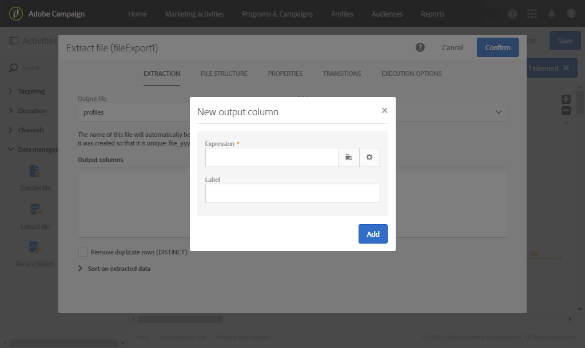

# Extract file{#extract-file}

## Description {#description}

The **[!UICONTROL Extract file]** activity allows you to export data from Adobe Campaign in the form of an external file.

## Context of use {#context-of-use}

Il modo in cui i dati vengono estratti viene definito durante la configurazione dell'attività.

>[!CAUTION]
>
>The **[!UICONTROL Extract file]** activity must be placed after a **[!UICONTROL Query]** activity in order to be used.

## Configuration {#configuration}

1. Drag and drop an **[!UICONTROL Extract file]** activity into your workflow.

   

1. Select the activity, then open it using the  button from the quick actions that appear.
1. Enter the label of the **Output file**. L'etichetta del file verrà compilata automaticamente con la data e l'ora in cui è stata creata. Ad esempio: recipients_20150815_081532.txt per un file generato il 15 agosto 2015 alle 08:15:32.

   >[!NOTE]
   >
   >It is possible to use the **[!UICONTROL formatDate]** function in this field to specify the file name.

1. If you like, you can zip the output file by selecting **[!UICONTROL Compression]** in the **[!UICONTROL Add a pre-processing step]** field. Il file di output verrà compresso in un file GZIP (.gz).
1. Click the  or **[!UICONTROL Add an element]** button to add an output column.

   

   Viene aperta una nuova finestra.

   

1. Immettete un'espressione. To do this, you can select an existing expression or create a new one using the **expression editor**.
1. Confermare l'espressione.

   L'espressione viene aggiunta alle colonne di output.

1. Create tutte le colonne necessarie. Potete modificare le colonne facendo clic sulle relative espressioni ed etichette.

   Se esportate i profili e desiderate utilizzarli in uno strumento esterno, accertatevi di esportare un unico identificatore. Per impostazione predefinita, non tutti i profili hanno un identificatore univoco, a seconda del modo in cui vengono aggiunti al database. For more information, refer to the [Generating a unique ID for profiles](../../developing/using/configuring-the-resource-s-data-structure.md#generating-a-unique-id-for-profiles-and-custom-resources) section.

1. Click the **[!UICONTROL File structure]** tab to configure the output, date, and number formats for the file that will be exported.

   Check the **[!UICONTROL Export labels instead of internal values of enumerations]** option in case you export enumeration values. Questa opzione consente di ottenere etichette più brevi facili da comprendere invece di ID.

1. In the **[!UICONTROL Properties]** tab, select the **[!UICONTROL Do not generate a file if the inbound transition is empty]** option to avoid creating and uploading empty files on SFTP servers if the inbound transition is empty.
1. Confermate la configurazione dell'attività e salvate il flusso di lavoro.

## Example {#example}

The following example illustrates how to configure an **[!UICONTROL Extract file]** activity after a **[!UICONTROL Query]** activity.

Questo flusso di lavoro consente di esportare un elenco di profili sotto forma di file esterno, in modo che i dati possano essere utilizzati all'esterno di Adobe Campaign.

1. Drag and drop an **[!UICONTROL Extract file]** activity into your workflow and place it after the **[!UICONTROL Query]** activity.

   In questo esempio, la query viene eseguita su tutti i profili da 18 a 30.

1. Aprite l'attività Estrai file per modificarla.
1. Denominate il file di output.
1. Aggiungere colonne di output.

   In questo esempio, l'e-mail, l'età, la data di nascita, il nome e il cognome dei profili vengono aggiunti come colonne di output.

   

1. Click the **[!UICONTROL File structure]** tab to define:

   * Formato di output CSV

      

   * Formato data

      

1. Confermate l'attività.
1. Drag and drop a **[!UICONTROL Transfer file]** activity after the **[!UICONTROL Extract file]** activity to recover the extract file on an external account.
1. Open the activity and choose the **[!UICONTROL File upload]** action.

   

1. Selezionate l'account esterno e immettete il percorso della cartella sul server.

   

1. Confermate l'attività e salvate il flusso di lavoro.
1. Avviate il flusso di lavoro.

   Quando il flusso di lavoro è stato eseguito correttamente, il file estratto è disponibile sull'account esterno.

