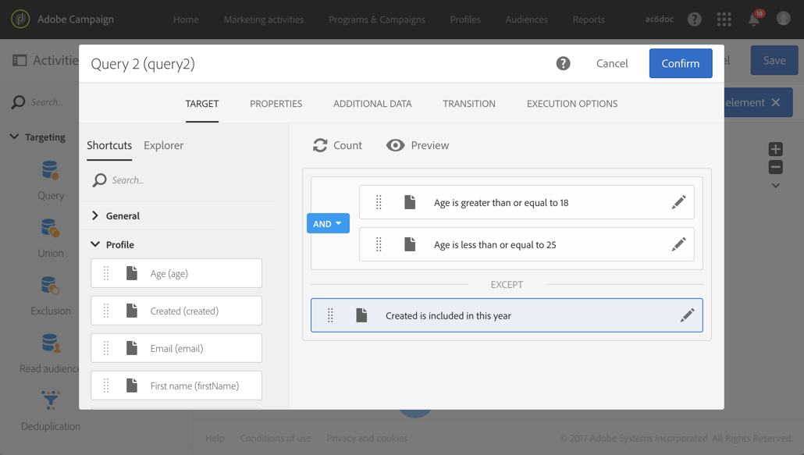

# Identificazione di duplicati prima della consegna {#identifying-duplicates-before-a-delivery}

L&#39;esempio seguente illustra una deduplicazione che consente di escludere i duplicati di una destinazione prima di inviare un&#39;e-mail. Ciò significa che eviti di inviare una comunicazione più volte allo stesso profilo.

Il flusso di lavoro è costituito da:

* Una [query](../../automating/using/query.md) che consente di definire la destinazione dell&#39;e-mail. In questo caso, il flusso di lavoro si applica a tutti i profili di età compresa tra i 18 e i 25 anni presenti nel database client da oltre un anno.

   

* Un&#39;attività di [deduplicazione](../../automating/using/deduplication.md) che consente di identificare i duplicati derivanti dalla query precedente. In questo esempio viene salvato un solo record per ogni duplicato. I duplicati vengono identificati utilizzando l&#39;indirizzo e-mail. Ciò significa che la consegna dell&#39;e-mail può essere inviata solo una volta per ogni indirizzo e-mail presente nel targeting.

   Il metodo di deduplicazione selezionato è **[!UICONTROL Non-empty value]**. Questo consente di garantire che tra i record conservati in caso di duplicati, sia data priorità a quelli in cui è stato fornito il **Nome** . Questo renderà più coerente l’utilizzo del nome nei campi di personalizzazione del contenuto dell’e-mail.

   Inoltre, viene aggiunta una transizione aggiuntiva per mantenere i duplicati e per poterli elencare.

   

* Una consegna  e-mail inserita dopo la transizione in uscita principale della deduplicazione.
* Un&#39;attività [Salva audience](../../automating/using/save-audience.md) inserita dopo l&#39;ulteriore transizione della deduplicazione per salvare i duplicati in un pubblico **Duplicati** . Questo pubblico può essere riutilizzato per escludere direttamente i suoi membri da ogni invio di e-mail.
