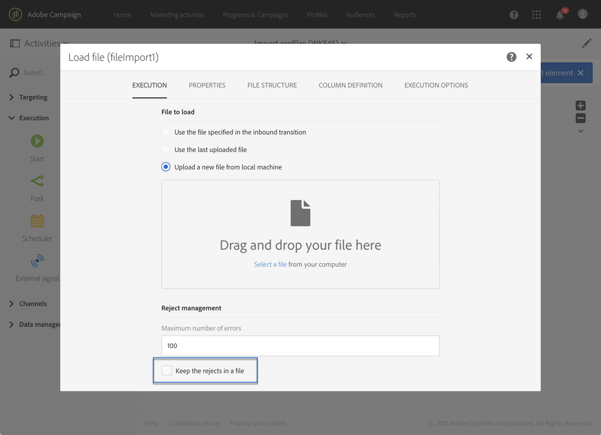

# Importing data{#importing-data}

## Collecting data {#collecting-data}

Puoi raccogliere dati da un file per elaborarlo e/o per importarlo nel database Adobe Campaign.

* The **[!UICONTROL Load file]** activity allows you to import data in one structured form to use this data in Adobe Campaign. I dati vengono importati temporaneamente e un'altra attività è necessaria per integrarla definitivamente nel database di Adobe Campaign.
* The **[!UICONTROL Transfer file]** activity allows you to receive or send files, test whether there are files present, or list files in Adobe Campaign.

   You can use this activity before a **[!UICONTROL Load file]** in case you need to retrieve the file from an external source.

## Import best practices {#import-best-practices}

Prestare attenzione e seguire le poche regole semplici riportate di seguito sarà molto utile per garantire la coerenza dei dati all'interno del database e per evitare errori comuni durante l'aggiornamento del database o le esportazioni di dati.

### Using import templates {#using-import-templates}

Most import workflows should contain the following activities: **[!UICONTROL Load file]**, **[!UICONTROL Reconciliation]**, **[!UICONTROL Segmentation]**, **[!UICONTROL Deduplication]**, **[!UICONTROL Update data]**.

Utilizzando i modelli di importazione è molto utile preparare importazioni simili e garantire coerenza dei dati all'interno del database.

In many projects, imports are built without **[!UICONTROL Deduplication]** activity because the files used in the project do not have duplicates. A volte i duplicati appaiono dall'importazione di file diversi. La deduplicazione è quindi complicata. Di conseguenza, un passaggio di deduplicazione è una buona precauzione in tutti i flussi di lavoro di importazione.

Non dimenticare che i dati in arrivo sono coerenti e corretti, oppure che il reparto IT o il supervisore Adobe Campaign vi occuperanno. Durante il progetto, tenete presente la funzione di pulizia dei dati. Deduplicare, riconciliare e mantenere coerenza quando si importano dati.

An example of a generic workflow template designed for importing data is available in the [Example: Import workflow template](../../automating/using/importing-data.md#example--import-workflow-template) section.

>[!NOTE]
>
>You can also use [import templates](../../automating/using/importing-data-with-import-templates.md). Si tratta di modelli di flussi di lavoro definiti da un amministratore che, una volta attivati, offrono solo la possibilità di specificare il file contenente i dati da importare.

### Using flat file formats {#using-flat-file-formats}

Il formato più efficiente per le importazioni è file semplici. I file Flat possono essere importati in modalità collettiva a livello di database.

Ad esempio:

* Separatore: tabulazione o punto e virgola
* Prima riga con intestazioni
* Nessun delimitatore stringa
* Formato data: AAAA/MM/GG HH: mm: SS

Esempio di file da importare:

```
lastname;firstname;birthdate;email;crmID
Smith;Hayden;23/05/1989;hayden.smith@example.com;124365
Mars;Daniel;17/11/1987;dannymars@example.com;123545
Smith;Clara;08/02/1989;hayden.smith@example.com;124567
Durance;Allison;15/12/1978;allison.durance@example.com;120987
```

### Using compression {#using-compression}

Se possibile, usate file compressi per importare ed esportare. GZIP è supportato per impostazione predefinita. You can add pre-processing when importing files or post-processing when extracting data, respectively in the **[!UICONTROL Load file]** and **[!UICONTROL Extract file]** workflow activities.

### Importing in Delta mode {#importing-in-delta-mode}

Le importazioni regolari devono essere eseguite in modalità delta. Ciò significa che solo i dati modificati o nuovi vengono inviati ad Adobe Campaign, anziché all'intera tabella.

Le importazioni complete devono essere utilizzate solo per il caricamento iniziale.

### Maintaining consistency {#maintaining-consistency}

Per mantenere la coerenza dei dati nel database di Adobe Campaign, segui i principi seguenti:

* Se i dati importati corrispondono a una tabella di riferimento in Adobe Campaign, devono essere riconciliati con quella tabella nel flusso di lavoro. I record che non corrispondono devono essere rifiutati.
* Ensure that the imported data is always **"normalized"** (email, phone number, direct mail address) and that this normalization is reliable and will not change over the years. In caso contrario, alcuni duplicati saranno probabilmente visualizzati nel database e, poiché Adobe Campaign non fornisce strumenti per eseguire corrispondenza "sfocata", sarà molto difficile gestirli e rimuoverli.
* I dati transazionali devono avere una chiave di riconciliazione e essere riconciliati con i dati esistenti per evitare di creare duplicati.
* **Importare file correlati in ordine**. Se l'importazione è composta da più file che dipendono tra loro, il flusso di lavoro deve essere sicuro che i file vengano importati nell'ordine corretto. Quando un file non riesce, gli altri file non vengono importati.
* **Deduplicare,** riconciliare e mantenere coerenza quando si importano dati.

## Example: Import workflow template {#example--import-workflow-template}

L'utilizzo di un modello di importazione è una procedura consigliata per importare regolarmente file con la stessa struttura.

Questo esempio mostra come preimpostare un flusso di lavoro che può essere riutilizzato per importare profili provenienti da un CRM nel database di Adobe Campaign.

1. Create a new workflow template from **[!UICONTROL Resources > Templates > Workflow templates]**.
1. Aggiungete le attività seguenti:

   * **[!UICONTROL Load file]**: Definite la struttura prevista del file contenente i dati da importare.

      >[!NOTE]
      >
      >È possibile importare solo dati da un singolo file. If the workflow has multiple **[!UICONTROL Load file]** activities, the same file will be used each time.

   * **[!UICONTROL Reconciliation]**: Riconciliare i dati importati con i dati del database.
   * **[!UICONTROL Segmentation]**: Create filtri per elaborare i record in modo diverso a seconda che possano essere riconciliati o meno.
   * **[!UICONTROL Deduplication]**: Deduplicare i dati dal file in entrata prima che sia inserito nel database.
   * **[!UICONTROL Update data]**: Aggiornate il database con i profili importati.
   

1. Configure the **[!UICONTROL Load file]** activity:

   * Definite la struttura prevista caricando un file di esempio. Il file di esempio deve contenere solo alcune righe, ma tutte le colonne necessarie per l'importazione. Controllate e modificate il formato del file per assicurarvi che il tipo di ogni colonna sia impostato correttamente: testo, data, numero intero, ecc. Ad esempio:

      ```
      lastname;firstname;birthdate;email;crmID
      Smith;Hayden;23/05/1989;hayden.smith@mailtest.com;123456
      ```

   * In the **[!UICONTROL File to load]** section, select **[!UICONTROL Upload a new file from the local machine]** and leave the field blank. Ogni volta che viene creato un nuovo flusso di lavoro da questo modello, potete specificare qui il file desiderato, in quanto corrisponde alla struttura definita.

      Potete utilizzare una qualsiasi delle opzioni, ma dovete modificare il modello di conseguenza. For example, if you select **[!UICONTROL Use the file specified in the inbound transition]**, you can add a **[!UICONTROL Transfer file]** activity before to retrieve the file to import from a FTP/SFTP server.

      If you want users to be able to download a file containing errors that occurred during an import, check the **[!UICONTROL Keep the rejects in a file]** option and specify the **[!UICONTROL File name]**.

      

1. Configure the **[!UICONTROL Reconciliation]** activity. Lo scopo di questa attività in questo contesto è identificare i dati in arrivo.

   * In the **[!UICONTROL Relations]** tab, select **[!UICONTROL Create element]** and define a link between the imported data and the recipients targeting dimension (see [Targeting dimensions and resources](../../automating/using/query.md#targeting-dimensions-and-resources)). In this example, the **CRM ID** custom field is used to create the join condition. Utilizzare il campo o la combinazione di campi necessari per consentire l'identificazione di record univoci.
   * In the **[!UICONTROL Identification]** tab, leave the **[!UICONTROL Identify the document from the working data]** option unchecked.
   

1. Configure the **[!UICONTROL Segmentation]** activity to retrieve reconciled recipients in one transition and recipients that could not be reconciled but who have enough data in a second transition.

   La transizione con i destinatari riconciliati può quindi essere utilizzata per aggiornare il database. La transizione con i destinatari sconosciuti può quindi essere utilizzata per creare nuove voci dei destinatari nel database se nel file è disponibile un set minimo di informazioni.

   I destinatari che non possono essere riconciliati e non dispongono di dati sufficienti sono selezionati in una transizione in uscita complementare e possono essere esportati in un file separato o semplicemente ignorati.

   * In the **[!UICONTROL General]** tab of the activity, set the **[!UICONTROL Resource type]** to **[!UICONTROL Temporary resource]** and select **[!UICONTROL Reconciliation]** as the targeted set.
   * In the **[!UICONTROL Advanced options]** tab, check the **[!UICONTROL Generate complement]** option to be able to see if any record cannot be inserted in the database. Se necessario, potete quindi applicare un'ulteriore elaborazione ai dati complementari: esportazione file, aggiornamento elenco, ecc.
   * In the first segment of the **[!UICONTROL Segments]** tab, add a filtering condition on the inbound population to select only records for which the profile's CRM ID is not equal to 0. In questo modo, i dati del file che vengono riconciliati con profili provenienti dal database sono selezionati in tale sottoinsieme.

      

   * Aggiungi un secondo segmento che seleziona record non riconciliati che dispongono di dati sufficienti per essere inseriti nel database. Ad esempio: indirizzo e-mail, nome e cognome. I record che non vengono riconciliati presentano il valore ID CRM del proprio profilo pari a 0.

      

   * All records that are not selected in the first two subsets are selected in the **[!UICONTROL Complement]**.

1. Configure the **[!UICONTROL Update data]** activity located after the first outbound transition of the **[!UICONTROL Segmentation]** activity configured previously.

   * Select **[!UICONTROL Update]** as **[!UICONTROL Operation type]** since the inbound transition only contains recipients already present in the database.
   * In the **[!UICONTROL Identification]** tab, select **[!UICONTROL Using reconciliation criteria]** and define a key between the **[!UICONTROL Dimension to update]** - Profiles in this case - and the link created in the **[!UICONTROL Reconciliation]** activity. In this example, the **CRM ID** custom field is used.

      

   * In the **[!UICONTROL Fields to update]** tab, indicate the fields from the Profiles dimension to update with the value of the corresponding column from the file. Se i nomi delle colonne del file sono identici o quasi identici ai nomi dei campi dimensione dei destinatari, potete utilizzare il pulsante bacchetta magica per corrispondenza automatica dei diversi campi.

      

      >[!NOTE]
      >
      >Se pianificate di inviare posta diretta a tali profili, accertatevi di includere un indirizzo postale in quanto queste informazioni sono essenziali per il provider di posta diretta. Also make sure that the **[!UICONTROL Address specified]** box in your profiles' information is checked. To update this option from a workflow, simply add an element to the fields to update, and specify **1** as **[!UICONTROL Source]** and select the **[postalAddress/@addrDefined]** field as **[!UICONTROL Destination]**. For more on direct mail and the use of the **[!UICONTROL Address specified]** option, see [this document](../../channels/using/about-direct-mail.md#recommendations).

1. Configure the **[!UICONTROL Deduplication]** activity located after the transition containing unreconciled profiles:

   * In the **[!UICONTROL Properties]** tab, set the **[!UICONTROL Resource type]** to the temporary resource generated from the **[!UICONTROL Reconciliation]** activity of the workflow.

      

   * In questo esempio, il campo e-mail viene usato per trovare profili univoci. Potete utilizzare qualsiasi campo sicuro e parte di una combinazione univoca.
   * Choose a **[!UICONTROL Deduplication method]**. In questo caso, l'applicazione decide automaticamente quali record vengono mantenuti nel caso di duplicati.
   

1. Configure the **[!UICONTROL Update data]** activity located after the **[!UICONTROL Deduplication]** activity configured previously.

   * Select **[!UICONTROL Insert only]** as **[!UICONTROL Operation type]** since the inbound transition only contains profiles not present in the database.
   * In the **[!UICONTROL Identification]** tab, select **[!UICONTROL Using reconciliation criteria]** and define a key between the **[!UICONTROL Dimension to update]** - Profiles in this case - and the link created in the **[!UICONTROL Reconciliation]** activity. In this example, the **CRM ID** custom field is used.

      

   * In the **[!UICONTROL Fields to update]** tab, indicate the fields from the Profiles dimension to update with the value of the corresponding column from the file. Se i nomi delle colonne del file sono identici o quasi identici ai nomi dei campi dimensione dei destinatari, potete utilizzare il pulsante bacchetta magica per corrispondenza automatica dei diversi campi.

      

      >[!NOTE]
      >
      >Se pianificate di inviare posta diretta a tali profili, accertatevi di includere un indirizzo postale in quanto queste informazioni sono essenziali per il provider di posta diretta. Also make sure that the **[!UICONTROL Address specified]** box in your profiles' information is checked. To update this option from a workflow, simply add an element to the fields to update, and specify **1** as **[!UICONTROL Source]** and select the **[postalAddress/@addrDefined]** field as **[!UICONTROL Destination]**. For more on direct mail and the use of the **[!UICONTROL Address specified]** option, see [this document](../../channels/using/about-direct-mail.md#recommendations).

1. After the third transition of the **[!UICONTROL Segmentation]** activity, add a **[!UICONTROL Extract file]** activity and a **[!UICONTROL Transfer file]** activity if you want to keep track of data not inserted in the database. Configurate queste attività per esportare la colonna necessaria e per trasferire il file su un server FTP o SFTP in cui potete recuperarlo.
1. Add an **[!UICONTROL End]** activity and save the workflow template.

Ora è possibile utilizzare il modello ed è disponibile per ogni nuovo flusso di lavoro. All is needed is then to specify the file containing the data to import in the **[!UICONTROL Load file]** activity.


