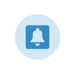

# In-App delivery{#in-app-delivery}

## Description {#description}

The **In-App delivery** activity allows you to configure sending an In-App message within a workflow. Messaggistica in-app consente di visualizzare un messaggio quando l'utente è attivo all'interno dell'applicazione. For more information concerning the In-App delivery, refer to this [section](../../channels/using/about-in-app-messaging.md).

## Context of use {#context-of-use}

The **[!UICONTROL In-App delivery]** activity is generally used to automate sending an In-App message to a target audience calculated in the same workflow.

I destinatari vengono definiti a monte dell'attività nello stesso flusso di lavoro, mediante attività di targeting quali query, intersezioni ecc.

La preparazione del messaggio viene attivata in base ai parametri di esecuzione del flusso di lavoro. Dal pannello del messaggio, potete selezionare se richiedere o meno una conferma manuale per inviare il messaggio (richiesto per impostazione predefinita). Puoi avviare il flusso di lavoro manualmente oppure inserire un'attività pianificatore nel flusso di lavoro per automatizzare l'esecuzione.

## Configuration {#configuration}

1. Drag and drop a **[!UICONTROL Query]** activity to your workflow. Please note that the **[!UICONTROL Query]** activity targeting dimension in the **[!UICONTROL Properties]** tab needs to be updated according to the template chosen in Step 4:

   * Targeting dimension should be set to **[!UICONTROL mobileApp (mobileAppV5)]** for the **[!UICONTROL Target all users of a Mobile app (inAppBroadcast)]** template.
   * Targeting dimension should be set to **[!UICONTROL profile (profile)]** for the **[!UICONTROL Target users based on their Campaign profile (inAppProfile)]** template.
   * Targeting dimension should be set to **[!UICONTROL subscriptions to an application (nms:appSubscriptionRcp:appSubscriptionRcpDetail)]** for the **[!UICONTROL Target users based on their Mobile profile (inApp)]** template.

1. Drag and drop a **[!UICONTROL In-App delivery]** activity into your workflow.
1. Select the activity, then open it using the  button from the quick actions that appear.

   >[!NOTE]
   >
   >You can access the general properties and advanced options of the activity (and not of the delivery itself) via the  button from the activity's quick actions.

   

1. Selezionate il tipo di messaggio in-app. This will depend on the data targeted in your **[!UICONTROL Query]** activity.

   * **[!UICONTROL Target users based on their Campaign profile (inAppProfile)]**: Questo tipo di messaggio consente di eseguire il targeting dei profili di Adobe Campaign che hanno effettuato la sottoscrizione all'applicazione mobile e di personalizzare i messaggi in-app con gli attributi del profilo disponibili in Campaign.
   * **[!UICONTROL Target all users of a Mobile app (inAppBroadcast)]**: Questo tipo di messaggio consente di inviare un messaggio a tutti gli utenti della tua applicazione mobile anche se non dispongono di un profilo esistente in Campaign.
   * **[!UICONTROL Target users based on their Mobile profile (inApp)]**: Questo tipo di messaggio consente di eseguire il targeting di tutti gli utenti di un'app mobile che dispongono di un profilo mobile in Campaign, sia noto o sconosciuto, sia per personalizzare i messaggi in-app con qualsiasi attributo di profilo ottenuto da dispositivi mobili.
   

1. Enter your In-App message properties and select your mobile app in the **[!UICONTROL Associate a Mobile App to a delivery]** field.
1. In the **[!UICONTROL Triggers]** tab, drag and drop the event that will trigger your message. Sono disponibili tre categorie di eventi:
1. Definite il contenuto in-app. Refer to the section concerning [In-App customization](../../channels/using/customizing-an-in-app-message.md).
1. By default, the **[!UICONTROL In-App delivery]** activity does not include any outbound transitions. If you would like to add an outbound transition to your **[!UICONTROL In-App delivery]** activity, go to the **[!UICONTROL General]** tab of the advanced activity options (  button in the activity's quick actions) then check one of the following options:

   * **[!UICONTROL Add outbound transition without the population]**: consente di generare una transizione in uscita contenente la stessa popolazione della transizione in ingresso.
   * **[!UICONTROL Add outbound transition with the population]**: consente di generare una transizione in uscita contenente la popolazione a cui è stato inviato il messaggio. I membri della destinazione esclusi durante la preparazione di consegna sono esclusi da questa transizione.
   

1. Confermate la configurazione dell'attività e salvate il flusso di lavoro.

Quando riaprite l'attività, verrete indirizzati direttamente al dashboard in-app. Solo il relativo contenuto può essere modificato.

Per impostazione predefinita, l'avvio di un flusso di lavoro di consegna attiva solo la preparazione del messaggio. L'invio di messaggi creati da un flusso di lavoro deve comunque essere confermato dopo che il flusso di lavoro è stato avviato. But from the message dashboard, and only if the message was created from a workflow, you can disable the **[!UICONTROL Request confirmation before sending messages]** option. Deselezionando questa opzione, i messaggi vengono inviati senza ulteriore preavviso una volta completata la preparazione.

## Remarks {#remarks}

Le consegne create all'interno di un flusso di lavoro sono accessibili nell'elenco delle attività di marketing dell'applicazione. Potete visualizzare lo stato di esecuzione del flusso di lavoro utilizzando il dashboard. I collegamenti nel riquadro riepilogo delle notifiche push consentono di accedere direttamente agli elementi collegati (flusso di lavoro, campagna ecc.).

In the parent deliveries, which can be accessed from the marketing activity list, you can view the total number of sends that have been processed (according to the aggregation period specified when the **[!UICONTROL In-App delivery]** activity was configured). To do this, open the detail view of the parent delivery's **[!UICONTROL Deployment]** block by selecting .
