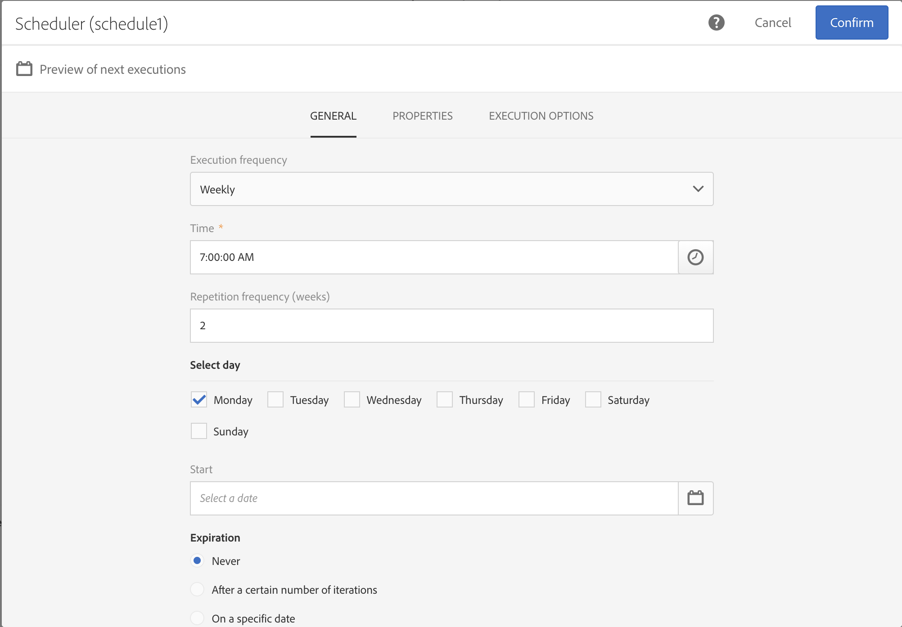
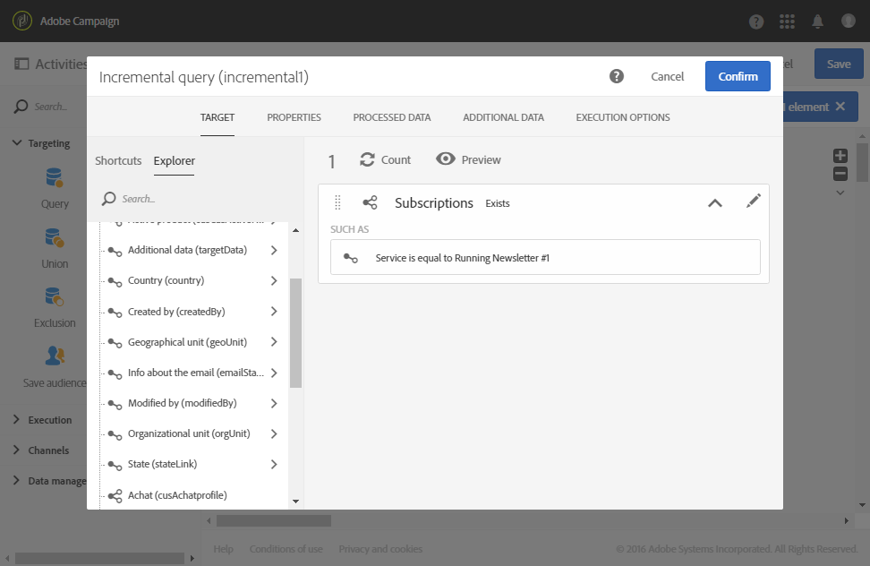

# Query incrementale sugli abbonati a un servizio {#example--incremental-query-on-subscribers-to-a-service}

L&#39;esempio seguente mostra la configurazione di un&#39; **[!UICONTROL Incremental query]** attività che filtra i profili nel database del Adobe Campaign  sottoscritti al servizio Newsletter **in** esecuzione, per inviare loro un messaggio e-mail di benvenuto contenente un codice promozionale.

Il flusso di lavoro è costituito dai seguenti elementi:

* Un&#39;attività [Scheduler](../../automating/using/scheduler.md) , per eseguire il flusso di lavoro ogni lunedì alle 6.

   

* Un&#39;attività di query  incrementale, che si rivolge a tutti gli utenti correnti durante la prima esecuzione, quindi solo ai nuovi sottoscrittori della settimana durante le seguenti esecuzioni.

   

* Un&#39;attività di consegna [tramite e-](../../automating/using/email-delivery.md) mail. Il flusso di lavoro viene eseguito una volta alla settimana, ma potete aggregare i messaggi e-mail inviati e i risultati mensili, ad esempio per generare rapporti su un periodo di un intero mese e non solo una settimana.

   A questo scopo, scegliete di creare una **[!UICONTROL Recurring email]** struttura che raggruppa le e-mail e i risultati **[!UICONTROL By month]**.

   Definite il contenuto dell&#39;e-mail e inserite il codice promozionale di benvenuto. Per ulteriori informazioni, consulta [Definizione delle sezioni relative al contenuto](../../designing/using/personalization.md) delle e-mail.

Quindi avviate l&#39;esecuzione del flusso di lavoro. Ogni settimana i nuovi abbonati riceveranno l&#39;e-mail di benvenuto con il codice promozionale.
