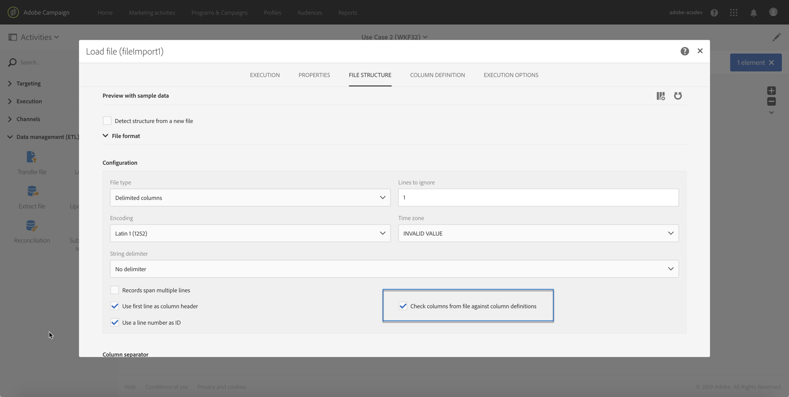

# Load file {#load-file}

## Descrizione {#description}

>[!CAUTION]
>
>Ricorda i limiti di archiviazione SFTP, archiviazione DB e profilo attivo secondo il contratto Adobe Campaign  durante l&#39;utilizzo di questa funzionalità.

L’attività **[!UICONTROL Load file]** ti consente di importare i dati all’interno di un modulo strutturato, in modo da poterli utilizzare in Adobe Campaign. I dati vengono importati temporaneamente e occorre un’altra attività per integrarli definitivamente nel database di Adobe Campaign.

## Contesto di utilizzo {#context-of-use}

La modalità di estrazione dei dati viene definita durante la configurazione dell’attività. Il file da caricare può rappresentare un elenco di contatti, ad esempio.

Puoi:

* Utilizzare la struttura del file per applicarla ai dati di un altro file (recuperati utilizzando l’attività **[!UICONTROL Transfer file]**) oppure
* Usare la struttura e i dati del file per poi importarlo all’interno di Adobe Campaign.

>[!IMPORTANT]
>
>Vengono presi in considerazione solo i file con struttura &quot;flat&quot;, ad esempio .txt, .csv e così via.

**Argomenti correlati:**

* [Caso di utilizzo: Aggiornamento del database con dati esterni](../../automating/using/update-database-file.md)
* [Caso di utilizzo: Aggiornamento dei dati in base a un download automatico del file](../../automating/using/update-data-automatic-download.md)
* [Caso di utilizzo: Invio di un’e-mail con campi arricchiti](../../automating/using/sending-email-enriched-fields.md)
* [Caso di utilizzo: Riconciliare un pubblico di file con il database](../../automating/using/reconcile-file-audience-with-database.md)

## Configurazione {#configuration}

La configurazione dell’attività prevede due passaggi. Innanzitutto, devi definire la struttura del file prevista effettuando il caricamento di un file di esempio. Al termine della procedura, puoi specificare l’origine del file di cui verranno importati i dati.

>[!NOTE]
>
>I dati del file di esempio sono utilizzati per la configurazione dell’attività, ma non vengono importati. È consigliabile utilizzare un file di esempio contenente pochi dati.

1. Trascina e rilascia un’attività **[!UICONTROL Load file]** nel flusso di lavoro.
1. Seleziona l’attività, quindi aprila utilizzando il pulsante  delle azioni rapide visualizzate.
1. Carica il file di esempio, che ti consentirà di definire la struttura prevista al momento dell’importazione del file finale.

   

   Una volta caricato il file di dati, nell’attività vengono visualizzate due nuove schede: **[!UICONTROL File structure]** e **[!UICONTROL Column definition]**.

1. Passa alla scheda **[!UICONTROL File structure]** per visualizzare la struttura rilevata automaticamente dal file di esempio.

   Se la struttura del file non è stata rilevata correttamente, hai a disposizione varie opzioni per la correzione di eventuali errori:

   * La scelta dell’opzione **[!UICONTROL Detect structure from a new file]** ti consente di utilizzare la struttura di un altro file.
   * Puoi modificare i parametri di rilevamento predefiniti in modo da adattarli al file. Il campo **[!UICONTROL File type]** ti consente di specificare se il file da importare è costituito da colonne dalla lunghezza fissa. In tal caso, devi inoltre specificare il numero massimo di caratteri per ciascuna colonna della scheda **[!UICONTROL Column definition]**.

      Tutte le opzioni di rilevamento necessarie per il corretto recupero dei dati dal file sono raggruppate in **[!UICONTROL File format]**. Tenendo presenti queste nuove impostazioni, puoi apportarvi modifiche per poi rilevare nuovamente la struttura dell’ultimo file caricato nell’attività. Per eseguire questa operazione, utilizza il pulsante **[!UICONTROL Apply configuration]**. Ad esempio, puoi specificare un separatore di colonna diverso.

      >[!NOTE]
      >
      >Questa operazione prende in considerazione l’ultimo file caricato nell’attività. Se il file rilevato è di grandi dimensioni, l’anteprima dati mostrerà solo le prime 30 righe.

      

      Nella sezione **[!UICONTROL File format]**, l’opzione **[!UICONTROL Check columns from file against column definitions]** ti consente di verificare che le colonne del file che stai caricando corrispondano alla definizione della colonna.

      Se il numero e/o il nome delle colonne non corrisponde alla definizione della colonna, verrà visualizzato un messaggio di errore durante l’esecuzione del flusso di lavoro. Se l’opzione non è attivata, verranno visualizzati degli avvisi nel file di registro.

      

1. Se necessario, vai alla scheda **[!UICONTROL Column definition]** per controllare il formato dei dati di ogni colonna e per regolare i parametri.

   La scheda **[!UICONTROL Column definition]** ti consente di specificare con precisione la struttura dati di ciascuna colonna al fine di importare dati privi di errori (ad esempio, utilizzando la gestione null) e di farli corrispondere ai tipi già presenti nel database di Adobe Campaign, in modo che siano disponibili per le operazioni future.

   Ad esempio, puoi modificare l’etichetta di una colonna, selezionarne il tipo (stringa, numero intero, data, ecc.) o anche specificare l’elaborazione degli errori.

   Per ulteriori informazioni, consulta la sezione [Formato colonna](#column-format).

   

1. Nella scheda **[!UICONTROL Execution]**, specifica se il file deve essere elaborato per il caricamento dei dati:

   * Proviene da una transizione in entrata nel flusso di lavoro.
   * È il file caricato durante il passaggio precedente.
   * È un nuovo file da caricare dal computer locale. Se il caricamento di un primo file era già stato definito nel flusso di lavoro, viene visualizzata l’opzione **[!UICONTROL Upload a new file from local machine]**. Ciò ti consente di effettuare il caricamento di un altro file da elaborare, qualora il file corrente non soddisfi le tue esigenze.

      

1. Se il file da cui vuoi caricare i dati è compresso in un file GZIP (.gz), seleziona l’opzione **[!UICONTROL Decompression]** nel campo **[!UICONTROL Add a pre-processing step]**. In tal modo, potrai decomprimere il file prima di caricare i dati. Questa opzione è disponibile solo se il file proviene dalla transizione in entrata dell’attività.

   Il **[!UICONTROL Add a pre-processing step]** campo consente inoltre di decrittografare un file prima di importarlo nel database. Per ulteriori informazioni su come utilizzare i file crittografati, consulta [questa sezione](../../automating/using/managing-encrypted-data.md)

1. L’opzione **[!UICONTROL Keep the rejects in a file]** ti consente di scaricare un file contenente errori verificatisi durante l’importazione e di applicarvi una fase di post-elaborazione. Quando l’opzione è attivata, la transizione in uscita viene rinominata come &quot;Rifiuti&quot;.

   >[!NOTE]
   >
   >L’opzione **[!UICONTROL Add date and time to the file name]** ti consente di aggiungere una marca temporale al nome del file contenente i rifiuti.

   

1. Conferma la configurazione dell’attività e salva il flusso di lavoro.

Se si verifica un errore nell’attività dopo l’esecuzione del flusso di lavoro, consulta i registri per ottenere ulteriori dettagli sui valori errati all’interno del file. Per ulteriori informazioni sui registri dei flussi di lavoro, consulta [questa sezione](../../automating/using/monitoring-workflow-execution.md).

## Formato colonna {#column-format}

Quando carichi un file di esempio, il formato colonna viene rilevato automaticamente con i parametri predefiniti per ciascun tipo di dati. È possibile modificare questi parametri predefiniti al fine di specificare i processi specifici da applicare ai dati, in particolare in caso di errore o di valore vuoto.

A questo scopo, seleziona **[!UICONTROL Edit properties]** dalle azioni rapide della colonna di cui vuoi definire il formato. Viene aperta la finestra di dettaglio del formato colonna.

Puoi quindi modificare la formattazione di ciascuna colonna.

La formattazione della colonna ti consente di definire il valore di elaborazione di ciascuna colonna:

* **[!UICONTROL Ignore column]**: non elabora questa colonna durante il caricamento dei dati.
* **[!UICONTROL Data type]**: specifica il tipo di dati previsto per ogni colonna.
* **[!UICONTROL Format and separators]**, **Proprietà**: specifica le proprietà di un testo, il formato di ora, data e valore numerico, nonché il separatore specificato dal contesto della colonna.

   * **[!UICONTROL Maximum number of characters]**: indica il numero massimo di caratteri per le colonne del tipo di stringa.

      Questo campo deve essere compilato durante il caricamento di file composti da colonne dalla lunghezza fissa.

   * **[!UICONTROL Letter case management]**: definisce se è necessario applicare un processo relativo alle maiuscole/minuscole dei caratteri per i dati di tipo **Testo**.
   * **[!UICONTROL White space management]**: specifica se alcuni spazi devono essere ignorati in una stringa per i dati di tipo **Testo**.
   * **[!UICONTROL Time format]**, **[!UICONTROL Date format]**: specifica il formato per i dati di tipo **Data**, **Ora** e **Data e ora**.
   * **[!UICONTROL Format]**: ti consente di definire il formato dei valori numerici per i dati relativi a **Numeri interi** e **Numeri mobili**.
   * **[!UICONTROL Separator]**: definisce il separatore specificato dal contesto della colonna (separatore delle migliaia o separatore decimale per i valori numerici, separatore per data e ora) per i dati di tipo **Data**, **Ora**, **Data e ora**, **Numero intero** e **Numero mobile**.

* **[!UICONTROL Remapping of values]**: questo campo è disponibile solo nella configurazione dei dettagli delle colonne. Ti consente di trasformare alcuni valori al momento dell’importazione. Ad esempio, puoi trasformare &quot;tre&quot; in &quot;3&quot;.
* **[!UICONTROL Error processing]**: definisce il comportamento in caso di errore.

   * **[!UICONTROL Ignore the value]**: il valore viene ignorato. Nel registro di esecuzione del flusso di lavoro viene generato un avviso.
   * **[!UICONTROL Reject the line]**: l’intera linea non viene elaborata.
   * **[!UICONTROL Use a default value]**: sostituisce il valore che causava l’errore con uno predefinito, definito nel campo **[!UICONTROL Default value]**.
   * **[!UICONTROL Use a default value in case the value is not remapped]**: sostituisce il valore che causava l’errore con un valore predefinito, definito nel campo **[!UICONTROL Default value]**, a meno che non sia stata definita una mappatura per il valore errato (vedi l’opzione precedente **[!UICONTROL Remapping of values]**).
   * **[!UICONTROL Reject the line when there is no remapping value]**: l’intera linea viene elaborata solo se è stata definita una mappatura per il valore errato (vedi l’opzione **[!UICONTROL Remapping of values]** precedente).

   >[!NOTE]
   >
   >**[!UICONTROL Error processing]** riguarda gli errori relativi ai valori presenti nel file importato. Ad esempio, è stato rilevato un tipo di dati errato (&quot;quattro&quot; scritto in lettere per una colonna &quot;Numero intero&quot;), una stringa contenente più caratteri del numero massimo autorizzato, una data con separatori errati e così via. Tuttavia, questa opzione non riguarda gli errori generati dalla gestione dei valori vuoti.

* **[!UICONTROL Default value]**: specifica il valore predefinito in base all’elaborazione dell’errore selezionata.
* **[!UICONTROL Empty value management]**: indica come gestire i valori vuoti durante il caricamento dei dati.

   * **[!UICONTROL Generate an error for numerical fields]**: genera un errore solo per i campi numerici, altrimenti inserisce un valore NULL.
   * **[!UICONTROL Insert NULL in the corresponding field]**: autorizza valori vuoti. Pertanto, viene inserito il valore NULL.
   * **[!UICONTROL Generate an error]**: se un valore è vuoto, genera un errore.
