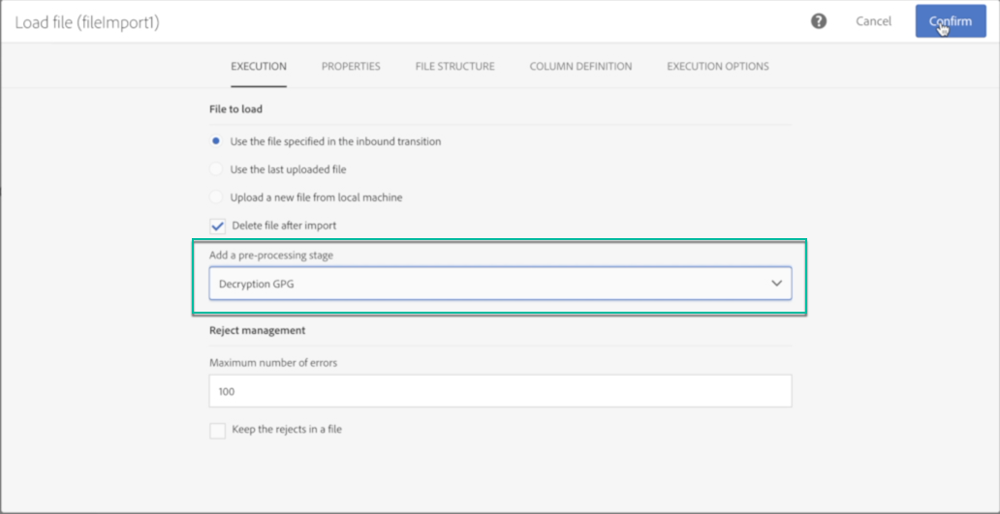
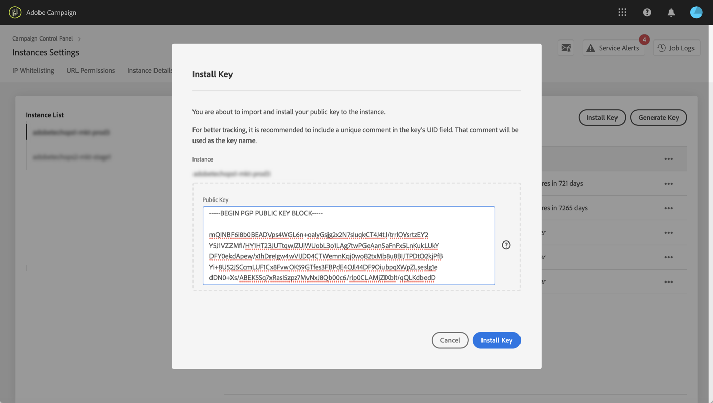

# Gestione dei dati crittografati {#managing-encrypted-data}

## Informazioni sulle fasi di pre-elaborazione {#about-preprocessing-stages}

In alcuni casi, i dati da importare sui server delle campagne potrebbero dover essere crittografati, ad esempio se contengono dati PII.

Per poter crittografare i dati in uscita o decrittografare quelli in arrivo, è necessario gestire le chiavi GPG tramite l&#39; [Pannello di controllo Campaign](https://docs.adobe.com/content/help/it-IT/control-panel/using/instances-settings/gpg-keys-management.html).

>[!NOTE]
>
>Il Pannello di controllo Campaign è disponibile per tutti i clienti ospitati su AWS (ad eccezione dei clienti che ospitano le proprie istanze di marketing in sede).

Se non siete autorizzati a utilizzare il Pannello di controllo Campaign, dovete contattare  Assistenza clienti di Adobe in modo che forniscano all&#39;istanza i comandi di cifratura/decrittazione necessari. A tal fine, inviare una richiesta indicando:

* L&#39; **etichetta** che verrà visualizzata nell&#39;interfaccia di Campaign per utilizzare il comando. Ad esempio &quot;Cifra file&quot;.
* Il **comando** da installare nell’istanza.

Una volta elaborata la richiesta, i comandi di cifratura/decrittazione saranno disponibili nel **[!UICONTROL Pre-processing stage]** campo dalle **[!UICONTROL Load file]** attività e **[!UICONTROL Extract file]** . Potete utilizzarli per decifrare o cifrare i file da importare o esportare.

**Argomenti correlati:**

* [Load file](../../automating/using/load-file.md)
* [Extract file](../../automating/using/extract-file.md)

## Caso di utilizzo: Importazione di dati crittografati con una chiave generata dal Pannello di controllo Campaign {#use-case-gpg-decrypt}

In questo caso, verrà creato un flusso di lavoro per importare i dati crittografati in un sistema esterno, utilizzando una chiave generata nel Pannello di controllo Campaign.

In [questa sezione](https://docs.adobe.com/content/help/en/campaign-standard-learn/tutorials/administrating/control-panel/gpg-key-management/decrypting-data.html)è disponibile anche un video di esercitazione che mostra come usare una chiave GPG per decifrare i dati.

Le operazioni da eseguire per questo caso di utilizzo sono le seguenti:

1. Utilizzate il Pannello di controllo Campaign per generare una coppia di chiavi (pubblica/privata). I passaggi dettagliati sono disponibili nella documentazione [dell&#39;](https://docs.adobe.com/content/help/en/control-panel/using/instances-settings/gpg-keys-management.html#decrypting-data)Pannello di controllo Campaign.

   * La chiave pubblica verrà condivisa con il sistema esterno, che la utilizzerà per crittografare i dati da inviare a Campaign.
   * La chiave privata verrà utilizzata da Campaign per decifrare i dati crittografati in arrivo.

   

1. Nel sistema esterno, utilizzare la chiave pubblica scaricata dal Pannello di controllo Campaign per cifrare i dati da importare in Campaign Standard.

   

1. In Campaign Standard, creare un flusso di lavoro per importare i dati crittografati e decifrarlo utilizzando la chiave privata installata tramite il Pannello di controllo Campaign. A tal fine, verrà creato un flusso di lavoro come segue:

   

   * **[!UICONTROL Transfer file]** activity: Trasferisce il file da un&#39;origine esterna a Campaign. In questo esempio, vogliamo trasferire il file da un server SFTP.
   * **[!UICONTROL Load file]** activity: Carica i dati dal file nel database e decrittografalo utilizzando la chiave privata generata nel Pannello di controllo Campaign.

1. Aprite l&#39; **[!UICONTROL Transfer file]** attività e configuratela in base alle vostre esigenze. Concetti globali su come configurare l&#39;attività sono disponibili in [questa sezione](../../automating/using/load-file.md).

   Nella **[!UICONTROL Protocol]** scheda, specificate i dettagli relativi al server sftp e al file .gpg cifrato che desiderate trasferire.

   

1. Aprite l&#39; **[!UICONTROL Load file]** attività, quindi configuratela in base alle vostre esigenze. Concetti globali su come configurare l&#39;attività sono disponibili in [questa sezione](../../automating/using/load-file.md).

   Aggiungete una fase di pre-elaborazione all&#39;attività, per decifrare i dati in arrivo. A tale scopo, selezionare l&#39; **[!UICONTROL Decryption GPG]** opzione dall&#39;elenco.

   >[!NOTE]
   >
   >Non è necessario specificare la chiave privata da utilizzare per decrittografare i dati. La chiave privata è memorizzata nel Pannello di controllo Campaign, che rileverà automaticamente la chiave da utilizzare per decrittografare il file.

   

1. Fate clic **[!UICONTROL OK]** per confermare la configurazione dell&#39;attività.

1. Ora puoi eseguire il flusso di lavoro.

## Caso di utilizzo: Cifratura ed esportazione di dati tramite una chiave installata sul Pannello di controllo Campaign {#use-case-gpg-encrypt}

In questo caso, verrà creato un flusso di lavoro per la cifratura e l&#39;esportazione dei dati tramite una chiave installata sul Pannello di controllo Campaign.

In [questa sezione](https://docs.adobe.com/content/help/en/campaign-standard-learn/tutorials/administrating/control-panel/gpg-key-management/using-a-gpg-key-to-encrypt-data.html)è disponibile anche un video di esercitazione che mostra come utilizzare una chiave GPG per cifrare i dati.

Le operazioni da eseguire per questo caso di utilizzo sono le seguenti:

1. Generate una coppia di chiavi GPG (pubblica/privata) utilizzando un&#39;utility GPG, quindi installate la chiave pubblica sul Pannello di controllo Campaign. I passaggi dettagliati sono disponibili nella documentazione [dell&#39;](https://docs.adobe.com/content/help/en/control-panel/using/instances-settings/gpg-keys-management.html#encrypting-data)Pannello di controllo Campaign.

   

1. In Campaign Standard, genera un flusso di lavoro per esportare i dati ed esportarli utilizzando la chiave privata installata tramite il Pannello di controllo Campaign. A tal fine, verrà creato un flusso di lavoro come segue:

   

   * **[!UICONTROL Query]** activity: In questo esempio, si desidera eseguire una query per eseguire il targeting dei dati del database che si desidera esportare.
   * **[!UICONTROL Extract file]** activity: Cifra ed estrae i dati in un file.
   * **[!UICONTROL Transfer file]** activity: Trasferisce il file contenente i dati crittografati a un server SFTP.

1. Configurate l&#39; **[!UICONTROL Query]** attività per eseguire il targeting dei dati desiderati dal database. Per ulteriori informazioni al riguardo, consulta [questa sezione](../../automating/using/query.md).

1. Aprite l&#39; **[!UICONTROL Extract file]** attività e configuratela in base alle vostre esigenze (file di output, colonne, formato, ecc.). Concetti globali su come configurare l&#39;attività sono disponibili in [questa sezione](../../automating/using/extract-file.md).

   Aggiungete un passaggio di pre-elaborazione all&#39;attività, per cifrare i dati da estrarre. A tal fine, selezionare la chiave GPG di crittografia da utilizzare per cifrare i dati.

   

   >[!NOTE]
   >
   >Il valore tra parentesi è il **commento** definito durante la generazione della coppia di chiavi con lo strumento di cifratura GPG. Assicurarsi di selezionare la chiave di corrispondenza corretta, altrimenti il destinatario non sarà in grado di decifrare il file.

1. Aprite l&#39; **[!UICONTROL Transfer file]** attività, quindi specificate il server SFTP al quale desiderate inviare il file. Concetti globali su come configurare l&#39;attività sono disponibili in [questa sezione](../../automating/using/transfer-file.md).

   

1. Ora puoi eseguire il flusso di lavoro. Una volta eseguita, la destinazione dei dati dalla query verrà esportata nel server SFTP in un file .gpg crittografato.

   
