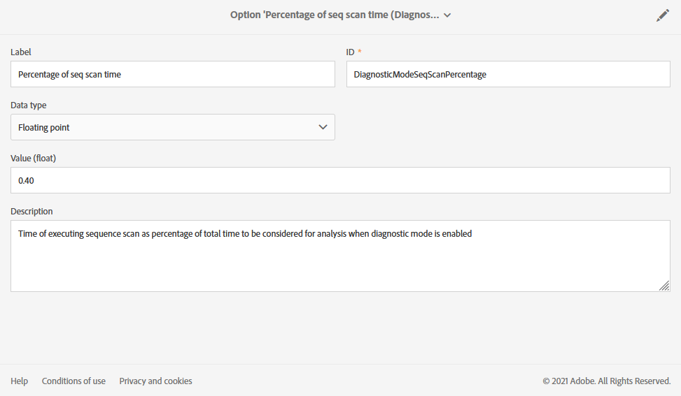

# Gestione delle opzioni di esecuzione {#managing-execution-options}

Per modificare le opzioni di esecuzione di un flusso di lavoro, utilizza  per accedere alle proprietà del flusso di lavoro e selezionare **[!UICONTROL Execution]** sezione.

Le opzioni possibili sono:

* **[!UICONTROL Default affinity]**: questo campo ti consente di forzare l’esecuzione di un flusso di lavoro o di un’attività del flusso di lavoro su un computer specifico.

* **[!UICONTROL History in days]**: specifica il numero di giorni dopo i quali la cronologia deve essere eliminata. La cronologia contiene elementi relativi al flusso di lavoro: registri, attività, eventi (oggetti tecnici collegati all’operazione del flusso di lavoro), nonché file scaricati da **[!UICONTROL Transfer file]** attività. Per i modelli di flusso di lavoro preconfigurati, il valore predefinito è 30 giorni.

   L’eliminazione della cronologia viene eseguita dal flusso di lavoro tecnico per la pulizia del database, che viene eseguito quotidianamente per impostazione predefinita (vedere [Elenco dei flussi di lavoro tecnici](../../administration/using/technical-workflows.md).)

   >[!IMPORTANT]
   >
   >Se il **[!UICONTROL History in days]** Se questo campo viene lasciato vuoto, il suo valore verrà considerato come &quot;1&quot;, il che significa che la cronologia verrà eliminata dopo 1 giorno.

* **[!UICONTROL Save SQL queries in the log]**: consente di salvare le query SQL dal flusso di lavoro nei registri.

* **[!UICONTROL Diagnostic mode (Log execution plan of long running queries and give recommendations)]**: seleziona questa opzione se desideri che venga registrato l’intero piano di esecuzione. Per impostazione predefinita, è disabilitata.

   Per ulteriori informazioni su questa opzione, consulta [sezione](#diagnostic-mode).

* **[!UICONTROL Keep interim results]**: seleziona questa opzione se desideri visualizzare i dettagli delle transizioni.

   >[!CAUTION]
   >
   >Questa opzione consuma molto spazio su disco ed è progettata per consentire la creazione di un flusso di lavoro, garantendone la corretta configurazione e il giusto comportamento. Lascia deselezionata questa opzione nelle istanze di produzione.

* **[!UICONTROL Execute in the engine (do not use in production)]**: consente di eseguire il flusso di lavoro a livello locale, a scopo di test dell’ambiente di sviluppo.

* **[!UICONTROL Severity]**: consente di specificare un livello di priorità per l’esecuzione dei flussi di lavoro nell’istanza di Adobe Campaign. Questo campo viene utilizzato dai team Adobe solo a scopo di monitoraggio.

Il **[!UICONTROL Error management]** Questa sezione fornisce opzioni aggiuntive che consentono di gestire il comportamento dei flussi di lavoro in caso di errori. Queste opzioni sono descritte in dettaglio nella [Gestione degli errori](../../automating/using/monitoring-workflow-execution.md#error-management) sezione.

## Modalità diagnostica {#diagnostic-mode}

>[!CAUTION]
>
>Questa opzione può avere un impatto significativo sulle prestazioni del flusso di lavoro e deve essere utilizzata con moderazione.

Quando è attivata, la **[!UICONTROL Diagnostic mode (Log execution plan of long running queries and give recommendations)]** opzione in **[!UICONTROL Execution]** sezione delle proprietà del flusso di lavoro registra l’intero piano di esecuzione se una query richiede più di un minuto.

Dopo aver abilitato questa opzione e aver avviato il flusso di lavoro, se la query richiede più di un minuto, il piano di esecuzione verrà registrato. È quindi possibile recuperare il piano di esecuzione utilizzando EXPLAIN ANALYZE.

Per ulteriori informazioni, consulta [Documentazione di PostgreSQL](https://www.postgresql.org/docs/9.4/using-explain.html).

Se in questa query è presente un&#39;analisi di sequenza, **[!UICONTROL Diagnostic mode]** fornirà anche consigli per creare un indice con l’aiuto di un’espressione di filtro.

>[!NOTE]
>
> Queste raccomandazioni sono destinate esclusivamente a scopi di riferimento e devono essere utilizzate con attenzione a seconda del caso d’uso.

Per attivare i consigli, è necessario soddisfare le due condizioni seguenti durante l’esecuzione del flusso di lavoro:

* La scansione della sequenza richiede più del 40% del tempo della query.

* Le righe risultanti dopo la scansione della sequenza sono meno dell’1 % delle righe totali presenti nella tabella.

Puoi gestire l’opzione dal menu avanzato selezionando **[!UICONTROL Administration]** > **[!UICONTROL Application settings]** > **[!UICONTROL Options]**:

* **[!UICONTROL Time of query execution (in milliseconds)(DiagnosticModeQueryTime)]**: da **[!UICONTROL Value]** , è possibile impostare una nuova ora per l’esecuzione della query. Se l’esecuzione della query supera questo valore, il piano di esecuzione verrà registrato.

   

* **[!UICONTROL Percentage of seq scan time (DiagnosticModeSeqScanPercentage)]**: da **[!UICONTROL Value]** , è possibile modificare la percentuale di tempo di query richiesta dall&#39;analisi della sequenza per generare il consiglio.

   
