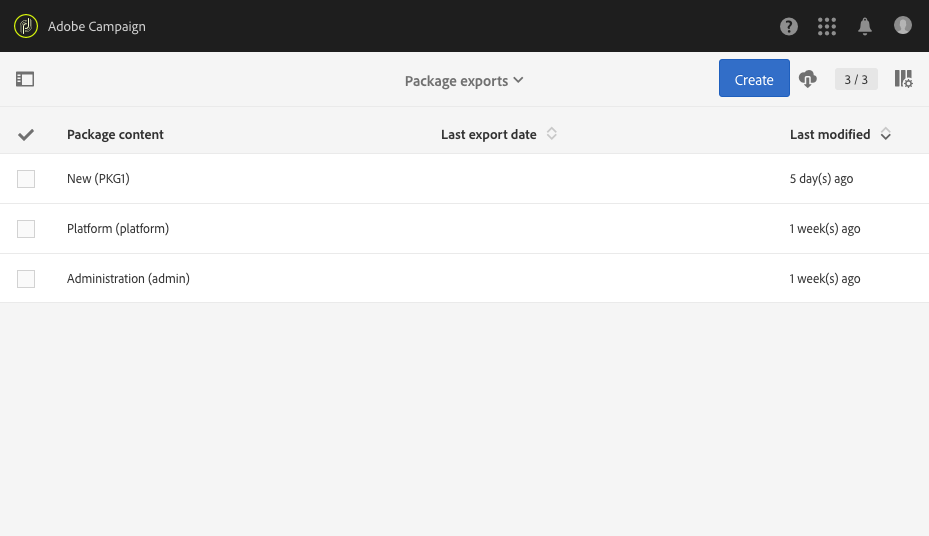

# Gestione dei pacchetti{#managing-packages}

Gli amministratori possono definire pacchetti per lo scambio di risorse tra diverse istanze di Adobe Campaign attraverso file XML strutturati. Si può trattare di parametri di configurazione o dati.

Ciò può essere utile per trasferire dati da un server all’altro o per replicare la configurazione di un’istanza.

I pacchetti sono disponibili nei menu **[!UICONTROL Administration]** > **[!UICONTROL Deployment]** > **[!UICONTROL Package exports]** o **[!UICONTROL Package imports]**. I due menu funzionano in modo simile.

Gli elementi di ogni elenco vengono visualizzati per impostazione predefinita in base alla data di modifica o installazione, dal più recente al meno recente.

Per visualizzare e modificare il contenuto di un elemento, fai clic sulla relativa etichetta. Consulta le sezioni [Esportazione di un pacchetto](#exporting-a-package) e [Importazione di un pacchetto](#importing-a-package).

## Esportazioni dei pacchetti {#package-exports}

### Pacchetti standard {#standard-packages}

**[!UICONTROL Platform]** e **[!UICONTROL Administration]** sono due pacchetti incorporati, ognuno contenente un elenco predefinito di risorse da esportare. È possibile aprirli in modalità di sola lettura e sono adatti solo all’esportazione.

>[!IMPORTANT]
>
>L’esportazione dei pacchetti non è autorizzata se le risorse esportate dispongono di ID predefiniti. Pertanto, è necessario modificare gli ID delle risorse esportabili utilizzando un nome diverso dai modelli forniti come standard da Adobe Campaign Standard. Ad esempio, per esportare profili di test, non è necessario utilizzare un ID contenente il valore &quot;SDM&quot; o &quot;sdm&quot;.
>
>Quando tenti di esportare pacchetti contenenti ID predefiniti, puoi visualizzare errori quali: &quot;Il tipo di entità ‘Brands (branding)’ utilizza un ID predefinito (‘BRD1’) che può causare un conflitto durante l’importazione del pacchetto. Cambia questo nome e ripeti l’operazione&quot;.

I passaggi per l’esportazione del pacchetto sono descritti nella sezione [Esportazione di un pacchetto](#exporting-a-package).

* Il pacchetto **[!UICONTROL Platform]** raggruppa tutte le risorse aggiunte durante la configurazione tecnica: risorse personalizzate, set di risorse personalizzate, trigger e opzioni dell’applicazione con il tipo **[!UICONTROL System]**.
* Il pacchetto **[!UICONTROL Administration]** raggruppa tutti gli oggetti aggiunti durante la configurazione aziendale, ad esempio: modelli di campagna, di contenuto, di consegna, della pagina di destinazione, del programma e del flusso di lavoro.

   Include inoltre i seguenti oggetti: blocchi di contenuto, mappature del target, account esterni, unità organizzative, opzioni di applicazione con il tipo **[!UICONTROL User]**, ruoli, tipologie, regole di tipologia e utenti.

>[!NOTE]
>
>Non è possibile modificare il contenuto di questi due pacchetti. Al contrario, questi pacchetti contengono sempre i dati più aggiornati disponibili. Puoi [creare pacchetti personalizzati](#creating-a-package) per esportare elementi specifici.

### Creazione di un pacchetto {#creating-a-package}

Devi creare un pacchetto, se hai la necessità di esportare set di dati specifici.

Per creare un pacchetto, devi disporre dei diritti di amministrazione.

1. Da **[!UICONTROL Administration]** > **[!UICONTROL Deployment]** > **[!UICONTROL Package exports]**, fai clic sul pulsante **[!UICONTROL Create]** nell’elenco dei contenuti del pacchetto.

   L’elemento viene creato immediatamente. Per annullare la creazione, torna all’elenco e seleziona la casella corrispondente per eliminarlo.

1. Nella schermata del contenuto del pacchetto, specifica un nome e un ID.
1. Fai clic sul pulsante **[!UICONTROL Edit properties]** se desideri aggiungere una descrizione e limitare l’accesso a determinati utenti.

   

1. Utilizza il pulsante **[!UICONTROL Create element]** nella scheda **[!UICONTROL Export content]** per selezionare le risorse da esportare.

   

1. Le risorse sono visualizzate in ordine alfabetico e possono essere filtrate per nome. Il nome tecnico viene visualizzato tra parentesi. Seleziona un elemento dall’elenco e conferma.

   

1. Il nome della risorsa viene visualizzato nella scheda **[!UICONTROL Export content]**. Per modificare una risorsa, seleziona la casella corrispondente e utilizza il pulsante **[!UICONTROL Show detail of the element selected]**.

   

1. L’editor delle query ti consente di filtrare gli elementi da esportare. Per ulteriori informazioni, consulta la sezione [Modifica delle query](../../automating/using/editing-queries.md#creating-queries).

   

   >[!NOTE]
   >
   >Puoi esportare fino a 5000 oggetti per risorsa.

1. Dopo che hai specificato tutte le risorse da esportare, salva la selezione.

Ora il pacchetto viene creato ed è pronto per l’esportazione.

### Esportazione di un pacchetto {#exporting-a-package}

L’esportazione di un pacchetto ti consente di salvare uno stato specifico di una risorsa da reimportare in un’altra istanza o in un secondo momento nella stessa istanza.

>[!CAUTION]
>
>L’esportazione dei pacchetti non è autorizzata se le risorse esportate dispongono di ID preconfigurati. Pertanto, è necessario modificare gli ID delle risorse esportabili utilizzando un nome diverso dai modelli forniti come standard da Adobe Campaign Standard. Ad esempio, per esportare profili di test, non è necessario utilizzare un ID contenente il valore &quot;SDM&quot; o &quot;sdm&quot;.

1. Seleziona un pacchetto per accedere ai relativi dettagli da **[!UICONTROL Administration]** > **[!UICONTROL Deployment]** > **[!UICONTROL Package exports]**.
1. Verifica che il pacchetto contenga i dati necessari.
1. Fai clic sul pulsante **[!UICONTROL Start export]**.

Il file esportato viene archiviato nella cartella di download del browser in uso. Viene automaticamente denominato &quot;pacchetto_xxx.xml&quot;, dove &quot;xxx&quot; corrisponde all’ID del pacchetto.

Al termine dell’operazione vengono visualizzate diverse sezioni:

* **[!UICONTROL Export status]**: questa sezione mostra se l’operazione è stata eseguita correttamente.

   

* Puoi consultare i diversi passaggi dell’esportazione tramite la scheda **[!UICONTROL Log]**. Questa contiene gli stati di tutte le esportazioni precedenti.

   

>[!NOTE]
>
>Durante la selezione di un elemento dall’elenco del contenuto del pacchetto che è già stato esportato, le schede **[!UICONTROL Log]** e **[!UICONTROL Last export]** sono ancora disponibili.

## Importazioni dei pacchetti {#package-imports}

### Aggiornamenti di sistema {#system-updates}

L’elenco delle importazioni dei pacchetti riportato sopra contiene le importazioni automatiche collegate agli aggiornamenti eseguiti da Adobe.

La scheda **[!UICONTROL Execution logs]** archivia tutti i passaggi dell’importazione. Un pannello laterale visualizza le informazioni generali.

>[!NOTE]
>
>Questi elementi sono accessibili in modalità di sola lettura.

### Importazione di un pacchetto {#importing-a-package}

Un amministratore può importare manualmente un pacchetto proveniente da un’esportazione eseguita in precedenza da un’istanza di Adobe Campaign. Per ulteriori informazioni, consulta la sezione [Esportazioni dei pacchetti](#package-exports).

L’importazione manuale del pacchetto è composta da due passaggi: prima devi caricare un file, poi puoi importarne il contenuto.

1. Da **[!UICONTROL Administration]** > **[!UICONTROL Deployment]** > **[!UICONTROL Package imports]**, fai clic sul pulsante **[!UICONTROL Create]** nell’elenco di importazione del pacchetto.

   L’elemento viene creato immediatamente. Per annullare la creazione, torna all’elenco e seleziona la casella corrispondente per eliminarlo.

1. Specifica un nome e un ID per la nuova importazione.
1. Seleziona il file da caricare trascinandolo e rilasciandolo o facendo clic sul collegamento **[!UICONTROL Select from folder]**.

   È necessario che i file importati siano in formato XML o ZIP (contenente un file XML).

   

   >[!NOTE]
   >
   >Per sostituire il documento caricato, inizia eliminando il file tramite l’icona X a destra del nome, quindi ripeti l’operazione.

1. Dopo che il file è stato caricato, importane il contenuto nel database utilizzando il pulsante **[!UICONTROL Start import]**.

   

Al termine dell’operazione vengono visualizzate diverse sezioni:

* **[!UICONTROL Import status]**: questa sezione mostra se l’operazione è stata eseguita correttamente.
* Puoi consultare i diversi passaggi dell’importazione tramite la scheda **[!UICONTROL Execution logs]**. Ciò è particolarmente importante per visualizzare errori.

   

Al termine dell’importazione di un pacchetto non puoi importarlo nuovamente dallo stesso elemento. Puoi modificarne solo l’etichetta e l’ID.

Per reimportare lo stesso pacchetto, devi tornare all’elenco di importazione del pacchetto, creare un elemento e quindi caricare di nuovo il file selezionato.
