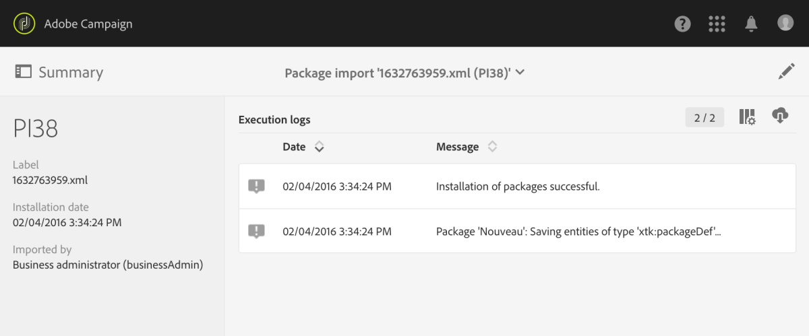

# Managing packages{#managing-packages}

Gli amministratori possono definire i pacchetti per scambiare risorse tra diverse istanze di Adobe Campaign tramite file XML strutturati. Questi possono essere parametri di configurazione o dati.

Potrebbe essere utile per trasferire dati da un server a un altro o per replicare la configurazione di un'istanza.

Packages are available under the **[!UICONTROL Administration]** &gt; **[!UICONTROL Deployment]** &gt; **[!UICONTROL Package exports]** or **[!UICONTROL Package imports]** menus. I due menu funzionano in modo simile.

Gli elementi di ciascun elenco vengono visualizzati per impostazione predefinita in base alla data di modifica o di installazione, dal più recente alle meno recenti.

Per visualizzare e modificare il contenuto di un elemento, fate clic sulla relativa etichetta. Refer to the [Exporting a package](../../automating/using/managing-packages.md#exporting-a-package) and [Importing a package](../../automating/using/managing-packages.md#importing-a-package) sections.

## Package exports {#package-exports}

### Standard packages {#standard-packages}

**[!UICONTROL Platform]** e **[!UICONTROL Administration]** sono due pacchetti incorporati, ciascuno contenente un elenco predefinito di risorse da esportare. Possono essere aperti in modalità di sola lettura e sono idonei solo per l'esportazione.

>[!CAUTION]
>
>L'esportazione dei pacchetti non è autorizzata se le risorse esportate dispongono di ID predefiniti. Pertanto, gli ID di risorse opuscole devono essere modificati utilizzando un nome diverso dai modelli forniti come standard da Adobe Campaign Standard. Ad esempio, per esportare i profili di prova, non è necessario utilizzare un ID contenente il valore "SDM" o "sdm". Quando si tenta di esportare pacchetti contenenti ID predefiniti, si possono verificare errori quali: " Il tipo di entità "Brands (branding)" utilizza un ID predefinito ('BRD 1 ') che può provocare un conflitto durante l'importazione del pacchetto. Modificate questo nome e ripetete l'operazione. "

The package export steps are described in the [Exporting a package](../../automating/using/managing-packages.md#exporting-a-package) section.

* **[!UICONTROL Platform]** Il pacchetto rimuove tutte le risorse aggiunte durante la configurazione tecnica: risorse personalizzate, set di risorse personalizzati, attivatori e opzioni dell'applicazione con il **[!UICONTROL System]** tipo.
* **[!UICONTROL Administration]** Il pacchetto rimuove tutti gli oggetti aggiunti durante la configurazione aziendale, ad esempio: modelli di campagne, modelli di contenuto, modelli di consegna, modelli di pagina di destinazione, modelli di programmi e modelli di flusso di lavoro.

   It also includes the following objects: content blocks, target mappings, external accounts, organizational units, application options with the **[!UICONTROL User]** type, roles, typologies, typology rules and users.

>[!NOTE]
>
>Il contenuto di questi due pacchetti non può essere modificato. Per contro, questi pacchetti contengono sempre i dati più aggiornati disponibili. You can [create your own packages](../../automating/using/managing-packages.md#creating-a-package) to export specific elements.

### Creating a package {#creating-a-package}

Se necessario, dovete creare un pacchetto per esportare specifici set di dati.

Per creare un pacchetto, sono necessari i diritti di amministrazione.

1. From **[!UICONTROL Administration]** &gt; **[!UICONTROL Deployment]** &gt; **[!UICONTROL Package exports]**, click the **[!UICONTROL Create]** button in the list of package contents.

   L'elemento viene creato immediatamente. Per annullare la creazione, tornare all'elenco e controllare la casella corrispondente per eliminarla.

1. Nella schermata del contenuto del pacchetto, specificate un nome e un ID.
1. Click the **[!UICONTROL Edit properties]** button if you would like to add a description and restrict access to certain users.

   

1. Use the **[!UICONTROL Create element]** button in the **[!UICONTROL Export content]** tab to select the resources you wish to export.

   

1. Le risorse vengono visualizzate in ordine alfabetico e possono essere filtrate per nome. Il nome tecnico viene visualizzato tra parentesi. Selezionate un elemento dall'elenco e confermate.

   

1. The resource name is displayed in the **[!UICONTROL Export content]** tab. To modify a resource, check the corresponding box and use the **[!UICONTROL Show detail of the element selected]** button.

   

1. L'editor query consente di filtrare gli elementi da esportare. For more on this, refer to the [Editing queries](../../automating/using/editing-queries.md#creating-queries) section.

   

   >[!NOTE]
   >
   >È possibile esportare fino a 5000 oggetti per risorsa.

1. Una volta specificate tutte le risorse da esportare, salvate la selezione.

Il pacchetto viene ora creato ed è pronto per l'esportazione.

### Exporting a package {#exporting-a-package}

L'esportazione di un pacchetto consente di salvare uno stato specifico di una risorsa che sarà possibile reimportare in un'altra istanza o più avanti sulla stessa istanza.

>[!CAUTION]
>
>L'esportazione dei pacchetti non è autorizzata se le risorse esportate dispongono di ID forniti. Pertanto, gli ID di risorse opuscole devono essere modificati utilizzando un nome diverso dai modelli forniti come standard da Adobe Campaign Standard. Ad esempio, per esportare i profili di prova, non è necessario utilizzare un ID contenente il valore "SDM" o "sdm".

1. From **[!UICONTROL Administration]** &gt; **[!UICONTROL Deployment]** &gt; **[!UICONTROL Package exports]**, select a package to access its detail.
1. Verificate che il pacchetto contenga i dati necessari.
1. Click the **[!UICONTROL Start export]** button.

Il file esportato viene memorizzato nella cartella di download del browser utilizzato. Viene automaticamente denominato "package_xxx.xml", dove "xxx" corrisponde all'ID pacchetto.

Al termine dell'operazione, vengono visualizzate diverse sezioni:

* **[!UICONTROL Export status]**: questa sezione mostra se l'operazione è stata eseguita correttamente.

   

* You can consult the different steps of the export via the **[!UICONTROL Log]** tab. Ciò contiene gli stati di tutte le esportazioni precedenti.

   

>[!NOTE]
>
>When selecting an element from the package content list that has already been exported, the **[!UICONTROL Log]** and **[!UICONTROL Last export]** tabs are still available.

## Package imports {#package-imports}

### System updates {#system-updates}

L'elenco di importazione del pacchetto sopra qualsiasi elemento contiene le importazioni automatiche collegate agli aggiornamenti eseguiti da Adobe.

**[!UICONTROL Execution logs]** La scheda memorizza tutti i passaggi di importazione. Un pannello laterale visualizza le informazioni generali.

>[!NOTE]
>
>Questi elementi sono accessibili in modalità di sola lettura.

### Importing a package {#importing-a-package}

Un amministratore può importare manualmente un pacchetto originato da un'esportazione eseguita precedentemente da un'istanza di Adobe Campaign. For more on this, refer to the [Package exports](../../automating/using/managing-packages.md#package-exports) section.

L'importazione manuale del pacchetto consiste in due passaggi: per prima cosa, è necessario caricare un file, quindi importare il relativo contenuto.

1. From **[!UICONTROL Administration]** &gt; **[!UICONTROL Deployment]** &gt; **[!UICONTROL Package imports]**, click the **[!UICONTROL Create]** button in the package import list.

   L'elemento viene creato immediatamente. Per annullare la creazione, tornare all'elenco e controllare la casella corrispondente per eliminarla.

1. Specificate un nome e un ID per la nuova importazione.
1. Select the file you wish to upload by dragging and dropping it, or by clicking the **[!UICONTROL Select from folder]** link.

   I file importati devono essere XML o ZIP (contenente un formato XML).

   

   >[!NOTE]
   >
   >Per sostituire il documento caricato, iniziate eliminando il file tramite l'icona X a destra del nome, quindi ripetete l'operazione.

1. Once the file is uploaded, import its content into the database by using the **[!UICONTROL Start import]** button.

   

Al termine dell'operazione, vengono visualizzate diverse sezioni:

* **[!UICONTROL Import status]**: questa sezione mostra se l'operazione è stata eseguita correttamente.
* You can consult the different steps of the import via the **[!UICONTROL Execution logs]** tab. Questo è particolarmente importante per visualizzare gli errori.

   

Una volta importato un pacchetto, non potete importarlo nuovamente dallo stesso elemento. È possibile modificare solo l'etichetta e l'ID.

Per reimportare lo stesso pacchetto, dovete tornare all'elenco di importazione del pacchetto, creare un elemento, quindi caricare di nuovo il file selezionato.
