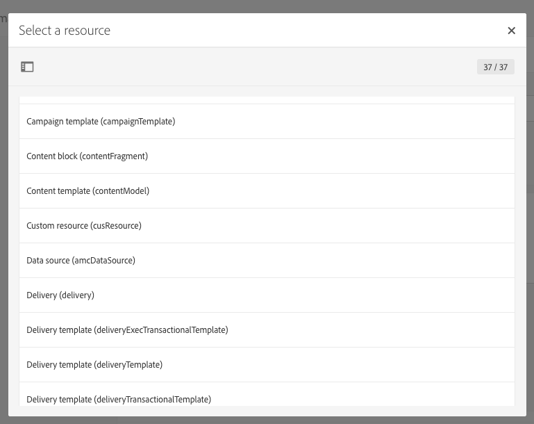

# Gestione dei pacchetti{#managing-packages}

Gli amministratori possono definire pacchetti per lo scambio di risorse tra diverse istanze di Adobe Campaign attraverso file XML strutturati. Questi possono essere parametri di configurazione o dati.

Ciò può essere utile per trasferire dati da un server all'altro o per replicare la configurazione di un'istanza.

I pacchetti sono disponibili in **[!UICONTROL Administration]** &gt; **[!UICONTROL Deployment]** &gt; **[!UICONTROL Package exports]** o **[!UICONTROL Package imports]** nei menu. I due menu funzionano in modo simile.

Gli elementi di ciascun elenco vengono visualizzati per impostazione predefinita in base alla data di modifica o installazione, dalla più recente alla meno recente.

Per visualizzare e modificare il contenuto di un elemento, fate clic sulla relativa etichetta. Fate riferimento alla sezione [Esportazione di un pacchetto](#exporting-a-package) e [Importazione di un pacchetto](#importing-a-package) .

## Esportazioni pacchetti {#package-exports}

### Pacchetti standard {#standard-packages}

**[!UICONTROL Platform]** e **[!UICONTROL Administration]** sono due pacchetti incorporati, ciascuno contenente un elenco predefinito di risorse da esportare. Possono essere aperti in modalità di sola lettura e sono adatti solo all’esportazione.

>[!CAUTION]
>
>L'esportazione dei pacchetti non è autorizzata se le risorse esportate dispongono di ID predefiniti. Pertanto, gli ID delle risorse esportabili devono essere modificati utilizzando un nome diverso dai modelli forniti come standard da Adobe Campaign Standard. Ad esempio, per esportare i profili di test, non è necessario utilizzare un ID contenente il valore "SDM" o "sdm". Quando tentate di esportare pacchetti contenenti ID predefiniti, potete visualizzare errori quali: "Il tipo di entità 'Brands (branding)' utilizza un ID predefinito ('BRD1') che può causare un conflitto durante l'importazione del pacchetto. Cambiate questo nome e ripetete l'operazione."

I passaggi per l’esportazione del pacchetto sono descritti nella sezione [Esportazione di un pacchetto](#exporting-a-package) .

* Il **[!UICONTROL Platform]** pacchetto raggruppa tutte le risorse aggiunte durante la configurazione tecnica: risorse personalizzate, set di risorse personalizzate, attivatori e opzioni dell'applicazione con il **[!UICONTROL System]** tipo.
* Il **[!UICONTROL Administration]** pacchetto raggruppa tutti gli oggetti aggiunti durante la configurazione aziendale, ad esempio: modelli di campagna, modelli di contenuto, modelli di consegna, modelli di pagina di destinazione, modelli di programma e modelli di flusso di lavoro.

   Include inoltre i seguenti oggetti: blocchi di contenuto, mappature di destinazione, account esterni, unità organizzative, opzioni di applicazione con il **[!UICONTROL User]** tipo, ruoli, tipologie, regole di tipologia e utenti.

>[!NOTE]
>
>Il contenuto di questi due pacchetti non può essere modificato. Al contrario, questi pacchetti contengono sempre i dati più aggiornati disponibili. Potete [creare pacchetti](#creating-a-package) personalizzati per esportare elementi specifici.

### Creazione di un pacchetto {#creating-a-package}

Per esportare set di dati specifici, è necessario creare un pacchetto.

Per creare un pacchetto, sono necessari i diritti di amministrazione.

1. Da **[!UICONTROL Administration]** &gt; **[!UICONTROL Deployment]** &gt; **[!UICONTROL Package exports]**, fate clic sul **[!UICONTROL Create]** pulsante nell’elenco dei contenuti del pacchetto.

   L’elemento viene creato immediatamente. Per annullare la creazione, tornare all'elenco e selezionare la casella corrispondente per eliminarlo.

1. Nella schermata del contenuto del pacchetto, specificate un nome e un ID.
1. Fate clic sul **[!UICONTROL Edit properties]** pulsante per aggiungere una descrizione e limitare l’accesso a determinati utenti.

   

1. Utilizzate il **[!UICONTROL Create element]** pulsante nella **[!UICONTROL Export content]** scheda per selezionare le risorse da esportare.

   

1. Le risorse sono visualizzate in ordine alfabetico e possono essere filtrate per nome. Il nome tecnico viene visualizzato tra parentesi. Selezionate un elemento dall’elenco e confermate.

   

1. Il nome della risorsa viene visualizzato nella **[!UICONTROL Export content]** scheda. Per modificare una risorsa, selezionate la casella corrispondente e utilizzate il **[!UICONTROL Show detail of the element selected]** pulsante.

   

1. L’editor di query consente di filtrare gli elementi da esportare. Per ulteriori informazioni, consultare la sezione [Modifica delle query](../../automating/using/editing-queries.md#creating-queries) .

   

   >[!NOTE]
   >
   >Potete esportare fino a 5000 oggetti per risorsa.

1. Dopo aver specificato tutte le risorse da esportare, salvate la selezione.

Il pacchetto è stato creato ed è pronto per essere esportato.

### Esportazione di un pacchetto {#exporting-a-package}

L’esportazione di un pacchetto consente di salvare uno stato specifico di una risorsa da reimportare in un’altra istanza o in un secondo momento nella stessa istanza.

>[!CAUTION]
>
>L'esportazione dei pacchetti non è autorizzata se le risorse esportate dispongono di ID predefiniti. Pertanto, gli ID delle risorse esportabili devono essere modificati utilizzando un nome diverso dai modelli forniti come standard da Adobe Campaign Standard. Ad esempio, per esportare i profili di test, non è necessario utilizzare un ID contenente il valore "SDM" o "sdm".

1. Da **[!UICONTROL Administration]** &gt; **[!UICONTROL Deployment]** &gt; **[!UICONTROL Package exports]**, selezionate un pacchetto per accedere ai dettagli.
1. Verificate che il pacchetto contenga i dati necessari.
1. Fate clic sul **[!UICONTROL Start export]** pulsante.

Il file esportato viene memorizzato nella cartella di download del browser in uso. Viene automaticamente denominato "package_xxx.xml", dove "xxx" corrisponde all'ID del pacchetto.

Al termine dell'operazione, vengono visualizzate diverse sezioni:

* **[!UICONTROL Export status]**: in questa sezione viene indicato se l'operazione è stata eseguita correttamente.

   

* È possibile consultare i diversi passaggi dell'esportazione tramite la **[!UICONTROL Log]** scheda. Contiene gli stati di tutte le esportazioni precedenti.

   

>[!NOTE]
>
>Quando selezionate un elemento dall'elenco del contenuto del pacchetto che è già stato esportato, le schede **[!UICONTROL Log]** e **[!UICONTROL Last export]** sono ancora disponibili.

## Importazioni pacchetti {#package-imports}

### Aggiornamenti del sistema {#system-updates}

L'elenco di importazioni di pacchetti riportato sopra contiene le importazioni automatiche collegate agli aggiornamenti eseguiti da Adobe.

La **[!UICONTROL Execution logs]** scheda memorizza tutti i passaggi di importazione. Un pannello laterale visualizza le informazioni generali.

>[!NOTE]
>
>Tali elementi sono accessibili in modalità di sola lettura.

### Importazione di un pacchetto {#importing-a-package}

Un amministratore può importare manualmente un pacchetto proveniente da un'esportazione eseguita in precedenza da un'istanza di Adobe Campaign. Per ulteriori informazioni, consulta la sezione [Esportazioni](#package-exports) pacchetti.

L'importazione manuale del pacchetto è composta da due passaggi: innanzitutto, dovete caricare un file e quindi importarne il contenuto.

1. Da **[!UICONTROL Administration]** &gt; **[!UICONTROL Deployment]** &gt; **[!UICONTROL Package imports]**, fate clic sul **[!UICONTROL Create]** pulsante nell’elenco di importazione del pacchetto.

   L’elemento viene creato immediatamente. Per annullare la creazione, tornare all'elenco e selezionare la casella corrispondente per eliminarlo.

1. Specificate un nome e un ID per la nuova importazione.
1. Selezionate il file da caricare trascinandolo o facendo clic sul **[!UICONTROL Select from folder]** collegamento.

   I file importati devono essere in formato XML o ZIP (contenente un file XML).

   

   >[!NOTE]
   >
   >Per sostituire il documento caricato, iniziate eliminando il file tramite l'icona X a destra del nome, quindi ripetete l'operazione.

1. Una volta caricato il file, importatene il contenuto nel database utilizzando il **[!UICONTROL Start import]** pulsante.

   

Al termine dell'operazione, vengono visualizzate diverse sezioni:

* **[!UICONTROL Import status]**: in questa sezione viene indicato se l'operazione è stata eseguita correttamente.
* È possibile consultare i diversi passaggi dell'importazione tramite la **[!UICONTROL Execution logs]** scheda. Ciò è particolarmente importante per visualizzare gli errori.

   

Una volta importato un pacchetto, non potete importarlo nuovamente dallo stesso elemento. È possibile modificarne solo l’etichetta e l’ID.

Per reimportare lo stesso pacchetto, dovete tornare all'elenco di importazione del pacchetto, creare un elemento e quindi caricare di nuovo il file selezionato.
