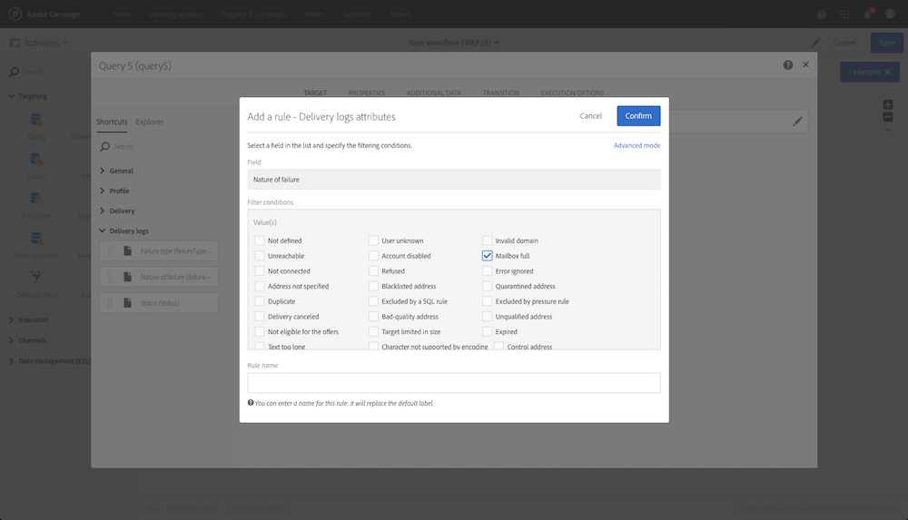
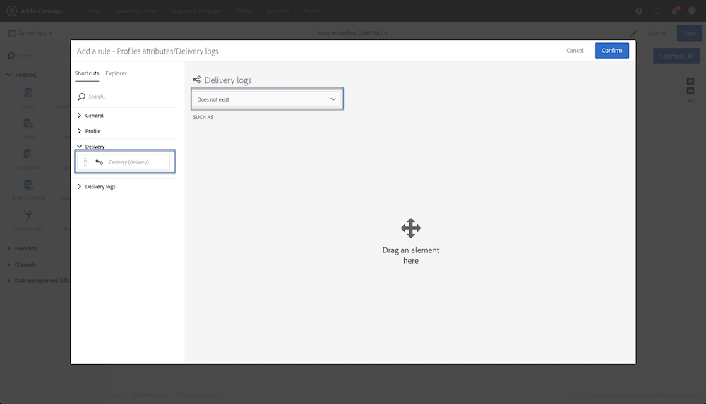
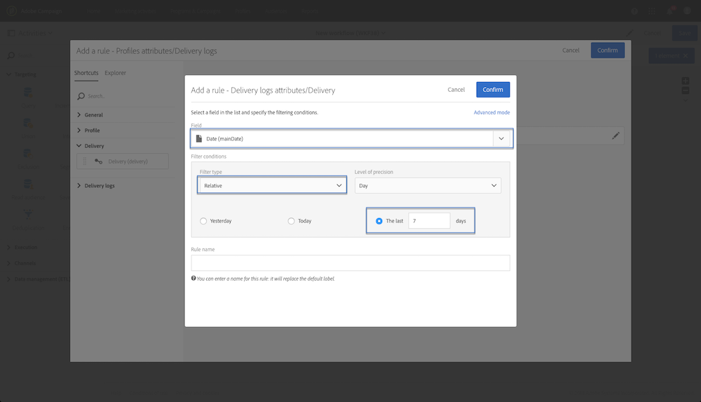
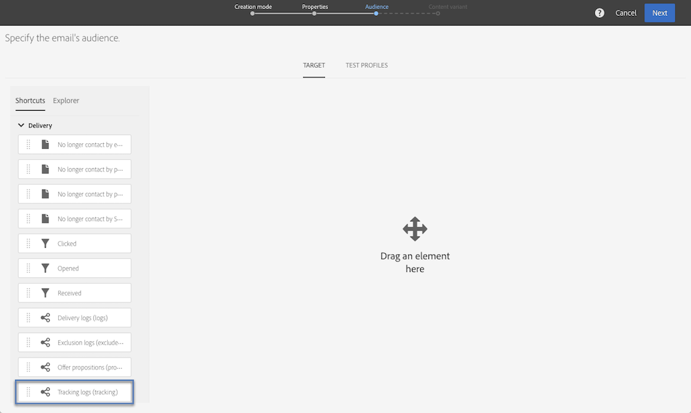

# Esempi di query {#query-samples}

Questa sezione presenta un caso d&#39;uso quando si utilizza un&#39;attività **[!UICONTROL Query]**. Per ulteriori informazioni su come utilizzare un&#39;attività **[!UICONTROL Query]**, fare riferimento a [questa sezione](../../automating/using/query.md).

## Esecuzione del targeting su attributi di profilo semplici {#targeting-on-simple-profile-attributes}

L’esempio seguente mostra un’attività Query configurata per un target di uomini in un’età compresa tra i 18 e i 30 anni che vivono a Londra.

## Esecuzione del targeting su attributi di e-mail {#targeting-on-email-attributes}

L’esempio seguente mostra un’attività Query configurata per eseguire il targeting di profili con il dominio dell’indirizzo e-mail &quot;orange.co.uk&quot;.

L’esempio seguente mostra un’attività Query configurata per eseguire il targeting di profili che hanno fornito l’indirizzo e-mail.

## Esecuzione del targeting di profili che festeggiano il compleanno oggi {#targeting-profiles-whose-birthday-is-today}

L’esempio seguente mostra un’attività Query configurata per eseguire il targeting di profili che festeggiano il compleanno oggi.

1. Trascina il filtro **[!UICONTROL Birthday]** nella query.

   

1. Imposta il **[!UICONTROL Filter type]** su **[!UICONTROL Relative]** e seleziona **[!UICONTROL Today]**.

   

## Esecuzione del targeting di profili che hanno aperto una consegna specifica {#targeting-profiles-who-opened-a-specific-delivery}

L’esempio seguente mostra un’attività Query configurata per filtrare profili che hanno aperto la consegna con l’etichetta &quot;Ora legale&quot;.

1. Trascina il filtro **[!UICONTROL Opened]** nella query.

   

1. Seleziona la consegna, quindi fai clic su **[!UICONTROL Confirm]**.

   

## Esecuzione del targeting di profili con consegne non riuscite per un motivo specifico {#targeting-profiles-for-whom-deliveries-failed-for-a-specific-reason}

L’esempio seguente mostra un’attività Query configurata per filtrare profili con consegne non riuscite perché la casella di posta era piena. Questa query è disponibile solo per gli utenti con diritti di amministrazione e appartenenti alle unità organizzative **[!UICONTROL All (all)]** (consulta [questa sezione](../../administration/using/organizational-units.md)).

1. Seleziona la risorsa **[!UICONTROL Delivery logs]** per filtrare direttamente nella tabella dei registri di consegna (vedi [Utilizzo di risorse diverse dalle dimensioni targeting](../../automating/using/using-resources-different-from-targeting-dimensions.md)).

   

1. Trascina il filtro **[!UICONTROL Nature of failure]** nella query.

   

1. Seleziona il tipo di errore di cui desideri eseguire il targeting. In questo caso **[!UICONTROL Mailbox full]**.

   

## Esecuzione del targeting di profili non contattati negli ultimi 7 giorni {#targeting-profiles-not-contacted-during-the-last-7-days}

L’esempio seguente mostra un’attività Query configurata per filtrare profili che non sono stati contattati negli ultimi 7 giorni.

1. Trascina il filtro **[!UICONTROL Delivery logs (logs)]** nella query.

   

   Seleziona **[!UICONTROL Does not exist]** nell’elenco a discesa, quindi trascina il filtro **[!UICONTROL Delivery]**.

   

1. Configura il filtro come indicato di seguito.

   

## Esecuzione del targeting di profili che hanno fatto clic su un collegamento specifico {#targeting-profiles-who-clicked-a-specific-link-}

1. Trascina il filtro **[!UICONTROL Tracking logs (tracking)]** nella query.

   

1. Trascina il filtro **[!UICONTROL Label (urlLabel)]**.

   

1. Nel campo **[!UICONTROL Value]**, digita l’etichetta definita durante l’inserimento del collegamento nella consegna, quindi conferma.

   
