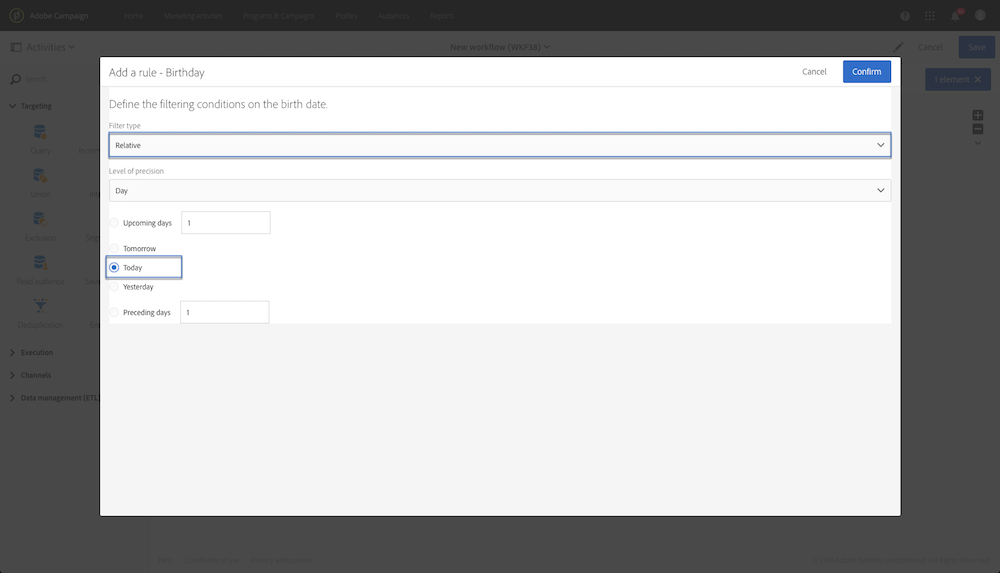

# Query{#query}

## Descrizione {#description}

L' **[!UICONTROL Query]** attività consente di filtrare ed estrarre una serie di elementi dal database di Adobe Campaign. È possibile definire **[!UICONTROL Additional data]** per la popolazione di destinazione tramite una scheda dedicata. Questi dati vengono memorizzati in colonne aggiuntive e possono essere utilizzati solo per il flusso di lavoro in corso.

L'attività utilizza lo strumento di editor di query. Questo strumento è dettagliato in una sezione dedicata.

## Contesto di utilizzo {#context-of-use}

L' **[!UICONTROL Query]** attività può essere utilizzata per vari tipi di usi:

* Segmentazione di singoli utenti per definire la destinazione di un messaggio, un pubblico ecc.
* Arricchimento dei dati dell'intera tabella di database di Adobe Campaign.
* Esportazione dei dati.

## Configurazione {#configuration}

1. Trascinate e rilasciate un' **[!UICONTROL Query]** attività nel flusso di lavoro.
1. Selezionate l'attività, quindi apritela utilizzando il  pulsante delle azioni rapide visualizzate. Per impostazione predefinita, l'attività è preconfigurata per la ricerca di profili.
1. Se desiderate eseguire una query su una risorsa diversa dalla risorsa del profilo, andate alla **[!UICONTROL Properties]** scheda dell'attività e selezionate un **[!UICONTROL Resource]** e un **[!UICONTROL Targeting dimension]**.

   Questo **[!UICONTROL Resource]** consente di perfezionare i filtri visualizzati nella palette, mentre il **[!UICONTROL Targeting dimension]**, contestuale rispetto alla risorsa selezionata, corrisponde al tipo di popolazione che si desidera ottenere (profili identificati, consegne, dati collegati alla risorsa selezionata, ecc.).

   Per ulteriori informazioni, consulta [Impostazione del targeting di dimensioni e risorse](#targeting-dimensions-and-resources).

1. Nella **[!UICONTROL Target]** scheda, eseguire la query definendo e combinando le regole.
1. È possibile definire **[!UICONTROL Additional data]** per la popolazione di destinazione tramite una scheda dedicata. Questi dati vengono memorizzati in colonne aggiuntive e possono essere utilizzati solo per il flusso di lavoro in corso. In particolare, puoi aggiungere dati dalle tabelle del database Adobe Campaign collegate alla dimensione di targeting della query. Consultate la sezione [Arricchimento dei dati](#enriching-data) .

   >[!NOTE]
   >
   >Per impostazione predefinita, l’ **[!UICONTROL Remove duplicate rows (DISTINCT)]** opzione è selezionata nella **[!UICONTROL Advanced options]** scheda della **[!UICONTROL Additional data]** query. Se l' **[!UICONTROL Query]** attività contiene molti (da 100) dati aggiuntivi definiti, si consiglia di deselezionare questa opzione, per motivi di prestazioni. Attenzione: se si deseleziona questa opzione è possibile ottenere duplicati, a seconda dei dati interrogati.

1. Nella **[!UICONTROL Transition]** scheda, l' **[!UICONTROL Enable an outbound transition]** opzione consente di aggiungere una transizione in uscita dopo l'attività di query, anche se non recupera dati.

   Il codice del segmento della transizione in uscita può essere personalizzato utilizzando un'espressione standard e variabili di eventi (consultate [Personalizzazione delle attività con le variabili](../../automating/using/calling-a-workflow-with-external-parameters.md#customizing-activities-with-events-variables)di eventi).

1. Confermate la configurazione dell'attività e salvate il flusso di lavoro.

## Targeting di dimensioni e risorse {#targeting-dimensions-and-resources}

Le dimensioni e le risorse di targeting consentono di definire gli elementi su cui verrà basata una query per determinare la destinazione di una consegna.

Le dimensioni di targeting sono definite nelle mappature di destinazione. For more on this, refer to [this section](../../administration/using/target-mappings-in-campaign.md).

### Definizione della dimensione di targeting e della risorsa di una query {#defining-the-targeting-dimension-and-resource-of-a-query}

La dimensione di targeting e le risorse vengono definite durante la creazione di un flusso di lavoro, nella **[!UICONTROL Properties]** scheda di un'attività Query.

>[!NOTE]
>
>La dimensione di targeting può essere definita anche durante la creazione di un'audience (vedere [questa sezione](../../audiences/using/creating-audiences.md)).

Dimensioni e risorse di destinazione collegate. Le dimensioni di targeting disponibili dipendono quindi dalla risorsa selezionata.

Ad esempio, per la risorsa **[!UICONTROL Profiles (profile)]** saranno disponibili le seguenti dimensioni di targeting:

Mentre per **[!UICONTROL Deliveries (delivery)]**, l'elenco conterrà le seguenti dimensioni di targeting:

Una volta specificate la dimensione di targeting e la risorsa, nella query sono disponibili filtri diversi.

Esempio di filtri disponibili per la **[!UICONTROL Profiles (profile)]** risorsa:

Esempio di filtri disponibili per la **[!UICONTROL Deliveries (delivery)]** risorsa:

### Utilizzo di risorse diverse dalle dimensioni di targeting {#using-resources-different-from-targeting-dimensions}

Per impostazione predefinita, la dimensione di targeting e la risorsa sono impostate per i profili di destinazione.

Tuttavia, potrebbe essere utile utilizzare una risorsa diversa dalla dimensione di targeting se si desidera cercare un record specifico in una tabella lontana.

**Esempio 1: identificare i profili interessati dalla consegna con l'etichetta "Bentornato!"**.

* In questo caso, vogliamo eseguire il targeting dei profili. Imposteremo la dimensione di targeting su **[!UICONTROL Profiles (profile)]**.
* Vogliamo filtrare i profili selezionati in base all'etichetta di consegna. Pertanto, imposteremo la risorsa su **[!UICONTROL Delivery logs]**. In questo modo, filtriamo direttamente nella tabella del registro di consegna, che offrirà prestazioni migliori.

**Esempio 2: identificare i profili che non erano interessati dalla consegna con l'etichetta "Bentornato!"**

Nell'esempio precedente, abbiamo utilizzato una risorsa diversa dalla dimensione di targeting. Questa operazione è possibile solo se si desidera trovare un record **presente** nella tabella lontana (log di consegna nel nostro esempio).

Se si desidera trovare un record che non **sia presente** nella tabella lontana (ad esempio, profili non mirati da una consegna specifica), è necessario utilizzare la stessa dimensione di risorsa e targeting, in quanto il record non sarà presente nella tabella lontana (log di consegna).

* In questo caso, vogliamo eseguire il targeting dei profili. Imposteremo la dimensione di targeting su **[!UICONTROL Profiles (profile)]**.
* Vogliamo filtrare i profili selezionati in base all'etichetta di consegna. Non è possibile filtrare direttamente sui registri di consegna perché stiamo cercando un record non presente nella tabella dei registri di consegna. Pertanto, imposteremo la risorsa per **[!UICONTROL Profile (profile)]** e costruiremo la nostra query sulla tabella dei profili.

## Arricchimento dei dati {#enriching-data}

La **[!UICONTROL Additional data]** scheda delle attività **[!UICONTROL Query]**, **[!UICONTROL Incremental query]** e **[!UICONTROL Enrichment]** consente di arricchire i dati di destinazione e trasferire tali dati alle seguenti attività del flusso di lavoro, dove possono essere utilizzati. In particolare, potete aggiungere:

* Dati semplici
* Aggregati
* Raccolte

Per gli aggregati e le raccolte, **[!UICONTROL Alias]** viene automaticamente definito un ID tecnico per assegnare un'espressione complessa. Questo alias, che deve essere univoco, consente di trovare facilmente gli aggregati e le raccolte in seguito. Potete modificarlo per assegnargli un nome facilmente riconoscibile.

>[!NOTE]
>
>Gli alias devono rispettare le seguenti regole di sintassi: Sono autorizzati solo i caratteri alfanumerici e i caratteri "_". Gli alias seguono la distinzione tra maiuscole e minuscole. L'alias deve iniziare con il carattere "@". Il carattere immediatamente successivo a "@" non deve essere numerico. Ad esempio: @myAlias_1 e @_1Alias corretti; mentre @myAlias#1 e @1Alias non sono corretti.

Dopo aver aggiunto eventuali dati aggiuntivi, puoi applicare un livello di filtro aggiuntivo ai dati inizialmente interessati creando condizioni in base ai dati aggiuntivi definiti.

>[!NOTE]
>
>Per impostazione predefinita, l’ **[!UICONTROL Remove duplicate rows (DISTINCT)]** opzione è selezionata nella **[!UICONTROL Advanced options]** scheda della **[!UICONTROL Additional data]** query. Se l' **[!UICONTROL Query]** attività contiene molti (da 100) dati aggiuntivi definiti, si consiglia di deselezionare questa opzione, per motivi di prestazioni. Attenzione: se si deseleziona questa opzione è possibile ottenere duplicati, a seconda dei dati interrogati.

### Aggiunta di un campo semplice {#adding-a-simple-field}

Aggiungendo un campo semplice come dati aggiuntivi, tale campo diventa direttamente visibile nella transizione in uscita dell'attività. Questo consente all'utente di verificare, ad esempio, che i dati della query siano i dati desiderati.

1. Dalla **[!UICONTROL Additional data]** scheda, aggiungete un nuovo elemento.
1. Nella finestra che si apre, nel **[!UICONTROL Expression]** campo, selezionate uno dei campi disponibili direttamente nella dimensione di targeting o in una delle dimensioni collegate. È possibile modificare le espressioni e utilizzare funzioni o calcoli semplici (ad eccezione degli aggregati) dai campi dimensione.

   Se si modifica un'espressione che non è un semplice percorso XPATH, **[!UICONTROL Alias]** viene creata automaticamente (ad esempio: "Year(&lt;@publicationDate&gt;)"). Se volete, potete modificarlo. Se si seleziona un solo campo (ad esempio: "@age"), non è necessario definire un **[!UICONTROL Alias]**.

1. Selezionare **[!UICONTROL Add]** per confermare l'aggiunta del campo ai dati aggiuntivi. Quando la query viene eseguita, nella transizione in uscita dell'attività sarà presente una colonna aggiuntiva corrispondente al campo aggiunto.

### Aggiunta di un aggregato {#adding-an-aggregate}

Gli aggregati consentono di calcolare i valori dai campi della dimensione di targeting o dai campi di dimensioni collegati alla dimensione di targeting. Ad esempio: l'importo medio acquistato da un profilo.

1. Dalla **[!UICONTROL Additional data]** scheda, aggiungete un nuovo elemento.
1. Nella finestra visualizzata, selezionate la raccolta da utilizzare per creare l'aggregazione nel **[!UICONTROL Expression]** campo.

   Viene **[!UICONTROL Alias]** creato automaticamente un oggetto. Se lo si desidera, è possibile modificarlo tornando alla **[!UICONTROL Additional data]** scheda della query.

   Viene visualizzata la finestra Definizione aggregazione.

1. Definire un aggregato dalla **[!UICONTROL Data]** scheda. A seconda del tipo di aggregazione selezionato, nel **[!UICONTROL Expression]** campo sono disponibili solo gli elementi i cui dati sono compatibili. Ad esempio, una somma può essere calcolata solo con dati numerici.

   

   È possibile aggiungere diversi aggregati per i campi della raccolta selezionata. Assicuratevi di definire etichette esplicite per distinguere le diverse colonne nel dettaglio dei dati in uscita dell'attività.

   È inoltre possibile modificare gli alias definiti automaticamente per ogni aggregazione.

   

1. Se necessario, potete aggiungere un filtro per limitare i dati presi in considerazione.

   Fare riferimento alla sezione [Filtro dei dati](#filtering-added-data) aggiunti.

1. Selezionare **[!UICONTROL Confirm]** per aggiungere aggregati.

>[!NOTE]
>
>Non è possibile creare un'espressione contenente un aggregato direttamente dal **[!UICONTROL Expression]** campo della **[!UICONTROL New additional data]** finestra.

### Aggiunta di una raccolta {#adding-a-collection}

1. Dalla **[!UICONTROL Additional data]** scheda, aggiungete un nuovo elemento.
1. Nella finestra che si apre, selezionate la raccolta che desiderate aggiungere nel **[!UICONTROL Expression]** campo. Viene **[!UICONTROL Alias]** creato automaticamente un oggetto. Se lo si desidera, è possibile modificarlo tornando alla **[!UICONTROL Additional data]** scheda della query.
1. Selezionare **[!UICONTROL Add]**. Si apre una nuova finestra che consente di perfezionare i dati della raccolta da visualizzare.
1. Nella **[!UICONTROL Parameters]** scheda, selezionare **[!UICONTROL Collection]** e definire il numero di righe della raccolta che si desidera aggiungere. Ad esempio, per ottenere i tre acquisti più recenti effettuati da ciascun profilo, immettete "3" nel **[!UICONTROL Number of lines to return]** campo.

   >[!NOTE]
   >
   >È necessario immettere un numero maggiore o uguale a 1.

1. Dalla **[!UICONTROL Data]** scheda, definire i campi della raccolta che si desidera visualizzare per ogni riga.

   

1. Se lo desiderate, potete aggiungere un filtro per limitare le righe di raccolta prese in considerazione.

   Fare riferimento alla sezione [Filtro dei dati](#filtering-added-data) aggiunti.

1. Se lo desideri, puoi definire un ordinamento dei dati.

   Ad esempio, se hai selezionato 3 righe da restituire nella **[!UICONTROL Parameters]** scheda e vuoi determinare i tre acquisti più recenti, puoi definire un ordinamento decrescente nel campo "data" della raccolta che corrisponde alle transazioni.

1. Fare riferimento alla sezione [Ordinamento di dati](#sorting-additional-data) aggiuntivi.
1. Selezionare **[!UICONTROL Confirm]** per aggiungere la raccolta.

### Filtrare i dati aggiunti {#filtering-added-data}

Quando aggiungete un aggregato o una raccolta, potete specificare un filtro aggiuntivo per limitare i dati da visualizzare.

Ad esempio, se si desidera elaborare solo le linee di raccolta delle transazioni con importi pari o superiori a 50 dollari, è possibile aggiungere una condizione nel campo corrispondente all'importo della transazione dalla **[!UICONTROL Filter]** scheda.

### Ordinamento di dati aggiuntivi {#sorting-additional-data}

Quando si aggiunge un aggregato o una raccolta ai dati di una query, è possibile specificare se applicare un ordinamento, ascendente o discendente, in base al valore del campo o all'espressione definita.

Ad esempio, se si desidera salvare solo la transazione eseguita più di recente da un profilo, immettere "1" nel **[!UICONTROL Number of lines to return]** campo della **[!UICONTROL Parameters]** scheda e applicare un ordinamento decrescente nel campo corrispondente alla data della transazione tramite la **[!UICONTROL Sort]** scheda.

### Applicazione di filtri ai dati di destinazione in base a dati aggiuntivi {#filtering-the-targeted-data-according-to-additional-data}

Dopo aver aggiunto dati aggiuntivi, nella finestra di dialogo viene visualizzata una nuova **[!UICONTROL Output filtering]** scheda **[!UICONTROL Query]**. Questa scheda consente di applicare un filtro aggiuntivo ai dati inizialmente inclusi nella **[!UICONTROL Target]** scheda, tenendo conto dei dati aggiunti.

Ad esempio, se hai eseguito il targeting di tutti i profili che hanno eseguito almeno una transazione e un aggregato che calcola l'importo medio della transazione eseguita per ciascun profilo è stato aggiunto al **[!UICONTROL Additional data]**, puoi perfezionare la popolazione inizialmente calcolata utilizzando questa media.

A questo scopo, nella **[!UICONTROL Output filtering]** scheda, è sufficiente aggiungere una condizione a questi dati aggiuntivi.

### Esempio: personalizzazione di un'e-mail con dati aggiuntivi {#example--personalizing-an-email-with-additional-data}

L’esempio seguente illustra l’aggiunta di diversi tipi di dati aggiuntivi a una query e il relativo utilizzo come campo di personalizzazione in un messaggio e-mail.

In questo esempio vengono utilizzate risorse  personalizzate:

* La risorsa del **profilo** è stata estesa per aggiungere un campo che consente di salvare i punti fedeltà di ciascun profilo.
* È stata creata una risorsa di **transazioni** e identifica tutti gli acquisti effettuati dai profili nel database. La data, il prezzo e il prodotto acquistato vengono salvati per ogni transazione.
* È stata creata una risorsa **prodotto** che fa riferimento ai prodotti disponibili per l'acquisto.

L'obiettivo è inviare un'e-mail ai profili per i quali è stata salvata almeno una transazione. Tramite questa e-mail, i clienti riceveranno un promemoria dell'ultima transazione effettuata e una panoramica di tutte le loro transazioni: il numero di prodotti acquistati, il totale speso, un promemoria del numero totale di punti fedeltà maturati.

Il flusso di lavoro viene presentato come segue:

1. Aggiungete un' **[!UICONTROL Query]** attività, che consente di eseguire il targeting dei profili che hanno eseguito almeno una transazione.

   

   Dalla **[!UICONTROL Additional data]** scheda della query, definire i diversi dati da visualizzare nell'e-mail finale:

   * Campo semplice della dimensione del **profilo** corrispondente ai punti fedeltà. Fare riferimento alla sezione [Aggiunta di un campo](#adding-a-simple-field) semplice.
   * Due aggregati basati sulla raccolta delle transazioni: il numero di prodotti acquistati e l'importo totale speso. È possibile aggiungerli dalla **[!UICONTROL Data]** scheda della finestra di configurazione dell'aggregato utilizzando gli aggregati **Count** e **Sum** . Fare riferimento alla sezione [Aggiunta di un aggregato](#adding-an-aggregate) .
   * Una raccolta che restituisce l'importo speso, la data e il prodotto dell'ultima operazione effettuata.

      A questo scopo, è necessario aggiungere i diversi campi che si desidera visualizzare dalla **[!UICONTROL Data]** scheda della finestra di configurazione della raccolta.

      Per restituire solo la transazione più recente, è necessario immettere "1" per l'oggetto **[!UICONTROL Number of lines to return]** e applicare un ordinamento decrescente nel campo **Data** della raccolta dalla **[!UICONTROL Sort]** scheda.

      Fare riferimento alle sezioni [Aggiunta di una raccolta](#adding-a-collection) e [Ordinamento di dati](#sorting-additional-data) aggiuntivi.
   

   Per verificare che i dati siano correttamente trasferiti dalla transizione in uscita dell'attività, avviate il flusso di lavoro per la prima volta (senza l' **[!UICONTROL Email delivery]** attività) e aprite la transizione in uscita della query.

   

1. Aggiungete un' **[!UICONTROL Email delivery]** attività. Nel contenuto dell’e-mail, inserite i campi di personalizzazione corrispondenti ai dati calcolati nella query. Puoi trovarlo tramite il **[!UICONTROL Additional data (targetData)]** collegamento dell'esploratore dei campi di personalizzazione.

   

Il flusso di lavoro è ora pronto per essere eseguito. I profili interessati dalla query riceveranno un'e-mail personalizzata contenente i dati calcolati a partire dalle relative transazioni.

## Esempi di query {#query-samples}

### Targeting su attributi di profilo semplici {#targeting-on-simple-profile-attributes}

L'esempio seguente mostra un'attività di query configurata per gli uomini tra i 18 e i 30 anni che vivono a Londra.

### Targeting degli attributi e-mail {#targeting-on-email-attributes}

L'esempio seguente mostra un'attività di query configurata per i profili di destinazione con il dominio dell'indirizzo e-mail "orange.co.uk".

L'esempio seguente mostra un'attività di query configurata per i profili di destinazione il cui indirizzo e-mail è stato fornito.

### Profili di targeting il cui compleanno è oggi {#targeting-profiles-whose-birthday-is-today}

L'esempio seguente mostra un'attività di query configurata per il targeting dei profili il cui compleanno è oggi.

1. Trascinate il **[!UICONTROL Birthday]** filtro nella query.

   

1. Impostare **[!UICONTROL Filter type]** su **[!UICONTROL Relative]** e selezionare **[!UICONTROL Today]**.

   

### Profili di destinazione che hanno aperto una consegna specifica {#targeting-profiles-who-opened-a-specific-delivery}

L'esempio seguente mostra un'attività di query configurata per filtrare i profili che hanno aperto la consegna con l'etichetta "Ora legale".

1. Trascinate il **[!UICONTROL Opened]** filtro nella query.

   

1. Selezionate la consegna e fate clic su **[!UICONTROL Confirm]**.

   

### Targeting dei profili per i quali le consegne non sono riuscite per un motivo specifico {#targeting-profiles-for-whom-deliveries-failed-for-a-specific-reason}

L'esempio seguente mostra un'attività di query configurata per filtrare i profili per i quali le consegne non sono riuscite a causa della piena cassetta postale. Questa query è disponibile solo per gli utenti con diritti di amministrazione e appartenenti alle unità **[!UICONTROL All (all)]** organizzative (vedere [questa sezione](../../administration/using/organizational-units.md)).

1. Selezionate la **[!UICONTROL Delivery logs]** risorsa per filtrare direttamente nella tabella del registro di distribuzione (consultate [Utilizzo di risorse diverse dalle dimensioni](#using-resources-different-from-targeting-dimensions)di targeting).

   

1. Trascinate il **[!UICONTROL Nature of failure]** filtro nella query.

   

1. Selezionare il tipo di errore che si desidera eseguire. Nel nostro caso **[!UICONTROL Mailbox full]**.

   

### Profili di destinazione non contattati negli ultimi 7 giorni {#targeting-profiles-not-contacted-during-the-last-7-days}

L'esempio seguente mostra un'attività di query configurata per filtrare i profili che non sono stati contattati negli ultimi 7 giorni.

1. Trascinate il **[!UICONTROL Delivery logs (logs)]** filtro nella query.

   

   Selezionate **[!UICONTROL Does not exist]** nell’elenco a discesa, quindi trascinate il **[!UICONTROL Delivery]** filtro.

   

1. Configura il filtro come indicato di seguito.

   

### Profili di destinazione che hanno fatto clic su un collegamento specifico {#targeting-profiles-who-clicked-a-specific-link-}

1. Trascinate il **[!UICONTROL Tracking logs (tracking)]** filtro nella query.

   

1. Trascinate il **[!UICONTROL Label (urlLabel)]** filtro.

   

1. Nel **[!UICONTROL Value]** campo digitare l'etichetta definita al momento dell'inserimento del collegamento nella consegna, quindi confermare.

   

