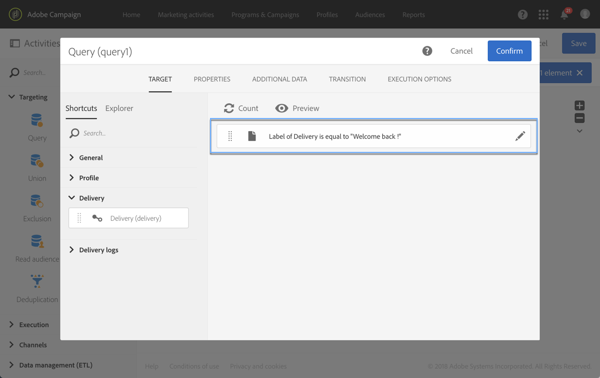
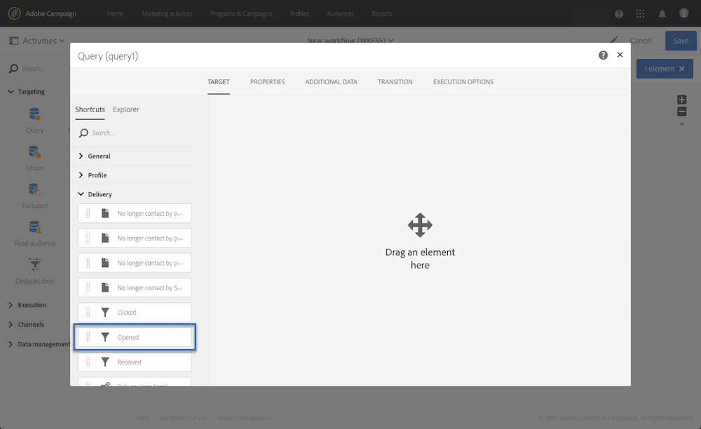

# Query{#query}

## Description {#description}

The **[!UICONTROL Query]** activity allows you to filter and extract a population of elements from the Adobe Campaign database. You can define **[!UICONTROL Additional data]** for the targeted population via a dedicated tab. Questi dati sono memorizzati in colonne aggiuntive e possono essere utilizzati solo per il flusso di lavoro in corso.

L'attività utilizza lo strumento di modifica query. This tool is detailed in a [dedicated section](../../automating/using/editing-queries.md#about-query-editor).

## Context of use {#context-of-use}

The **[!UICONTROL Query]** activity can be used for various types of uses:

* Segmentazione della destinazione di messaggi, audience e così via
* Arricchimento dei dati dell'intera tabella del database Adobe Campaign.
* Esportazione dei dati.

## Configuration {#configuration}

1. Drag and drop a **[!UICONTROL Query]** activity into your workflow.
1. Select the activity, then open it using the  button from the quick actions that appear. Per impostazione predefinita, l'attività è predefinita per la ricerca dei profili.
1. If you would like to run a query on a resource other than the profile resource, go to the activity's **[!UICONTROL Properties]** tab and select a **[!UICONTROL Resource]** and a **[!UICONTROL Targeting dimension]**.

   The **[!UICONTROL Resource]** allows you to refine the filters displayed in the palette whereas the **[!UICONTROL Targeting dimension]**, contextual with regard to the resource selected, corresponds to the type of population that you would like to obtain (identified profiles, deliveries, data linked to the selected resource, etc.).

   For more on this, refer to [Targeting dimensions and resources](../../automating/using/query.md#targeting-dimensions-and-resources)

1. In the **[!UICONTROL Target]** tab, run your query by defining and combining rules.
1. You can define **[!UICONTROL Additional data]** for the targeted population via a dedicated tab. Questi dati sono memorizzati in colonne aggiuntive e possono essere utilizzati solo per il flusso di lavoro in corso. In particolare, puoi aggiungere dati dalle tabelle di database di Adobe Campaign collegate alla dimensione di targeting della query. Consult the [Enriching data](../../automating/using/query.md#enriching-data) section.

   >[!NOTE]
   >
   >By default, the **[!UICONTROL Remove duplicate rows (DISTINCT)]** option is checked in the **[!UICONTROL Advanced options]** of the **[!UICONTROL Additional data]** tab of the query. If the **[!UICONTROL Query]** activity contains many (from 100) additional data defined, it is recommended to uncheck this option, for performance reasons. Un controllo che deseleziona questa opzione può causare duplicati, a seconda dei dati inviati.

1. In the **[!UICONTROL Transition]** tab, the **[!UICONTROL Enable an outbound transition]** option lets you add an outbound transition after the query activity, even if it retrieves no data.

   The outbound transition's segment code can be personalized using a standard expression and events variables (see [Customizing activities with events variables](../../automating/using/calling-a-workflow-with-external-parameters.md#customizing-activities-with-events-variables)).

1. Confermate la configurazione dell'attività e salvate il flusso di lavoro.

## Targeting dimensions and resources {#targeting-dimensions-and-resources}

Le dimensioni e le risorse di targeting consentono di definire in quali elementi verrà basata una query per determinare la destinazione di una consegna.

Le dimensioni di targeting sono definite nelle mappature target. For more on this, refer to [this section](../../administration/using/target-mappings-in-campaign.md).

### Defining the targeting dimension and resource of a query {#defining-the-targeting-dimension-and-resource-of-a-query}

Targeting dimension and resources are defined when creating a workflow, in the **[!UICONTROL Properties]** tab of a Query activity.

>[!NOTE]
>
>The targeting dimension can also be defined when creating an audience (see [this section](../../audiences/using/creating-audiences.md)).

Le dimensioni e le risorse di targeting sono collegate. Le dimensioni di targeting disponibili dipendono quindi dalla risorsa selezionata.

For example, for the Resource **[!UICONTROL Profiles (profile)]**, the following targeting dimensions will be available:

While for **[!UICONTROL Deliveries (delivery)]**, the list will contain the following targeting dimensions:

Una volta specificata la dimensione e la dimensione di targeting, nella query sono disponibili filtri diversi.

Example of available filters for the **[!UICONTROL Profiles (profile)]** resource:

Example of available filters for the **[!UICONTROL Deliveries (delivery)]** resource:

### Using resources different from targeting dimensions {#using-resources-different-from-targeting-dimensions}

Per impostazione predefinita, la dimensione e la dimensione di targeting sono impostate per eseguire il targeting dei profili.

Tuttavia, potrebbe essere utile utilizzare una risorsa diversa dalla dimensione di targeting per ricercare un record specifico in una tabella distante.

**Esempio 1: identificazione di profili destinati alla distribuzione con l'etichetta «Welcome back! »**.

* In questo caso, vogliamo eseguire il targeting dei profili. We will set the targeting dimension to **[!UICONTROL Profiles (profile)]**.
* Vogliamo filtrare i profili selezionati in base all'etichetta di consegna. We will therefore set the resource to **[!UICONTROL Delivery logs]**. In questo modo, stiamo filtrando direttamente nella tabella di registro della distribuzione, che offrirà prestazioni migliori.

**Esempio 2: identificazione dei profili che non erano destinati alla distribuzione con l'etichetta «Welcome back! »»**

Nell'esempio precedente, abbiamo utilizzato una risorsa diversa dalla dimensione di targeting. This operation is only possible if you want to find a record that **is present** in the distant table (delivery logs in our example).

If we want to find a record that **is not present** in the distant table (for example, profiles who were not targeted by a specific delivery), you must use the same resource and targeting dimension, as the record will not be present in the distant table (delivery logs).

* In questo caso, vogliamo eseguire il targeting dei profili. We will set the targeting dimension to **[!UICONTROL Profiles (profile)]**.
* Vogliamo filtrare i profili selezionati in base all'etichetta di consegna. Non è possibile filtrare direttamente i registri di distribuzione mentre si cerca un record non presente nella tabella dei registri di consegna. We will therefore set the resource to **[!UICONTROL Profile (profile)]** and build our query on the profiles table.

## Enriching data {#enriching-data}

The **[!UICONTROL Additional data]** tab of the **[!UICONTROL Query]**, **[!UICONTROL Incremental query]** and **[!UICONTROL Enrichment]** activities allows you to enrich the data targeted and transfer this data to the following workflow activities, where it can be utilized. In particolare, potete aggiungere:

* Dati semplici
* Aggregati
* Raccolte

For aggregates and collections, an **[!UICONTROL Alias]** is automatically defined to give a technical ID to a complex expression. Questo alias, che deve essere univoco, consente di trovare facilmente gli aggregati e le raccolte. Potete modificarlo per ottenere un nome facilmente riconoscibile.

>[!NOTE]
>
>Gli alias devono rispettare le regole di sintassi seguenti: Solo i caratteri alfanumerici e i caratteri "_" sono autorizzati. Gli alias fanno distinzione tra maiuscole e minuscole. L'alias deve iniziare con il carattere " @". Il carattere immediatamente successivo a " @" non deve essere numerico. Ad esempio: @ Myalias_ 1 e @_ 1 Alias sono corretti; mentre @ myalias # 1 e @ 1 Alias non sono corretti.

Dopo aver aggiunto eventuali dati aggiuntivi, potete applicare un livello di filtro aggiuntivo ai dati inizialmente mirati creando condizioni in base ai dati aggiuntivi definiti.

>[!NOTE]
>
>By default, the **[!UICONTROL Remove duplicate rows (DISTINCT)]** option is checked in the **[!UICONTROL Advanced options]** of the **[!UICONTROL Additional data]** tab of the query. If the **[!UICONTROL Query]** activity contains many (from 100) additional data defined, it is recommended to uncheck this option, for performance reasons. Un controllo che deseleziona questa opzione può causare duplicati, a seconda dei dati inviati.

### Adding a simple field {#adding-a-simple-field}

Aggiungendo un campo semplice come dati aggiuntivi, tale campo diventa direttamente visibile nella transizione in uscita dell'attività. Questo consente all'utente di controllare, ad esempio, che i dati della query siano i dati desiderati.

1. From the **[!UICONTROL Additional data]** tab, add a new element.
1. In the window that opens, in the **[!UICONTROL Expression]** field, select one of the fields available directly in the targeting dimension or in one of the linked dimensions. Potete modificare le espressioni e utilizzare funzioni o calcoli semplici (tranne gli aggregati) dai campi dimensione.

   An **[!UICONTROL Alias]** is automatically created if you edit an expression that is not a simple XPATH path (for example: "Year(&lt;@birthDate&gt;)"). Se lo desiderate, potete modificarlo. If you only select one field (for example: "@age"), you do not need to define an **[!UICONTROL Alias]**.

1. Select **[!UICONTROL Add]** to confirm adding the field to the additional data. Quando la query viene eseguita, nella transizione in uscita dell'attività viene presente una colonna aggiuntiva corrispondente al campo aggiunto.

### Adding an aggregate {#adding-an-aggregate}

Gli aggregati consentono la calcolo dei valori dai campi della dimensione di targeting o dai campi di dimensioni collegate alla dimensione di targeting. Ad esempio: l'importo medio acquistato da un profilo.

1. From the **[!UICONTROL Additional data]** tab, add a new element.
1. In the window that opens, select the collection that you want to use to create your aggregate in the **[!UICONTROL Expression]** field.

   An **[!UICONTROL Alias]** is created automatically. If you like, you can modify it by going back to the query's **[!UICONTROL Additional data]** tab.

   Viene aperta la finestra di definizione aggregata.

1. Define an aggregate from the **[!UICONTROL Data]** tab. Depending on the type of aggregate selected, only the elements whose data is compatible are available in the **[!UICONTROL Expression]** field. Ad esempio, una somma può essere calcolata solo con dati numerici.

   

   Potete aggiungere diversi aggregati per i campi della raccolta selezionata. Assicuratevi di definire etichette esplicite per distinguere le diverse colonne nei dettagli dei dati in uscita dell'attività.

   È inoltre possibile modificare gli alias definiti automaticamente per ogni aggregato.

   

1. Se necessario, potete aggiungere un filtro per limitare i dati presi in considerazione.

   Refer to the [Filtering added data](../../automating/using/query.md#filtering-added-data) section.

1. Select **[!UICONTROL Confirm]** to add aggregates.

>[!NOTE]
>
>You cannot create an expression containing an aggregate directly from the **[!UICONTROL Expression]** field of the **[!UICONTROL New additional data]** window.

### Adding a collection {#adding-a-collection}

1. From the **[!UICONTROL Additional data]** tab, add a new element.
1. In the window that opens, select the collection that you want to add in the **[!UICONTROL Expression]** field. An **[!UICONTROL Alias]** is created automatically. If you like, you can modify it by going back to the query's **[!UICONTROL Additional data]** tab.
1. Select **[!UICONTROL Add]**. Viene visualizzata una nuova finestra che consente di perfezionare i dati della raccolta da visualizzare.
1. In the **[!UICONTROL Parameters]** tab, select **[!UICONTROL Collection]** and define the number of lines of the collection that you want to add. For example, if you want to get the three most recent purchases carried out by each profile, enter "3" in the **[!UICONTROL Number of lines to return]** field.

   >[!NOTE]
   >
   >È necessario immettere un numero maggiore o uguale a 1.

1. From the **[!UICONTROL Data]** tab, define the fields of the collection that you want to display for each line.

   

1. Se lo desiderate, potete aggiungere un filtro per limitare le righe di raccolta prese in considerazione.

   Refer to the [Filtering added data](../../automating/using/query.md#filtering-added-data) section.

1. Se ti piace, puoi definire un ordinamento dati.

   For example, if you have selected 3 lines to return in the **[!UICONTROL Parameters]** tab, and you want to determine the three most recent purchases, you can define a descending sort on the "date" field of the collection that corresponds to the transactions.

1. Refer to the [Sorting additional data](../../automating/using/query.md#sorting-additional-data) section.
1. Select **[!UICONTROL Confirm]** to add the collection.

### Filtering added data {#filtering-added-data}

Quando aggiungete un'aggregazione o una raccolta, potete specificare un filtro aggiuntivo per limitare i dati da visualizzare.

For example, if you want to only process the collection lines of transactions with amounts of 50 dollars and above, you can add a condition on the field corresponding to the transaction amount from the **[!UICONTROL Filter]** tab.

### Sorting additional data {#sorting-additional-data}

Quando si aggiunge un aggregato o una raccolta ai dati di una query, è possibile specificare se applicare un ordinamento (ascendente o discendente) in base al valore del campo o all'espressione definita.

For example, if you want to save only the transaction that was carried out most recently by a profile, enter "1" in the **[!UICONTROL Number of lines to return]** field of the **[!UICONTROL Parameters]** tab, and apply a descending sort on the field corresponding to the transaction date via the **[!UICONTROL Sort]** tab.

### Filtering the targeted data according to additional data {#filtering-the-targeted-data-according-to-additional-data}

Once you have added additional data, a new **[!UICONTROL Output filtering]** tab appears in the **[!UICONTROL Query]**. This tab allows you to apply an additional filter on the data initially targeted in the **[!UICONTROL Target]** tab, by taking into account the added data.

For example, if you have targeted all of the profiles that carried out at least one transaction and an aggregate calculating the average transaction amount carried out for each profile was added to the **[!UICONTROL Additional data]**, you can refine the population initially calculated using this average.

To do this, in the **[!UICONTROL Output filtering]** tab, simply add a condition on this additional data.

### Example: personalizing an email with additional data {#example--personalizing-an-email-with-additional-data}

L'esempio seguente illustra l'aggiunta di diversi tipi di dati aggiuntivi a una query e il suo utilizzo come campo personalizzato in un messaggio e-mail.

For this example, [custom resources](../../developing/using/data-model-concepts.md) are used:

* The **profile** resource was extended in order to add a field which allows each profile's loyalty points to be saved.
* A **transactions** resource was created and identifies all purchases carried out by the profiles in the database. La data, il prezzo e il prodotto acquistati vengono salvati per ogni transazione.
* A **products** resource was created and references the products available for purchase.

L'obiettivo è quello di inviare un messaggio e-mail ai profili per i quali almeno una transazione è stata salvata. Tramite questa e-mail, i client riceveranno un promemoria sull'ultima transazione eseguita e su una panoramica di tutte le loro transazioni: Numero di prodotti acquistati, totale speso, promemoria del numero totale di punti fedeltà maturati.

Il flusso di lavoro viene presentato come segue:

1. Add a **[!UICONTROL Query]** activity, which allows you to target the profiles that have carried out at least one transaction.

   

   From the query's **[!UICONTROL Additional data]** tab, define the different data to be displayed in the final email:

   * The simple field of the **profile** dimension corresponding to the loyalty points. Refer to the [Adding a simple field](../../automating/using/query.md#adding-a-simple-field) section.
   * Due aggregati basati sulla raccolta delle transazioni: il numero di prodotti acquistati e l'importo totale speso. You can add them from the **[!UICONTROL Data]** tab of the aggregate configuration window, using the **Count** and **Sum** aggregates. Refer to the [Adding an aggregate](../../automating/using/query.md#adding-an-aggregate) section.
   * Una raccolta che restituisce l'importo trascorso, la data e il prodotto dell'ultima transazione effettuata.

      To do this, you have to add the different fields that you want to display from the **[!UICONTROL Data]** tab of the collection configuration window.

      To return only the most recent transaction, you have to enter "1" for the **[!UICONTROL Number of lines to return]** and apply a descending sort on the **Date** field of the collection from the **[!UICONTROL Sort]** tab.

      Refer to the [Adding a collection](../../automating/using/query.md#adding-a-collection) and [Sorting additional data](../../automating/using/query.md#sorting-additional-data) sections.
   

   If you would like to check that the data is correctly transferred by the activity's outbound transition, start the workflow for the first time (without the **[!UICONTROL Email delivery]** activity) and open the query's outbound transition.

   

1. Add an **[!UICONTROL Email delivery]** activity. Nel contenuto e-mail, inserire i campi di personalizzazione corrispondenti ai dati calcolati nella query. You can find it via the **[!UICONTROL Additional data (targetData)]** link of the personalization fields explorer.

   

Il flusso di lavoro è pronto per essere eseguito. I profili destinati alla query riceveranno un messaggio e-mail personalizzato contenente i dati calcolati dalle rispettive transazioni.

## Query samples {#query-samples}

### Targeting on simple profile attributes {#targeting-on-simple-profile-attributes}

L'esempio seguente mostra un'attività di query configurata per eseguire il targeting di uomo tra 18 e 30 anni, vivendo a Londra.

### Targeting on email attributes {#targeting-on-email-attributes}

L'esempio seguente mostra un'attività di query configurata per i profili target con il dominio dell'indirizzo e-mail "orange.co.uk".

L'esempio seguente mostra un'attività di query configurata per i profili di destinazione il cui indirizzo e-mail è stato fornito.

### Targeting profiles whose birthday is today {#targeting-profiles-whose-birthday-is-today}

L'esempio seguente mostra un'attività di query configurata per i profili di destinazione il cui compleanno è oggi stesso.

1. Drag the **[!UICONTROL Birthday]** filter in your query.

   

1. Set the **[!UICONTROL Filter type]** to **[!UICONTROL Relative]** and select **[!UICONTROL Today]**.

   

### Targeting profiles who opened a specific delivery {#targeting-profiles-who-opened-a-specific-delivery}

L'esempio seguente mostra un'attività di query configurata per filtrare i profili che hanno aperto la distribuzione con l'etichetta "Summer Time".

1. Drag the **[!UICONTROL Opened]** filter in your query.

   

1. Select the delivery then click **[!UICONTROL Confirm]**.

   

### Targeting profiles for whom deliveries failed for a specific reason {#targeting-profiles-for-whom-deliveries-failed-for-a-specific-reason}

L'esempio seguente mostra un'attività di query configurata per filtrare i profili per i quali le consegne non sono riuscite perché la casella postale era piena. This query is only available for users with administration rights and belonging to the **[!UICONTROL All (all)]** organizational units (see [this section](../../administration/using/organizational-units.md)).

1. Select the **[!UICONTROL Delivery logs]** resource in order to filter directly in the delivery log table (see [Using resources different from targeting dimensions](../../automating/using/query.md#using-resources-different-from-targeting-dimensions)).

   

1. Drag the **[!UICONTROL Nature of failure]** filter in your query.

   

1. Selezionare il tipo di errore di destinazione. In our case **[!UICONTROL Mailbox full]**.

   

### Targeting profiles not contacted during the last 7 days {#targeting-profiles-not-contacted-during-the-last-7-days}

L'esempio seguente mostra un'attività di query configurata per filtrare profili che non sono stati contattati negli ultimi 7 giorni.

1. Drag the **[!UICONTROL Delivery logs (logs)]** filter in your query.

   

   Select **[!UICONTROL Does not exist]** in the drop-down list, then drag the **[!UICONTROL Delivery]** filter.

   

1. Configurate il filtro come segue.

   

### Targeting profiles who clicked a specific link {#targeting-profiles-who-clicked-a-specific-link-}

1. Drag the **[!UICONTROL Tracking logs (tracking)]** filter in your query.

   

1. Drag the **[!UICONTROL Label (urlLabel)]** filter.

   

1. In the **[!UICONTROL Value]** field, type the label that was defined when inserting the link in the delivery, then confirm.

   

