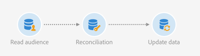

# Riconciliare un pubblico di file con il database {#example--reconcile-a-file-audience-with-the-database}

Questo esempio mostra come utilizzare l&#39; **[!UICONTROL Read audience]** attività per riconciliare un&#39;audience creata direttamente da un&#39;importazione di file.

Durante l&#39;importazione di un file, potete salvarne direttamente il contenuto in un pubblico. Questo pubblico è un pubblico di file e i relativi dati non sono collegati ad alcuna risorsa di database.

Il flusso di lavoro di importazione è stato progettato come segue:


* Un&#39;attività [Carica file](../../automating/using/load-file.md) carica un file contenente i dati dei profili estratti da uno strumento esterno.

   Ad esempio:

   ```
   lastname;firstname;birthdate;email;crmID
   Smith;Hayden;23/05/1989;hayden.smith@example.com;124365
   Mars;Daniel;17/11/1987;dannymars@example.com;123545
   Smith;Clara;08/02/1989;hayden.smith@example.com;124567
   Durance;Allison;15/12/1978;allison.durance@example.com;120987
   Lucassen;Jody;28/03/1988;jody.lucassen@example.com;127634
   Binder;Tom;19/01/1982;tombinder@example.com;128653
   Binder;Tommy;19/01/1915;tombinder@example.com;134576
   Connor;Jade;10/10/1979;connor.jade@example.com;132452
   Mack;Clarke;02/03/1985;clarke.mack@example.com;149876
   Ross;Timothy;04/07/1986;timross@example.com;157643
   ```

* Un&#39;attività [Salva audience](../../automating/using/save-audience.md) salva i dati in arrivo come pubblico. Poiché i dati non sono ancora stati riconciliati, l&#39;audience è un&#39;audience di File e i suoi dati non sono ancora riconosciuti come dati di profilo.

Il flusso di lavoro di riconciliazione è progettato come segue:



* Un&#39;attività di [lettura dell&#39;audience](../../automating/using/read-audience.md) carica l&#39;audience File creata nel flusso di lavoro di importazione. I dati del pubblico non sono ancora riconciliati con il database del Adobe Campaign .
* Un&#39;attività di [riconciliazione](../../automating/using/reconciliation.md) identifica i dati in arrivo come profili attraverso la relativa **[!UICONTROL Identification]** scheda. Ad esempio, utilizzando il campo **email** come criterio di riconciliazione.
* Un&#39;attività [Aggiorna dati](../../automating/using/update-data.md) inserisce e aggiorna la risorsa dei profili del database con i dati in arrivo. Poiché i dati sono già identificati come profili, potete selezionare l&#39; **[!UICONTROL Directly using the targeting dimension]** opzione e **[!UICONTROL Profiles]** nella **[!UICONTROL Identification]** scheda dell&#39;attività. Quindi, è sufficiente aggiungere l&#39;elenco dei campi che devono essere aggiornati nella scheda in base.
