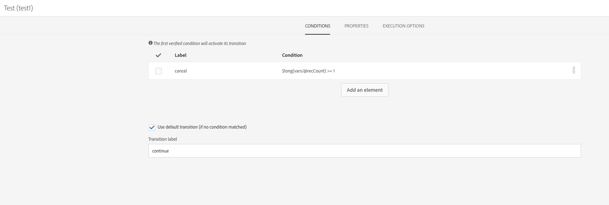

# Esecuzione sovrapposta di flussi di lavoro pianificati{#preventing-overlapping-execution-of-scheduled-workflows}

## Informazioni sull’esecuzione di flussi di lavoro pianificati

In Campaign Standard, il motore del flusso di lavoro garantisce che un’istanza del flusso di lavoro venga eseguita da un solo processo. Il blocco di attività quali importazioni, query con tempi di esecuzione lunghi o scritture nel database impedisce l&#39;esecuzione di qualsiasi altra attività durante l&#39;esecuzione.

Le attività non di blocco non bloccano invece l&#39;esecuzione di altre attività, in genere quelle in attesa di un evento come **[!UICONTROL Scheduler]** attività).

Questo può portare a uno scenario in cui un flusso di lavoro basato su pianificazione può iniziare l’esecuzione anche quando la precedente esecuzione dello stesso flusso di lavoro non è ancora stata completata, con possibili problemi di dati imprevisti.

Pertanto, durante la progettazione di un flusso di lavoro pianificato che include più attività, è necessario assicurarsi che il flusso di lavoro non venga ripianificato fino al suo completamento. A questo scopo, devi configurare il flusso di lavoro per impedirne l’esecuzione se una o più attività di un’esecuzione precedente sono ancora in sospeso.

## Configurazione del flusso di lavoro

Per verificare se una o più attività di una precedente esecuzione del flusso di lavoro sono ancora in sospeso, è necessario utilizzare un&#39; **[!UICONTROL Query]** e un **[!UICONTROL Test]** attività.

1. Aggiungi un **[!UICONTROL Query]** attività dopo il **[!UICONTROL Scheduler]** , quindi configurala come segue.

1. Modifica la risorsa dell’attività in **[!UICONTROL WorkflowTaskDetail]**, ovvero eseguirà il targeting delle attività correnti del flusso di lavoro.

   

1. Configura la query con le regole seguenti:

   

   * La prima regola filtra l&#39;attività corrente (query2) e la successiva attività di pianificazione (schedule2) appartenenti al flusso di lavoro corrente.

     >[!NOTE]
     >
     >Quando un **[!UICONTROL Scheduler]** all&#39;avvio dell&#39;attività, aggiunge immediatamente un&#39;altra attività di pianificazione da eseguire all&#39;ora pianificata successiva e avvia il flusso di lavoro. Pertanto, è importante filtrare sia la query che le attività pianificate quando si cercano le attività in sospeso di un’esecuzione precedente.

   * La seconda regola determina se le attività di una precedente esecuzione del flusso di lavoro sono ancora attive (in sospeso), che corrisponde allo stato di esecuzione 0.

1. Aggiungi un **[!UICONTROL Test]** per verificare il numero di attività in sospeso restituite dall&#39;attività **[!UICONTROL Query]** attività. A questo scopo, configura due transizioni in uscita.

   

   * La prima transizione prosegue l’esecuzione del flusso di lavoro se non sono presenti attività in sospeso,
   * La seconda transizione annulla l’esecuzione del flusso di lavoro se sono presenti attività in sospeso.

   

Ora puoi configurare il resto del flusso di lavoro in base alle esigenze. Se l’esecuzione del flusso di lavoro viene annullata a causa di attività in sospeso, quando il flusso di lavoro viene eseguito nuovamente in base alla pianificazione, è possibile eseguire questi passaggi. In questo modo l’esecuzione del flusso di lavoro continuerà solo se non sono presenti attività attive (in sospeso) da un’esecuzione precedente.
