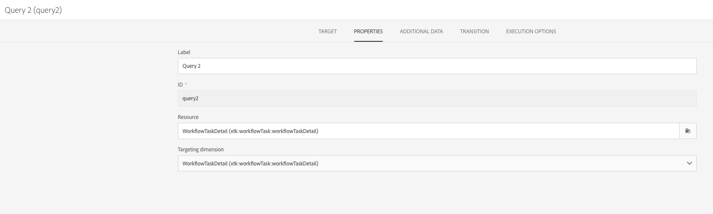

# Esecuzione sovrapposta di flussi di lavoro pianificati{#preventing-overlapping-execution-of-scheduled-workflows}

## Informazioni sull’esecuzione dei flussi di lavoro pianificati

In Campaign Standard, il motore del flusso di lavoro garantisce che un’istanza di flusso di lavoro venga eseguita da un solo processo. Il blocco di attività quali importazioni, query o scritture lunghe nel database impedisce l’esecuzione di qualsiasi altra attività durante l’esecuzione.

D’altro canto, le attività non bloccanti non bloccano l’esecuzione di altre attività (in genere le attività in attesa di un evento come il **[!UICONTROL Scheduler]** attività).

Questo può portare a uno scenario in cui un flusso di lavoro basato su pianificazione può iniziare a essere eseguito anche quando l’esecuzione precedente dello stesso flusso di lavoro non è ancora stata completata, generando potenzialmente problemi di dati imprevisti.

Pertanto, durante la progettazione di un flusso di lavoro pianificato che include più attività, è necessario assicurarsi che il flusso di lavoro non venga riprogrammato fino al termine. A questo scopo, devi configurare il flusso di lavoro per impedirne l’esecuzione se una o più attività di un’esecuzione precedente sono ancora in sospeso.

## Configurazione del flusso di lavoro

Per verificare se una o più attività di una precedente esecuzione del flusso di lavoro sono ancora in sospeso, è necessario utilizzare un **[!UICONTROL Query]** e **[!UICONTROL Test]** attività.

1. Aggiungi un **[!UICONTROL Query]** dopo **[!UICONTROL Scheduler]** , quindi configuralo come segue.

1. Modifica la risorsa dell’attività in **[!UICONTROL WorkflowTaskDetail]**, ovvero eseguirà il targeting delle attività correnti del flusso di lavoro.

   

1. Configura la query con le regole seguenti:

   

   * La prima regola filtra l’attività corrente (query2) e l’attività di pianificazione successiva (pianificazione2) appartenente al flusso di lavoro corrente.

      >[!NOTE]
      >
      >Quando un **[!UICONTROL Scheduler]** l’attività viene avviata e aggiunge immediatamente un’altra attività di pianificazione da eseguire all’ora pianificata successiva e avviare il flusso di lavoro. Pertanto, è importante filtrare sia la query che le attività di pianificazione quando si cercano attività in sospeso da un&#39;esecuzione precedente.

   * La seconda regola determina se eventuali attività di un&#39;esecuzione precedente del flusso di lavoro sono ancora attive (in sospeso), corrispondente allo stato di esecuzione 0.

1. Aggiungi un **[!UICONTROL Test]** per verificare il numero di attività in sospeso restituite dal **[!UICONTROL Query]** attività. A questo scopo, configura due transizioni in uscita.

   

   * La prima transizione prosegue l’esecuzione del flusso di lavoro in assenza di attività in sospeso,
   * La seconda transizione annulla l’esecuzione del flusso di lavoro in caso di attività in sospeso.

   

Ora puoi configurare il resto del flusso di lavoro in base alle esigenze. Se l’esecuzione del flusso di lavoro viene annullata a causa di attività in sospeso, quando il flusso di lavoro viene eseguito nuovamente secondo la pianificazione, può seguire questi passaggi. In questo modo l’esecuzione del flusso di lavoro procederà solo se non sono presenti attività attive (in sospeso) di un’esecuzione precedente.
