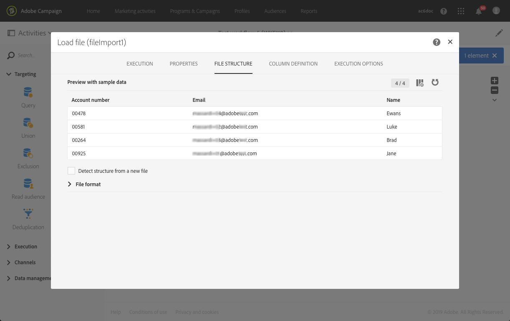

# Invio di un’e-mail con campi arricchiti {#sending-email-enriched-fields}

<!--A new example showing how to send an email containing additional data retrieved from a load file activity has been added. [Read more](example-2-email-with-enriched-fields)-->

L’attività di caricamento file consente inoltre di inviare nello stesso flusso di lavoro un’e-mail arricchita di dati aggiuntivi proveniente da un file esterno.

L’esempio seguente illustra la procedura per l’invio di un’e-mail utilizzando dati aggiuntivi recuperati da un file esterno tramite l’attività di caricamento file. In questo esempio, il file esterno contiene un elenco di profili con il relativo numero di account associato. Vorresti importare questi dati per poter inviare un messaggio e-mail a ogni profilo insieme al relativo numero di account.

Per generare il flusso di lavoro, effettuate le seguenti operazioni:

1. Drag and drop a [Query](../../automating/using/query.md) activity into your workflow and open it to define the main target.

   <!--The Query activity is presented in the [Query](../../automating/using/query.md) section.-->

1. Drag and drop a [Load file](../../automating/using/load-file.md) activity to assign some data to a profile. In questo esempio, eseguirai il caricamento di un file contenente i numeri di account corrispondenti ad alcuni profili del database.

   

1. Drag and drop an [Enrichment](../../automating/using/enrichment.md) activity into your workflow and link the load file and query activities to it.

1. Nella scheda **[!UICONTROL Advanced relations]** dell’attività Enrichment, seleziona **[!UICONTROL 0 or 1 cardinality simple link]** e definisci i campi da utilizzare per la riconciliazione. In questo caso, utilizziamo il cognome per riconciliare i dati con i profili del database.

   

1. Nella scheda **[!UICONTROL Additional data]**, seleziona gli elementi che desideri utilizzare nel messaggio e-mail. Qui puoi selezionare il numero di account, presente nella colonna del file recuperato tramite l’attività di caricamento file.

   

   <!---->

   Per ulteriori informazioni, consulta la sezione [Enrichment](../../automating/using/enrichment.md).

1. Drag and drop a [Segmentation](../../automating/using/segmentation.md) activity into your workflow and open it to refine the main target.

   

   Per ulteriori informazioni, consulta la sezione [Segmentazione](../../automating/using/segmentation.md).

1. Drag and drop an [Email delivery](../../automating/using/email-delivery.md) activity into your workflow and open it.

   <!--The Email delivery activity is presented in the [Email delivery](../../automating/using/email-delivery.md) section.-->

1. Aggiungi un campo di personalizzazione e seleziona dal nodo **[!UICONTROL Additional data (targetData)]** i dati aggiuntivi definiti nell’attività di arricchimento, in questo caso il numero account. Questa operazione ti consente di recuperare in modo dinamico il numero di account di ciascun profilo presente nel contenuto dell’e-mail.

   

1. Salva il messaggio e-mail e avvia il flusso di lavoro.

L’e-mail viene inviata alla destinazione. Ciascun profilo riceve l’e-mail con il numero di account corrispondente.

