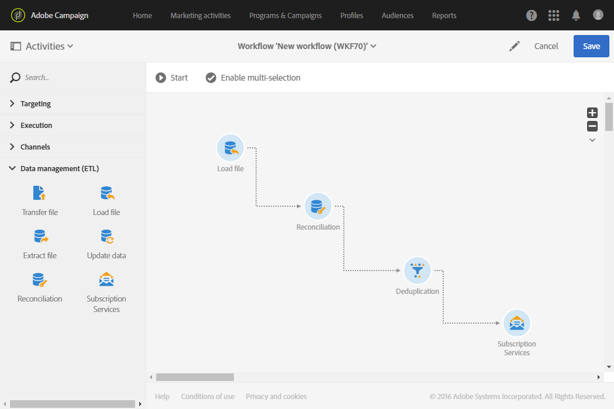

#  Servizi iscrizione{#subscription-services}

## Descrizione {#description}


L' **[!UICONTROL Subscription Services]** attività consente di prendere profili in massa e iscriverli a un servizio o annullarne l'iscrizione a un servizio.

>[!CAUTION]
>
>Quando l’iscrizione viene gestita nel contesto di un flusso di lavoro, i profili sottoscritti o non sottoscritti non ricevono i diversi messaggi e-mail di conferma definiti nelle proprietà del servizio.

## Contesto di utilizzo {#context-of-use}

L' **[!UICONTROL Subscription Services]** attività è l'unica funzionalità di Adobe Campaign che consente a più profili di essere sottoscritti o di annullare l'iscrizione a un servizio da un'unica azione.

Potete utilizzare questa attività dopo aver eseguito il targeting o aver importato un file con dati identificati.

Se specificata in un file tramite colonne dedicate, questa attività consente anche di scegliere l'azione (sottoscrizione o annullamento della sottoscrizione) e il servizio su cui eseguire l'azione.

## Configurazione {#configuration}

1. Trascinate e rilasciate un' **[!UICONTROL Subscription Services]** attività nel flusso di lavoro.
1. Connettilo dopo altre attività di targeting, ad esempio una query o una riconciliazione dopo un'importazione.
1. Selezionate l'attività, quindi apritela utilizzando il  pulsante delle azioni rapide visualizzate.
1. Selezionate le **[!UICONTROL Service]** sottoscrizioni per le quali desiderate gestire una delle seguenti opzioni:

   * **[!UICONTROL Select a specific service]**: selezionate manualmente un servizio.
   * **[!UICONTROL Select services from the inbound transition]**: il servizio è specificato nella transizione in entrata. Ad esempio, è possibile importare un file che specifica il servizio da gestire per ogni riga. Se scegli questa opzione, accertati che sia stato creato un collegamento tra i dati e la risorsa **Servizio** , come mostrato in [questo esempio](#example--updating-multiple-subscription-statuses-from-a-file).

      Il servizio su cui eseguire l'operazione viene quindi selezionato dinamicamente per ciascun record.

1. Selezionate la modalità **[!UICONTROL Operation type]** da eseguire utilizzando una delle seguenti opzioni:

   * **[!UICONTROL Select a specific operation type]**: selezionate manualmente se desiderate **[!UICONTROL Subscribe]** o **[!UICONTROL Unsubscribe]** profili.
   * **[!UICONTROL Select an operation type from a path of inbound transition]**: selezionare la colonna dei dati in entrata che specifica l'operazione da eseguire per ciascun record.

      In questa colonna, l'operazione deve essere specificata come booleana o come numero intero. Utilizzate **0** per annullare l’iscrizione di un record e **1** per iscrivervi.

      Se i valori contenuti in un file importato non corrispondono ai requisiti di cui sopra, potete comunque utilizzare l'opzione [Remapping dei valori](../../automating/using/load-file.md#column-format) disponibile nell' **[!UICONTROL Load file]** attività

1. Se i dati in entrata contengono una colonna corrispondente alla data di iscrizione del profilo al servizio, selezionatela. Potete lasciare vuoto il campo ma non impostare alcuna data di iscrizione durante l’esecuzione del flusso di lavoro.
1. Definire l'origine della sottoscrizione. È possibile impostarlo su uno dei campi dei dati in entrata o su un valore costante selezionato dall'utente, selezionando l' **[!UICONTROL Set a constant as origin]** opzione. Potete lasciarlo vuoto ma non viene impostata alcuna origine durante l'esecuzione del flusso di lavoro.
1. Se necessario, potete generare una transizione in uscita. Questa transizione contiene esattamente gli stessi dati dell'attività in entrata.
1. Confermate la configurazione dell'attività e salvate il flusso di lavoro.

   È ora pronto per essere eseguito. Una volta eseguiti, potete visualizzare i profili per i quali è stata sottoscritta o che è stata annullata la sottoscrizione al servizio nei dettagli del servizio.

## Esempio: Iscrizione di profili a un servizio specifico dopo l’importazione di un file {#example--subscribing-profiles-to-a-specific-service-after-importing-a-file}

Questo esempio illustra come importare un file contenente profili e iscriverlo a un servizio esistente. Dopo l'importazione del file, è necessario eseguire una riconciliazione in modo che i dati importati possano essere identificati come profili. Per garantire che il file non contenga duplicati, sui dati verrà eseguita un'attività di deduplicazione.

Il flusso di lavoro viene presentato come segue:



* Un' **[!UICONTROL Load file]** attività carica il file di profilo e definisce la struttura delle colonne importate.

   Per questo esempio, il file caricato è in formato .csv e contiene i dati seguenti:

   ```
   lastname;firstname;email;birthdate;subdate
   jackman;megan;megan.jackman@testmail.com;07/08/1975;10/08/2017
   phillips;edward;phillips@testmail.com;09/03/1986;10/08/2017
   weaver;justin;justin_w@testmail.com;11/15/1990;10/08/2017
   martin;babeth;babeth_martin@testmail.net;11/25/1964;10/08/2017
   reese;richard;rreese@testmail.com;02/08/1987;11/08/2017
   cage;nathalie;cage.nathalie227@testmail.com;07/03/1989;11/08/2017
   xiuxiu;andrea;andrea.xiuxiu@testmail.com;09/12/1992;11/08/2017
   grimes;daryl;daryl_890@testmail.com;12/06/1979;12/08/2017
   tycoon;tyreese;tyreese_t@testmail.net;10/08/1971;12/08/2017
   ```

   

* Un' **[!UICONTROL Reconciliation]** attività identifica i dati del file come appartenenti alla dimensione del profilo del database Adobe Campaign. È configurata solo la **[!UICONTROL Identification]** scheda. Identifica i dati del file in base agli indirizzi e-mail dei profili.

   

* Un **[!UICONTROL Deduplication]** basato sul campo **e-mail** della risorsa temporanea (derivante dalla riconciliazione) identifica eventuali duplicati. Se i dati importati dal file contengono duplicati, la sottoscrizione a un servizio non riuscirà per tutti i dati.

   

* Un' **[!UICONTROL Subscription Services]** attività consente di selezionare il servizio al quale devono essere sottoscritti i profili, il campo corrispondente alla data di iscrizione e l'origine dell'iscrizione.

   

## Esempio: Aggiornamento di più stati di iscrizione da un file {#example--updating-multiple-subscription-statuses-from-a-file}

Questo esempio illustra come importare un file contenente dei profili e aggiornare la propria sottoscrizione a diversi servizi specificati nel file. Dopo l'importazione del file, è necessario eseguire una riconciliazione in modo che i dati importati possano essere identificati come profili con un collegamento ai servizi. Per garantire che il file non contenga duplicati, sui dati verrà eseguita un'attività di deduplicazione.

Il flusso di lavoro viene presentato come segue:


* Un' **[!UICONTROL Load file]** attività carica il file di profilo e definisce la struttura delle colonne importate.

   Per questo esempio, il file caricato è in formato .csv e contiene i dati seguenti:

   ```
   lastname;firstname;email;birthdate;service;operation
   jackman;megan;megan.jackman@testmail.com;07/08/1975;SVC2;sub
   phillips;edward;phillips@testmail.com;09/03/1986;SVC3;unsub
   weaver;justin;justin_w@testmail.com;11/15/1990;SVC3;sub
   martin;babeth;babeth_martin@testmail.net;11/25/1964;SVC3;unsub
   reese;richard;rreese@testmail.com;02/08/1987;SVC3;sub
   cage;nathalie;cage.nathalie227@testmail.com;07/03/1989;SVC3;sub
   xiuxiu;andrea;andrea.xiuxiu@testmail.com;09/12/1992;SVC4;sub
   grimes;daryl;daryl_890@testmail.com;12/06/1979;SVC3;unsub
   tycoon;tyreese;tyreese_t@testmail.net;10/08/1971;SVC2;sub
   ```

   

   Come avrete notato, l'operazione è specificata nel file come "sub" o "non sub". Il sistema prevede che un valore **booleano** o **Intero** riconosca l'operazione da eseguire: "0" per annullare l’iscrizione e "1" per iscriversi. Per soddisfare questo requisito, viene eseguito un nuovo mapping dei valori nel dettaglio della colonna "operation".

   

   Se il file utilizza già "0" e "1" per identificare l'operazione, non è necessario rimappare tali valori. Assicurarsi solo che la colonna sia elaborata come **booleano** o **Intero** nella **[!UICONTROL Column definition]** scheda.

* Un' **[!UICONTROL Reconciliation]** attività identifica i dati del file come appartenenti alla dimensione del profilo del database Adobe Campaign. Tramite la **[!UICONTROL Identification]** scheda, il campo **e-mail** del file corrisponde al campo **e-mail** della risorsa del profilo.

   

   Nella **[!UICONTROL Relations]** scheda, viene creato un collegamento con la risorsa del servizio per consentire il riconoscimento del campo del **servizio** del file. In questo esempio, i valori corrispondono al campo del **nome** della risorsa del servizio.

   

* Un **[!UICONTROL Deduplication]** basato sul campo **e-mail** della risorsa temporanea (derivante dalla riconciliazione) identifica i duplicati. È importante eliminare i duplicati, in quanto la sottoscrizione a un servizio non riesce per tutti i dati in caso di duplicati.

   

* A **[!UICONTROL Subscription Services]** identifica i servizi da aggiornare come provenienti dalla transizione, attraverso il collegamento creato nell' **[!UICONTROL Reconciliation]** attività.

   Il file **[!UICONTROL Operation type]** viene identificato come proveniente dal campo **operativo** del file. Qui è possibile selezionare solo campi booleani o Interi. Se la colonna del file che contiene l'operazione da eseguire non viene visualizzata nell'elenco, accertatevi di aver impostato correttamente il formato della colonna nell' **[!UICONTROL Load file]** attività, come spiegato in precedenza in questo esempio.

   

