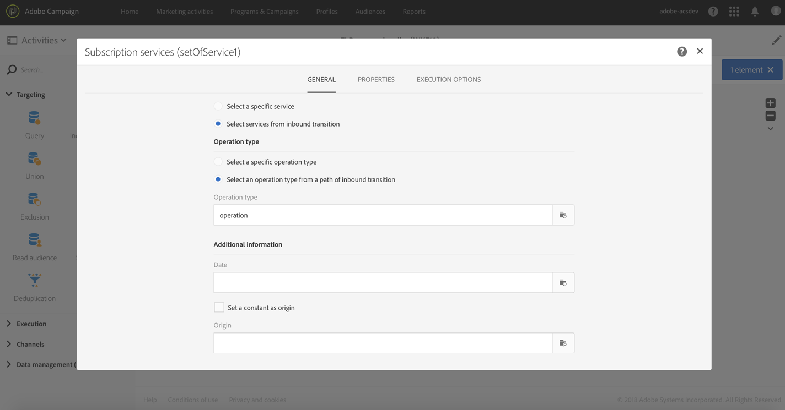

# Subscription Services{#subscription-services}

## Description {#description}


The **[!UICONTROL Subscription Services]** activity allows you to take profiles in mass and subscribe them to a service or unsubscribe them from a service.

>[!CAUTION]
>
>Quando l'iscrizione viene gestita nel contesto di un flusso di lavoro, i profili sottoscrittori o non registrati non ricevono le diverse e-mail di conferma definite nelle proprietà del servizio.

## Context of use {#context-of-use}

The **[!UICONTROL Subscription Services]** activity is the only Adobe Campaign functionality which allows multiple profiles to be subscribed to or to be unsubscribed from a service in a single action.

Potete utilizzare questa attività dopo aver eseguito il targeting o aver importato un file con dati identificati.

Se specificato in un file attraverso colonne dedicate, questa attività consente anche di scegliere l'azione (iscrizione o annullamento dell'iscrizione) e il servizio su cui eseguire l'azione.

## Configuration {#configuration}

1. Drag and drop a **[!UICONTROL Subscription Services]** activity into your workflow.
1. Connettetela dopo altre attività di targeting, ad esempio una query o una riconciliazione dopo un'importazione.
1. Select the activity, then open it using the  button from the quick actions that appear.
1. Select the **[!UICONTROL Service]** for which you would like to manage the subscriptions using one of the following options:

   * **[!UICONTROL Select a specific service]**: Selezionare manualmente un servizio.
   * **[!UICONTROL Select services from the inbound transition]**: il servizio viene specificato nella transizione in ingresso. Ad esempio, è possibile importare un file che specifica il servizio da gestire per ogni riga. If you choose this option, make sure a link has been created beforehand between the data and the **Service** resource, as shown in [this example](../../automating/using/subscription-services.md#example--updating-multiple-subscription-statuses-from-a-file).

      Il servizio su cui eseguire l'operazione viene selezionato in modo dinamico per ogni record.

1. Select the **[!UICONTROL Operation type]** to execute using one of the following options:

   * **[!UICONTROL Select a specific operation type]**: Seleziona manualmente se desideri **[!UICONTROL Subscribe]** o **[!UICONTROL Unsubscribe]** meno.
   * **[!UICONTROL Select an operation type from a path of inbound transition]**: selezionare la colonna dei dati in entrata che specifica l'operazione da eseguire per ogni record.

      In questa colonna, l'operazione deve essere specificata come booleano o Integer. Use **0** to unsubscribe a record and **1** to subscribe.

      In case the values contained in an imported file do not match the above requirements, you can still use the [Remapping of values](../../automating/using/load-file.md#column-format) option available in the **[!UICONTROL Load file]** activity

1. Se i dati in entrata contengono una colonna con la data di iscrizione del profilo al servizio, selezionatela. Potete lasciarlo vuoto ma non viene impostata alcuna data di iscrizione durante l'esecuzione del flusso di lavoro.
1. Definire l'origine dell'iscrizione. You can set it to one of the fields of the inbound data or to a constant value of your choice by checking the **[!UICONTROL Set a constant as origin]** option. Potete lasciarlo vuoto ma non viene impostata alcuna origine durante l'esecuzione del flusso di lavoro.
1. Se necessario, potete generare una transizione in uscita. Questa transizione contiene esattamente gli stessi dati dell'attività in entrata.
1. Confermate la configurazione dell'attività e salvate il flusso di lavoro.

   Ora è pronto per essere eseguito. Una volta eseguito, puoi visualizzare i profili che hanno effettuato la sottoscrizione o la sottoscrizione dal servizio nei dettagli del servizio.

## Example: Subscribing profiles to a specific service after importing a file {#example--subscribing-profiles-to-a-specific-service-after-importing-a-file}

Questo esempio illustra come importare un file contenente profili e iscriversi a un servizio esistente. Dopo aver importato il file, è necessario eseguire una riconciliazione affinché i dati importati possano essere identificati come profili. Per assicurare che il file non contenga duplicati, viene eseguita un'attività di deduplicazione sui dati.

Il flusso di lavoro viene presentato come segue:


* A **[!UICONTROL Load file]** activity loads the profile file and defines the structure of the imported columns.

   Per questo esempio, il file caricato è in formato. csv e contiene i dati seguenti:

   ```
   lastname;firstname;email;birthdate;subdate
   jackman;megan;megan.jackman@testmail.com;07/08/1975;10/08/2017
   phillips;edward;phillips@testmail.com;09/03/1986;10/08/2017
   weaver;justin;justin_w@testmail.com;11/15/1990;10/08/2017
   martin;babeth;babeth_martin@testmail.net;11/25/1964;10/08/2017
   reese;richard;rreese@testmail.com;02/08/1987;11/08/2017
   cage;nathalie;cage.nathalie227@testmail.com;07/03/1989;11/08/2017
   xiuxiu;andrea;andrea.xiuxiu@testmail.com;09/12/1992;11/08/2017
   grimes;daryl;daryl_890@testmail.com;12/06/1979;12/08/2017
   tycoon;tyreese;tyreese_t@testmail.net;10/08/1971;12/08/2017
   ```

   

* A **[!UICONTROL Reconciliation]** activity identifies the data from the file as belonging to the profile dimension of the Adobe Campaign database. Only the **[!UICONTROL Identification]** tab is configured. Identifica i dati del file in base agli indirizzi e-mail dei profili.

   

* A **[!UICONTROL Deduplication]** based on the **email** field of the temporary resource (resulting from the reconciliation) identifies any duplicates. Se i dati importati dal file contengono duplicati, l'iscrizione a un servizio non riesce per tutti i dati.

   

* A **[!UICONTROL Subscription Services]** activity lets you select the service to which the profiles must be subscribed, the field corresponding to the subscription date, and the origin of the subscription.

   

## Example: Updating multiple subscription statuses from a file {#example--updating-multiple-subscription-statuses-from-a-file}

Questo esempio illustra come importare un file contenente profili e aggiornare l'iscrizione a diversi servizi specificati nel file. Dopo aver importato il file, è necessario eseguire una riconciliazione affinché i dati importati possano essere identificati come profili con un collegamento ai servizi. Per assicurare che il file non contenga duplicati, viene eseguita un'attività di deduplicazione sui dati.

Il flusso di lavoro viene presentato come segue:


* A **[!UICONTROL Load file]** activity loads the profile file and defines the structure of the imported columns.

   Per questo esempio, il file caricato è in formato. csv e contiene i dati seguenti:

   ```
   lastname;firstname;email;birthdate;service;operation
   jackman;megan;megan.jackman@testmail.com;07/08/1975;SVC2;sub
   phillips;edward;phillips@testmail.com;09/03/1986;SVC3;unsub
   weaver;justin;justin_w@testmail.com;11/15/1990;SVC3;sub
   martin;babeth;babeth_martin@testmail.net;11/25/1964;SVC3;unsub
   reese;richard;rreese@testmail.com;02/08/1987;SVC3;sub
   cage;nathalie;cage.nathalie227@testmail.com;07/03/1989;SVC3;sub
   xiuxiu;andrea;andrea.xiuxiu@testmail.com;09/12/1992;SVC4;sub
   grimes;daryl;daryl_890@testmail.com;12/06/1979;SVC3;unsub
   tycoon;tyreese;tyreese_t@testmail.net;10/08/1971;SVC2;sub
   ```

   

   Come hai notato, l'operazione è specificata nel file come "sub" o "unsub". The system expects a **Boolean** or **Integer** value to recognize the operation to perform: "0" to unsubscribe and "1" to subscribe. Per soddisfare questo requisito, la modifica dei valori viene eseguita nel dettaglio della colonna "operation".

   

   Se il file utilizza già "0" e "1" per identificare l'operazione, non è necessario rimappare tali valori. Only make sure that the column is processed as a **Boolean** or **Integer** in the **[!UICONTROL Column definition]** tab.

* A **[!UICONTROL Reconciliation]** activity identifies the data from the file as belonging to the profile dimension of the Adobe Campaign database. Through the **[!UICONTROL Identification]** tab, the **email** field of the file is matched to the **email** field of the profile resource.

   

   In the **[!UICONTROL Relations]** tab, a link is created with the service resource to allow the **service** field of the file to be recognized. In this example, the values match the **name** field of the service resource.

   

* A **[!UICONTROL Deduplication]** based on the **email** field of the temporary resource (resulting from the reconciliation) identifies duplicates. È importante eliminare i duplicati perché l'iscrizione a un servizio non avrà esito negativo per tutti i dati in caso di duplicati.

   

* A **[!UICONTROL Subscription Services]** identifies the services to update as coming from the transition, through the link created in the **[!UICONTROL Reconciliation]** activity.

   The **[!UICONTROL Operation type]** is identified as coming from the **operation** field of the file. Qui è possibile selezionare solo campi booleani o interi. If the column of your file that contains the operation to perform does not appear in the list, make sure that you have correctly set your column format in the **[!UICONTROL Load file]** activity, as explained earlier in this example.

   

