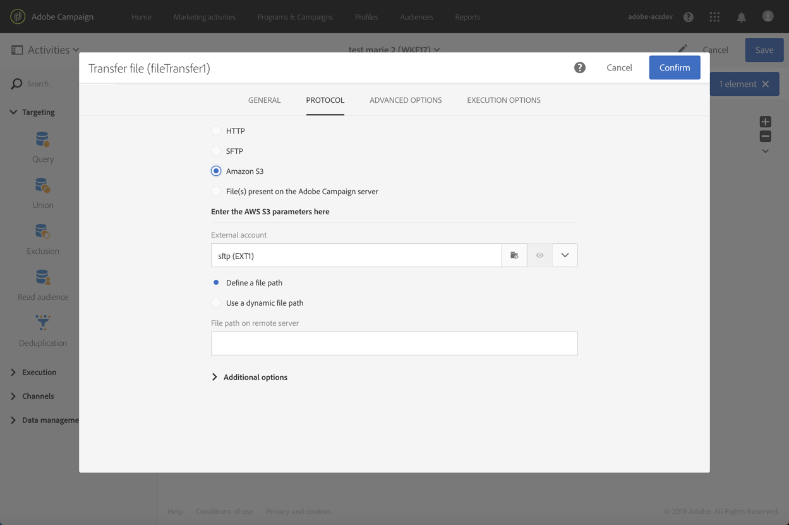

# Transfer file{#transfer-file}

## Descrizione {#description}

L’attività **[!UICONTROL Transfer file]** ti consente di ricevere o inviare file, verificare se sono presenti o elencarli in Adobe Campaign.

## Contesto di utilizzo {#context-of-use}

La modalità di estrazione dei dati viene definita durante la configurazione dell’attività. Il file da caricare può rappresentare un elenco di contatti, ad esempio.

Puoi utilizzare questa attività per recuperare dati che sono quindi strutturati con l’attività **[!UICONTROL Load file]**.

**Argomenti correlati:**

* [Caso di utilizzo: Aggiornamento dei dati in base a un download automatico del file](../../automating/using/update-data-automatic-download.md)

## Configurazione {#configuration}

1. Rilascia un’attività **[!UICONTROL Transfer file]** nel flusso di lavoro.
1. Seleziona l’attività, quindi aprila utilizzando il pulsante  delle azioni rapide visualizzate.
1. Utilizza l’elenco a discesa nel campo **[!UICONTROL Action]** per selezionare una delle seguenti azioni dell’attività:

   

   * **File download**: ti consente di scaricare un file.
   * **File upload**: ti consente di caricare un file. Il caricamento di un file da un file di Adobe Campaign genera una voce di registro nel menu **[!UICONTROL Export audits]**. Per ulteriori informazioni sui controlli delle esportazioni, consulta la sezione [Controllo delle esportazioni](../../administration/using/auditing-export-logs.md).
   * **Test to see if file exists**: ti consente di verificare se è presente un file.
   * **File listing**: ti consente di elencare i file presenti sul server definito nella scheda **[!UICONTROL Protocol]**. Puoi utilizzare questa azione principalmente a scopo di debug, per verificare se l’attività è configurata in base alle tue esigenze prima di scaricare i file dal server remoto.

1. Seleziona il protocollo da utilizzare:
   * [HTTP](#HTTP-configuration-wf)
   * [SFTP](#SFTP-configuration-wf)
   * [Amazon S3](#S3-configuration-wf)
   * [Archivio BLOB di Microsoft Azure](#azure-blob-configuration-wf)
   * [File presenti sul server di Adobe Campaign](#files-server-configuration-wf)

1. La sezione **[!UICONTROL Additional options]**, disponibile a seconda del protocollo selezionato, ti consente di aggiungere parametri al protocollo. Puoi:

   * **[!UICONTROL Delete the source files after transfer]**
   * **[!UICONTROL Disable passive mode]**
   * **[!UICONTROL List all files]**: questa opzione è disponibile quando selezioni l’azione **[!UICONTROL File listing]** nella scheda **[!UICONTROL General]**. Ti consente di indicizzare tutti i file presenti sul server nella variabile dell’evento **vars.filenames**, in cui i nomi dei file sono separati da **“n”** caratteri.

1. La sezione **[!UICONTROL If no files are found]** della scheda **[!UICONTROL Advanced options]** ti permette di configurare azioni specifiche in caso di errori o file inesistenti rilevati all’avvio dell’attività.

   Puoi anche definire il numero dei tentativi. I diversi tentativi vengono visualizzati nel log di esecuzione del flusso di lavoro.

   

1. Conferma la configurazione dell’attività e salva il flusso di lavoro.

### Configurazione con HTTP {#HTTP-configuration-wf}

Il protocollo HTTP ti consente di iniziare a scaricare un file da un account esterno o da un URL.

Con questo protocollo, puoi scegliere l’opzione **[!UICONTROL Use connection parameters defined in an external account]**. In questo caso, seleziona l’account desiderato e specifica il percorso del file da scaricare.

Puoi anche scegliere l’opzione **[!UICONTROL Quick configuration]**. Devi solo inserire l’URL nel relativo campo.

### Configurazione con SFTP {#SFTP-configuration-wf}

Il protocollo SFTP ti consente di iniziare a scaricare un file da un URL o da un account esterno.

Con questo protocollo, puoi scegliere l’opzione **[!UICONTROL Use connection parameters defined in an external account]**, quindi seleziona l’account desiderato e specifica il percorso del file da scaricare.

>[!CAUTION]
>
>I caratteri jolly sono supportati.

Puoi anche scegliere l’opzione **[!UICONTROL Quick configuration]**. Devi solo inserire l’URL nel relativo campo.

### Configurazione con Amazon S3 {#S3-configuration-wf}

Il protocollo Amazon S3 ti consente di iniziare a scaricare un file da un URL o da un account esterno tramite Amazon Simple Storage Service (S3).

1. Seleziona un account esterno di Amazon S3. Per ulteriori informazioni, consulta questa [pagina](../../administration/using/external-accounts.md#amazon-s3-external-account).

2. Scegli se vuoi **[!UICONTROL Define a file path]** o **[!UICONTROL Use a dynamic file path]**.

3. Specifica il percorso del file da scaricare.

   

4. Se desideri eliminare i file sorgente al termine del trasferimento, seleziona la casella **[!UICONTROL Delete the source files after transfer]**.

### Configurazione con l’archivio BLOB di Microsoft Azure {#azure-blob-configuration-wf}

Il protocollo BLOB di Microsoft Azure ti consente di accedere a BLOB che si trovano in un account di archiviazione BLOB di Microsoft Azure.

1. Seleziona un account esterno **[!UICONTROL Microsoft Azure Blob]**. Per ulteriori informazioni, consulta questa [pagina](../../administration/using/external-accounts.md#microsoft-azure-external-account).

1. Scegli se vuoi **[!UICONTROL Define a file path]** o **[!UICONTROL Use a dynamic file path]**.

   

1. Specifica il percorso del file da scaricare, che può corrispondere a più BLOB. In questo caso, l’attività **[!UICONTROL File transfer]** attiva la transizione in uscita ogni volta che viene trovato un BLOB. Vengono quindi elaborati in ordine alfabetico.

   >[!CAUTION]
   >
   >I caratteri jolly non sono supportati nel caso vengano riscontrati gli stessi nomi per più file. Invece, devi immettere un prefisso. Tutti i nomi dei BLOB che corrispondono a quel prefisso risultano idonei.

   Di seguito trovi alcuni esempi di percorsi di file:

   * **&quot;campaign/&quot;**: rileva tutti i BLOB nella cartella Campaign che si trova nella directory principale del contenitore.
   * **&quot;campaign/new-&quot;**: rileva tutti i BLOB con un nome di file che inizia con &quot;new-&quot; e si trova nella cartella Campaign.
   * **&quot;&quot;**: l’aggiunta di un percorso vuoto ti consente di far coincidere tutti i BLOB disponibili nel contenitore.

### Configurazione con file presenti nel server di Adobe Campaign {#files-server-configuration-wf}

Il protocollo **[!UICONTROL File(s) present on the Adobe Campaign server]** corrisponde all’archivio contenente i file da recuperare.
Puoi utilizzare metacaratteri o caratteri jolly (ad esempio * o ?) per filtrare file.

Scegli se desideri **[!UICONTROL Define a file path]** o **[!UICONTROL Use a dynamic file path]**. L’opzione **[!UICONTROL Use a dynamic file path]** ti consente di utilizzare un’espressione standard e variabili di eventi per personalizzare il nome del file da trasferire. Per ulteriori informazioni, consulta [questa pagina](../../automating/using/customizing-workflow-external-parameters.md).

Il percorso deve essere relativo alla directory dello spazio di archiviazione del server di Adobe Campaign. I file si trovano nella directory **sftp&lt;nomeistanza>/**. Inoltre non puoi sfogliare le directory al di sopra dello spazio di archiviazione. Ad esempio:

    >**user&amp;lt;yourinstancename>/my_recipients.csv** è corretto.
    >
    >**../hello/my_recipients.csv** non è corretto.
    >
    >**//myserver/hello/myrecipients.csv** non è corretto.

## Historization settings {#historization-settings}

Tutte le volte che esegui un’attività **[!UICONTROL Transfer file]**, memorizzi i file caricati o scaricati in una cartella dedicata. Viene creata una cartella per ogni attività **[!UICONTROL Transfer file]** di un flusso di lavoro. Pertanto, è importante poter limitare le dimensioni di questa cartella per preservare lo spazio fisico sul server.

A questo scopo, puoi definire le **[!UICONTROL Historization settings]** nelle **[!UICONTROL Advanced options]** dell’attività **[!UICONTROL Transfer File]**.

**[!UICONTROL Historization settings]** ti consentono di definire un numero massimo di file o una dimensione totale per la cartella dell’attività. Per impostazione predefinita sono autorizzati 100 file e 50 MB.

Tutte le volte che l’attività viene eseguita, la cartella viene controllata come segue:

* Vengono presi in considerazione solo file creati più di 24 ore prima dell’esecuzione dell’attività.
* Se il numero di file considerati è maggiore del valore del parametro **[!UICONTROL Maximum number of files]**, i file meno recenti vengono eliminati finché non viene raggiunto il **[!UICONTROL Maximum number of files]** consentito.
* Se la dimensione totale dei file considerati è maggiore del valore del parametro **[!UICONTROL Maximum size (in MB)]**, i file meno recenti vengono eliminati finché non viene raggiunta la **[!UICONTROL Maximum size (in MB)]** consentita.

>[!NOTE]
>
>Se l’attività non viene eseguita nuovamente, la relativa cartella non viene né controllata né eliminata. In quest’ottica, fai attenzione durante il trasferimento di file di grandi dimensioni.
