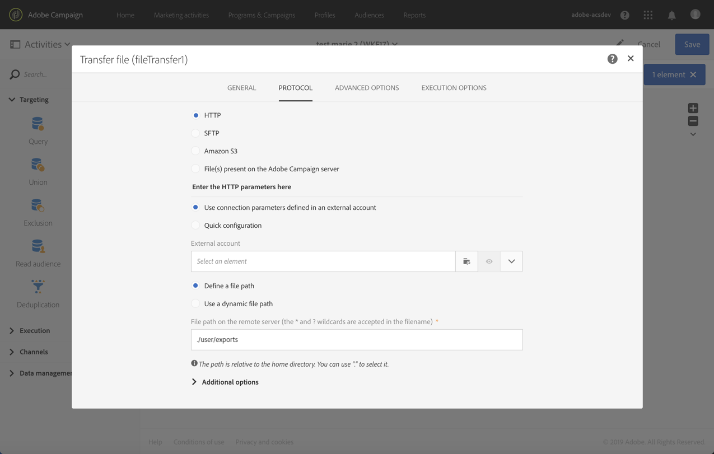

# File di trasferimento{#transfer-file}

## Descrizione {#description}

L' **[!UICONTROL Transfer file]** attività consente di ricevere o inviare file, verificare se sono presenti file o elencare i file in Adobe Campaign.

## Contesto di utilizzo {#context-of-use}

Il modo in cui i dati vengono estratti viene definito quando l'attività è configurata. Ad esempio, il file da caricare può essere un elenco di contatti.

Potete utilizzare questa attività per recuperare i dati che verranno quindi strutturati con l **[!UICONTROL Load file]** 'attività.

## Configurazione {#configuration}

1. Rilascia un **[!UICONTROL Transfer file]** 'attività nel tuo flusso di lavoro.
1. Selezionate l'attività, quindi apritela utilizzando il  pulsante dalle azioni rapide visualizzate.
1. Utilizzate l'elenco a discesa nel **[!UICONTROL Action]** campo per selezionare una delle azioni attività seguenti:

   

   * **Download file**: consente di scaricare un file.
   * **Caricamento file**: consente di caricare un file. Quando si carica un file dal file Adobe Campaign, viene generata una voce di registro nel **[!UICONTROL Export audits]** menu. Per ulteriori informazioni sui controlli di esportazione, consultare la sezione [relativa alle esportazioni](../../administration/using/auditing-export-logs.md) di audit.
   * **Verificate se il file esiste**: consente di verificare se è presente un file.
   * **Elenco dei file**: consente di elencare i file presenti in Adobe Campaign.
   A seconda dell'azione selezionata, sono disponibili uno o più protocolli:

   * **HTTP**: questo protocollo consente di iniziare a scaricare un file da un account esterno o da un URL.

      * Fate clic sull **[!UICONTROL Use connection parameters defined in an external account]** 'opzione, quindi selezionate l'account desiderato e specificate il percorso del file da scaricare.

         

      * Fate clic sull **[!UICONTROL Quick configuration]** 'opzione, quindi immettete l'URL nel campo visualizzato.

         
   * **S 3**: questo protocollo consente di iniziare a scaricare un file da un URL o un account esterno tramite Amazon Simple Storage Service (S 3).

      * Selezionate l'account esterno e specificate il percorso del file da scaricare.

         
   * **SFTP**: questo protocollo consente di iniziare a scaricare un file da un URL o da un account esterno.

      * Fate clic sull **[!UICONTROL Use connection parameters defined in an external account]** 'opzione, quindi selezionate l'account desiderato e specificate il percorso del file da scaricare.

         

         >[!CAUTION]
         >
         >Sono supportati i caratteri jolly.

      * Fate clic sull **[!UICONTROL Quick configuration]** 'opzione, quindi immettete l'URL nel campo visualizzato.
      * Se desiderate ordinare i file importati, selezionate l' **[!UICONTROL Sort alphanumerically]** opzione dalla **[!UICONTROL Additional options]** sezione. I file verranno quindi elaborati in ordine sequenziale.

         
   * **File presenti sul server Adobe Campaign**: questo protocollo corrisponde all'archivio che contiene i file da recuperare.

      Caratteri o caratteri jolly (ad esempio * o?) può essere usato per filtrare i file.

      Compilare questo campo e confermare l'attività per utilizzare questo protocollo.

      >[!NOTE]
      >
      >Il percorso deve essere relativo alla directory dello spazio di archiviazione del server Adobe Campaign. I file si trovano nell' **sftp &lt; yourinstancename &gt;/** directory. Inoltre, non potete sfogliare le directory sopra lo spazio di archiviazione. Ad esempio: **user &lt; yourinstancename &gt;/my_ recipient. csv** è corretto. **../hello/my_recipients.csv** non è corretta. **//myserver/hello/myrecipients.csv** non è corretta.
   Selezionate il protocollo e completate i campi associati.

   L' **[!UICONTROL Use a dynamic file path]** opzione, disponibile per ogni protocollo, consente di utilizzare una variabile standard di espressioni ed eventi per personalizzare il nome del file da trasferire. Per ulteriori informazioni, consultate la [sezione Personalizzazione delle attività con le variabili](../../automating/using/calling-a-workflow-with-external-parameters.md#customizing-activities-with-events-variables) degli eventi.

1. **[!UICONTROL Additional options]** La sezione, disponibile a seconda del protocollo selezionato, consente di aggiungere parametri al protocollo. Potete:

   * **[!UICONTROL Delete the source files after transfer]**
   * **[!UICONTROL Disable passive mode]**
   * **[!UICONTROL List all files]**: questa opzione è disponibile quando si seleziona l **[!UICONTROL File listing]** 'azione. Consente di indicizzare tutti i file presenti sul server nella variabile dell'evento **vars. file** in cui i nomi dei file sono separati **dai** caratterì n '.

1. La **[!UICONTROL If no files are found]** sezione della **[!UICONTROL Advanced options]** scheda consente di configurare azioni specifiche se vengono rilevati errori o file inesistenti al momento dell'avvio dell'attività.

   Potete anche definire dei tentativi. I diversi tentativi vengono visualizzati nel registro dell'esecuzione del flusso di lavoro.

   

1. Confermate la configurazione dell'attività e salvate il flusso di lavoro.

## Impostazioni di protezione {#historization-settings}

Ogni volta che un **[!UICONTROL Transfer file]** 'attività viene eseguita, memorizza i file caricati o scaricati in una cartella dedicata. Viene creata una cartella per ogni **[!UICONTROL Transfer file]** attività di un flusso di lavoro. Pertanto, è importante limitare le dimensioni di questa cartella per mantenere spazio fisico sul server.

A tal fine, potete definire **[!UICONTROL Historization settings]** nell' **[!UICONTROL Advanced options]****[!UICONTROL Transfer File]** attività.

**[!UICONTROL Historization settings]** consente di definire un numero massimo di file o di dimensioni totali per la cartella dell'attività. Per impostazione predefinita, 100 file e 50 MB sono autorizzati.

Ogni volta che l'attività viene eseguita, la cartella viene controllata come segue:

* Solo i file creati più di 24 ore prima dell'esecuzione dell'attività.
* Se il numero di file inclusi è maggiore del valore del **[!UICONTROL Maximum number of files]** parametro, i file meno recenti vengono eliminati finché non viene raggiunto il **[!UICONTROL Maximum number of files]** valore consentito.
* Se la dimensione totale dei file presi in considerazione è maggiore del valore del **[!UICONTROL Maximum size (in MB)]** parametro, i file meno recenti vengono eliminati finché non viene raggiunto il **[!UICONTROL Maximum size (in MB)]** valore consentito.

>[!NOTE]
Se l'attività non viene eseguita di nuovo, la sua cartella non verrà controllata né eliminata. Con questo approccio, prestate attenzione durante il trasferimento di file di grandi dimensioni.

## Esempio {#example}

L'esempio seguente mostra la configurazione di un **'attività di trasferimento** File che verrà successivamente seguita da un'attività **di caricamento di un file** , quindi da un **'attività di aggiornamento dei dati** . L'obiettivo di questo flusso di lavoro è quello di aggiungere o aggiornare i profili di database di Adobe Campaign con i dati recuperati dal flusso di lavoro.

1. Trascina un'attività di **trasferimento file** nel flusso di lavoro.
1. Selezionate l'attività, quindi apritela utilizzando il  pulsante dalle azioni rapide visualizzate.
1. Nella **[!UICONTROL Protocol]** scheda, selezionate **SFTP**.
1. Selezionate i **parametri di connessione utilizzati in un'opzione di account** esterna.
1. Immettete il nome dell'account esterno.
1. Immettete il **percorso File sul server remoto**.

   

1. Confermate l'attività e salvate il flusso di lavoro.

