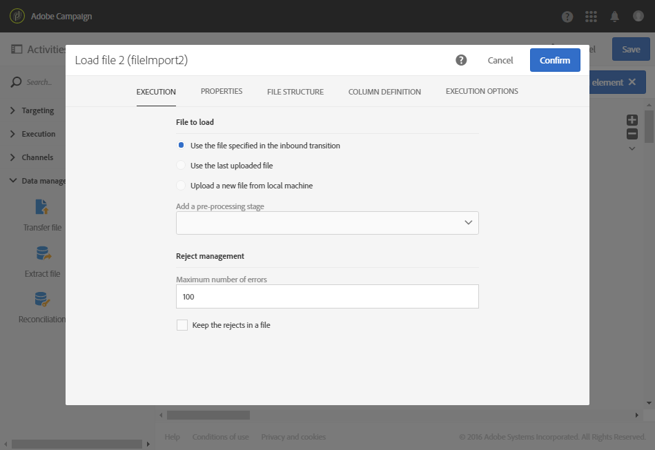

# Aggiornamento dei dati in base a un download automatico del file {#updating-data-automatic-file-download}

L’attività di caricamento file struttura principalmente i dati provenienti da un’attività del file di trasferimento, in modo da integrarli nei dati esistenti.

L’esempio seguente mostra il risultato di un’attività di caricamento file scaricata automaticamente tramite un’attività di trasferimento file, seguita da un’attività di aggiornamento dei dati. Questo flusso di lavoro mira ad arricchire il database di Adobe Campaign con nuovi profili o ad aggiornare quelli esistenti utilizzando i dati recuperati dal file importato.

Per generare il flusso di lavoro, effettuate le seguenti operazioni:

1. Trascina e rilascia l’attività [Transfer file](../../automating/using/transfer-file.md) nel flusso di lavoro.
1. Seleziona l’attività, quindi aprila utilizzando il pulsante  delle azioni rapide visualizzate.
1. Configurate l&#39;attività in modo che recuperi il file desiderato. Nella scheda **[!UICONTROL Protocol]**, seleziona **SFTP**.
1. Seleziona l’opzione **Use connection parameters defined in an external account**.
1. Immetti il nome dell’account esterno.
1. Immetti il **percorso del file sul server remoto**.

   

1. Conferma l’attività.
1. Drag and drop a [Load file](../../automating/using/load-file.md) activity into your workflow and place it after the **[!UICONTROL Transfer file]** activity.
1. Seleziona l’attività, quindi aprila utilizzando il pulsante  delle azioni rapide visualizzate.
1. Nella sezione **[!UICONTROL File to load]** della scheda **[!UICONTROL Execution]**, seleziona l’opzione **[!UICONTROL Use the file specified in the inbound transition]**.

   

1. Configura l’attività come specificato in precedenza.
1. Drag and drop an [Update data](../../automating/using/update-data.md) activity into your workflow and place it after the **[!UICONTROL Load file]** activity, then configure it.

Una volta avviato il flusso di lavoro, i dati del file caricato vengono estratti e quindi utilizzati per arricchire il database di Adobe Campaign.
