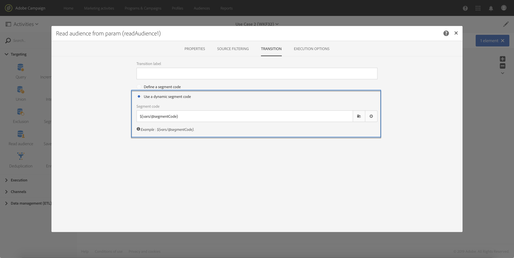

# Caso d’uso {#use-case}

Il caso d’uso seguente mostra come chiamare il flusso di lavoro con i parametri all’interno dei flussi di lavoro.

L&#39;obiettivo è attivare un flusso di lavoro da una chiamata API con parametri esterni. Questo flusso di lavoro caricherà i dati nel database da un file e creerà un&#39;audience associata. Una volta creata l&#39;audience, verrà attivato un secondo flusso di lavoro per inviare un messaggio personalizzato con i parametri esterni definiti nella chiamata API.

Per eseguire questo caso di utilizzo, è necessario eseguire le azioni seguenti:

1. **Eseguite una chiamata** API per attivare Workflow 1 con parametri esterni. Vedere [Passaggio 1: Configurazione della chiamata](../../automating/using/use-case-calling-workflow.md#step-1--configuring-the-api-call)API.
1. **Crea flusso di lavoro 1**: il flusso di lavoro trasferirà un file e lo caricherà nel database. Quindi, verrà verificato se i dati sono vuoti o meno e alla fine salverà i profili in un&#39;audience. Infine, attiverà Workflow 2. Vedere [Passaggio 2: Configurazione del flusso di lavoro 1](../../automating/using/use-case-calling-workflow.md#step-2--configuring-workflow-1).
1. **Crea flusso di lavoro 2**: il flusso di lavoro leggerà l&#39;audience creata nel Flusso di lavoro 1, quindi invierà un messaggio personalizzato ai profili, con un codice del segmento personalizzato con i parametri. Vedere [Passaggio 3: Configurazione del flusso di lavoro 2](../../automating/using/use-case-calling-workflow.md#step-3--configuring-workflow-2).


## Prerequisiti {#prerequisites}

Prima di configurare i flussi di lavoro, è necessario creare i flussi di lavoro 1 e 2 con un&#39; **[!UICONTROL External signal]** attività in ciascuno di essi. In questo modo, potrai eseguire il targeting di queste attività di segnale quando chiami i flussi di lavoro.

## Passaggio 1: Configurazione della chiamata API {#step-1--configuring-the-api-call}

Effettuare una chiamata API per attivare Workflow 1 con i parametri. Per ulteriori informazioni sulla sintassi delle chiamate API, consulta la documentazione [sulle API REST](../../api/using/triggering-a-signal-activity.md)Campaign Standard.

Nel nostro caso, vogliamo chiamare il flusso di lavoro con i parametri seguenti:

* **fileToTarget**: il nome del file da importare nel database.
* **discountDesc**: la descrizione che vogliamo visualizzare nella consegna per lo sconto.

```
-X POST https://mc.adobe.io/<ORGANIZATION>/campaign/<TRIGGER_URL>
-H 'Authorization: Bearer <ACCESS_TOKEN>' 
-H 'Cache-Control: no-cache' 
-H 'X-Api-Key: <API_KEY>' 
-H 'Content-Type: application/json;charset=utf-8' 
-H 'Content-Length:79' 
-i
-d {
-d "source:":"API",
-d "parameters":{
-d "fileToTarget":"profile.txt",
-d "discountDesc":"Running shoes"
-d } 
```

## Passaggio 2: Configurazione del flusso di lavoro 1 {#step-2--configuring-workflow-1}

Il flusso di lavoro 1 verrà creato come segue:

* **[!UICONTROL External signal]** activity: dove i parametri esterni devono essere dichiarati per essere utilizzati nel flusso di lavoro.
* **[!UICONTROL Transfer file]** activity: importa il file con il nome definito nei parametri.
* **[!UICONTROL Load file]** activity: carica i dati dal file importato nel database.
* **[!UICONTROL Update data]** activity: inserire o aggiornare il database con i dati del file importato.
* **[!UICONTROL Test]** activity: verifica se sono presenti dati importati.
* **[!UICONTROL Save audience]** activity: se il file contiene dei dati, salva i profili in un&#39;audience.
* **[!UICONTROL End activity]** activity: chiama Workflow 2 con i parametri che si desidera utilizzare al suo interno.


Per configurare il flusso di lavoro, effettuate le seguenti operazioni:

1. Dichiarare i parametri definiti nella chiamata API. A questo scopo, aprite l&#39; **[!UICONTROL External signal]** attività, quindi aggiungete i nomi e i tipi dei parametri.

   

1. Aggiungete un&#39; **[!UICONTROL Transfer file]** attività per importare i dati nel database. A tale scopo, trascinate l&#39;attività, apritela, quindi selezionate la **[!UICONTROL Protocol]** scheda.
1. Selezionate l&#39; **[!UICONTROL Use a dynamic file path]** opzione, quindi utilizzate il parametro **fileToTarget** come file da trasferire:

   ```
   $(vars/@fileToTarget)
   ```

   

1. Caricate i dati dal file nel database.

   A tal fine, trascinate un&#39; **[!UICONTROL Load file]** attività nel flusso di lavoro, quindi configuratela in base alle vostre esigenze.

1. Inserite e aggiornate il database con i dati del file importato.

   A tal fine, trascinate un&#39; **[!UICONTROL Update data]** attività, quindi selezionate la **[!UICONTROL Identification]** scheda per aggiungere un criterio di riconciliazione (nel nostro caso, il campo **e-mail** ).

   

1. Selezionate la **[!UICONTROL Fields to update]** scheda, quindi specificate i campi da aggiornare nel database (nel nostro caso, i campi **first name** e **email** ).

   

1. Verificate se i dati vengono recuperati dal file. A tal fine, trascinate un&#39; **[!UICONTROL Test]** attività nel flusso di lavoro, quindi fate clic sul **[!UICONTROL Add an element]** pulsante per aggiungere una condizione.
1. Assegnare un nome e definire la condizione. Nel nostro caso, vogliamo verificare se la transizione in uscita contiene dati con la sintassi seguente:

   ```
   $long(vars/@recCount)>0
   ```

   

1. Se i dati vengono recuperati, salvarli in un&#39;audience. A questo scopo, aggiungete un&#39; **[!UICONTROL Save audience]** attività alla transizione **Target non vuota** , quindi apritela.
1. Selezionate l&#39; **[!UICONTROL Use a dynamic label]** opzione, quindi utilizzate il parametro **fileToTarget** come etichetta dell&#39;audience:

   ```
   $(vars/@fileToTarget)
   ```

   

1. Trascina e rilascia un&#39; **[!UICONTROL End]** attività che chiamerà Flusso di lavoro 2 con i parametri, quindi aprila.
1. Selezionate la **[!UICONTROL External signal]** scheda, quindi specificate il flusso di lavoro da attivare e l&#39;attività del segnale associata.
1. Definite i parametri che desiderate utilizzare in Workflow 2 e i relativi valori associati.

   Nel nostro caso, vogliamo trasmettere i parametri originariamente definiti nella chiamata API (**fileToTarget** e **scontoDesc**), e un parametro aggiuntivo **segmentCode** con un valore costante (&quot;sconto del 20%&quot;).

   

Il flusso di lavoro 1 è configurato. È ora possibile generare il flusso di lavoro 2. Per ulteriori informazioni al riguardo, consulta [questa sezione](../../automating/using/use-case-calling-workflow.md#step-3--configuring-workflow-2).

## Passaggio 3: Configurazione del flusso di lavoro 2 {#step-3--configuring-workflow-2}

Il flusso di lavoro 2 verrà creato come segue:

* **[!UICONTROL External signal]** activity: dove i parametri devono essere dichiarati per essere utilizzati nel flusso di lavoro.
* **[!UICONTROL Read audience]** activity: legge il pubblico salvato nel Flusso di lavoro 1.
* **[!UICONTROL Email delivery]** activity: invia un messaggio ricorrente all&#39;audience di destinazione, personalizzato con parametri.


Per configurare il flusso di lavoro, effettuate le seguenti operazioni:

1. Dichiarare i parametri definiti nel Flusso di lavoro 1.

   A tal fine, aprite l&#39; **[!UICONTROL External signal]** attività, quindi aggiungete il nome e il tipo di ogni parametro definito nell&#39; **[!UICONTROL End]** attività del Flusso di lavoro 1.

   

1. Utilizza l&#39;audience salvata nel Flusso di lavoro 1. A questo scopo, trascinate un&#39; **[!UICONTROL Read audience]** attività nel flusso di lavoro, quindi apritela.
1. Selezionate l&#39; **[!UICONTROL Use a dynamic audience]** opzione, quindi utilizzate il parametro **fileToTarget** come nome dell&#39;audience da leggere:

   ```
   $(vars/@fileToTarget)
   ```

   

1. Denominate la transizione in uscita in base al parametro **segmentCode** .

   To do this, select the **[!UICONTROL Transition]** tab, then the **[!UICONTROL Use a dynamic segment code]** option.

1. Utilizzate il parametro **segmentCode** come nome della transizione in uscita:

   ```
   $(vars/@segmentCode)
   ```

   

1. Trascinate e rilasciate un&#39; **[!UICONTROL Email delivery]** attività per inviare un messaggio all&#39;audience.
1. Identificare i parametri da utilizzare nel messaggio per personalizzare con il parametro **scontoDesc** . A questo scopo, aprite le opzioni avanzate dell&#39;attività, quindi aggiungete il nome e il valore del parametro.

   

1. Ora puoi configurare il messaggio. Aprite l&#39;attività, quindi selezionate **[!UICONTROL Recurring email]**.

   

1. Selezionate il modello da usare, quindi definite le proprietà dell’e-mail in base alle vostre esigenze.
1. Utilizzate il parametro **scontoDesc** come campo di personalizzazione. A questo scopo, selezionatelo dall’elenco dei campi di personalizzazione.

   

1. Ora puoi completare la configurazione del messaggio e inviarlo come di consueto.

   

## Esecuzione dei flussi di lavoro {#executing-the-workflows}

Una volta generati i flussi di lavoro, puoi eseguirli. Assicurati che i due flussi di lavoro siano avviati prima di eseguire la chiamata API.
