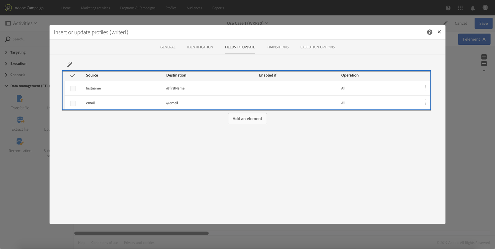

# Caso d’uso {#use-case}

Il caso d’uso seguente mostra come chiamare il flusso di lavoro con i parametri all’interno dei flussi di lavoro.

L’obiettivo è quello di attivare un flusso di lavoro da una chiamata API con parametri esterni. Questo flusso di lavoro caricherà i dati nel database da un file e creerà un pubblico associato. Una volta creato il pubblico, viene attivato un secondo flusso di lavoro per inviare un messaggio personalizzato con i parametri esterni definiti nella chiamata API.

Per eseguire questo caso d’uso, devi eseguire le azioni seguenti:

1. **Effettuare una chiamata API** per attivare il flusso di lavoro 1 con parametri esterni. Vedi [Passaggio 1: Configurazione della chiamata API](../../automating/using/use-case-calling-workflow.md#step-1--configuring-the-api-call).
1. **Crea flusso di lavoro 1**: il flusso di lavoro trasferirà un file e lo caricherà nel database. In seguito, verificherà se i dati sono vuoti o meno e alla fine salverà i profili in un pubblico. Infine, attiverà il flusso di lavoro 2. Vedi [Passaggio 2: Configurazione del flusso di lavoro 1](../../automating/using/use-case-calling-workflow.md#step-2--configuring-workflow-1).
1. **Crea flusso di lavoro 2**: il flusso di lavoro leggerà il pubblico creato nel flusso di lavoro 1, quindi invierà un messaggio personalizzato ai profili con un codice di segmento personalizzato con i parametri. Vedi [Passaggio 3: Configurazione del flusso di lavoro 2](../../automating/using/use-case-calling-workflow.md#step-3--configuring-workflow-2).


## Prerequisiti {#prerequisites}

Prima di configurare i flussi di lavoro, devi creare i flussi di lavoro 1 e 2 con un **[!UICONTROL External signal]** attività in ciascuno di essi. In questo modo, potrai eseguire il targeting di queste attività di segnale durante la chiamata dei flussi di lavoro.

## Passaggio 1: Configurazione della chiamata API {#step-1--configuring-the-api-call}

Effettua una chiamata API per attivare il flusso di lavoro 1 con i parametri . Per ulteriori informazioni sulla sintassi della chiamata API, consulta [Documentazione sulle API REST di Campaign Standard](../../api/using/triggering-a-signal-activity.md).

Nel nostro caso, vogliamo chiamare il flusso di lavoro con i parametri seguenti:

* **fileToTarget**: il nome del file da importare nel database.
* **discountDesc**: la descrizione da visualizzare nella consegna per lo sconto.

```
-X POST https://mc.adobe.io/<ORGANIZATION>/campaign/<TRIGGER_URL>
-H 'Authorization: Bearer <ACCESS_TOKEN>' 
-H 'Cache-Control: no-cache' 
-H 'X-Api-Key: <API_KEY>' 
-H 'Content-Type: application/json;charset=utf-8' 
-H 'Content-Length:79' 
-i
-d {
-d "source:":"API",
-d "parameters":{
-d "fileToTarget":"profile.txt",
-d "discountDesc":"Running shoes"
-d } 
```

## Passaggio 2: Configurazione del flusso di lavoro 1 {#step-2--configuring-workflow-1}

Il flusso di lavoro 1 verrà generato come segue:

* **[!UICONTROL External signal]** attività: dove i parametri esterni devono essere dichiarati per essere utilizzati all’interno del flusso di lavoro.
* **[!UICONTROL Transfer file]** attività: importa il file con il nome definito nei parametri .
* **[!UICONTROL Load file]** attività: carica i dati dal file importato nel database.
* **[!UICONTROL Update data]** attività: inserire o aggiornare il database con i dati del file importato.
* **[!UICONTROL Test]** attività: verifica se sono presenti dati importati.
* **[!UICONTROL Save audience]** attività: se il file contiene dati, salva i profili in un pubblico.
* **[!UICONTROL End activity]** attività: chiama Workflow 2 con i parametri che desideri utilizzare al suo interno.


Per configurare il flusso di lavoro, effettua le seguenti operazioni:

1. Dichiara i parametri definiti nella chiamata API. Per eseguire questa operazione, apri la **[!UICONTROL External signal]** , quindi aggiungi i nomi e i tipi dei parametri.

   

1. Aggiungi un **[!UICONTROL Transfer file]** attività per importare dati nel database. A questo scopo, trascina e rilascia l’attività, aprila, quindi seleziona la **[!UICONTROL Protocol]** scheda .
1. Seleziona la **[!UICONTROL Use a dynamic file path]** , quindi utilizza l’ **fileToTarget** come file da trasferire:

   ```
   $(vars/@fileToTarget)
   ```

   

1. Carica i dati dal file nel database.

   A questo scopo, trascina e rilascia una **[!UICONTROL Load file]** nel flusso di lavoro, quindi configuralo in base alle tue esigenze.

1. Inserire e aggiornare il database con i dati del file importato.

   A questo scopo, trascina e rilascia una **[!UICONTROL Update data]** , quindi seleziona la **[!UICONTROL Identification]** per aggiungere un criterio di riconciliazione (nel nostro caso, la **email** (campo).

   

1. Seleziona la **[!UICONTROL Fields to update]** , quindi specifica i campi da aggiornare nel database (nel nostro caso il **nome** e **email** campi).

   

1. Controlla se i dati vengono recuperati dal file. A questo scopo, trascina e rilascia una **[!UICONTROL Test]** nel flusso di lavoro, quindi fai clic sul pulsante **[!UICONTROL Add an element]** per aggiungere una condizione.
1. Denomina e definisci la condizione. Nel nostro caso, vogliamo verificare se la transizione in uscita contiene dati con la sintassi seguente:

   ```
   $long(vars/@recCount)>0
   ```

   

1. Se i dati vengono recuperati, salvarli in un pubblico. A questo scopo, aggiungi un **[!UICONTROL Save audience]** attività **Target non vuoto** , quindi aprilo.
1. Seleziona la **[!UICONTROL Use a dynamic label]** , quindi utilizza l’ **fileToTarget** come etichetta del pubblico:

   ```
   $(vars/@fileToTarget)
   ```

   

1. Trascina e rilascia una **[!UICONTROL End]** attività che chiamerà il Flusso di lavoro 2 con i parametri, quindi aprilo.
1. Seleziona la **[!UICONTROL External signal]** , quindi specifica il flusso di lavoro da attivare e l’attività del segnale associata.
1. Definisci i parametri da utilizzare all’interno del flusso di lavoro 2 e i relativi valori associati.

   Nel nostro caso, vogliamo trasmettere i parametri originariamente definiti nella chiamata API (**fileToTarget** e **discountDesc**) e un ulteriore **segmentCode** con valore costante (&quot;20% di sconto&quot;).

   

Il flusso di lavoro 1 è configurato, ora puoi generare il flusso di lavoro 2. Per ulteriori informazioni al riguardo, consulta [questa sezione](../../automating/using/use-case-calling-workflow.md#step-3--configuring-workflow-2).

## Passaggio 3: Configurazione del flusso di lavoro 2 {#step-3--configuring-workflow-2}

Il flusso di lavoro 2 verrà generato come segue:

* **[!UICONTROL External signal]** attività: dove i parametri devono essere dichiarati per poter essere utilizzati all’interno del flusso di lavoro.
* **[!UICONTROL Read audience]** attività: legge il pubblico salvato nel flusso di lavoro 1.
* **[!UICONTROL Email delivery]** attività: invia un messaggio ricorrente al pubblico di destinazione, personalizzato con parametri.


Per configurare il flusso di lavoro, effettua le seguenti operazioni:

1. Dichiara i parametri definiti nel flusso di lavoro 1.

   Per eseguire questa operazione, apri la **[!UICONTROL External signal]** , quindi aggiungi il nome e il tipo di ogni parametro definito nella **[!UICONTROL End]** attività del flusso di lavoro 1.

   

1. Utilizza il pubblico salvato nel Flusso di lavoro 1. A questo scopo, trascina e rilascia una **[!UICONTROL Read audience]** nel flusso di lavoro, quindi aprilo.
1. Seleziona la **[!UICONTROL Use a dynamic audience]** , quindi utilizza l’ **fileToTarget** come nome del pubblico da leggere:

   ```
   $(vars/@fileToTarget)
   ```

   

1. Denomina la transizione in uscita in base alla **segmentCode** parametro .

   A questo scopo, seleziona la **[!UICONTROL Transition]** , quindi la **[!UICONTROL Use a dynamic segment code]** opzione .

1. Utilizza la **segmentCode** come nome della transizione in uscita:

   ```
   $(vars/@segmentCode)
   ```

   

1. Trascina e rilascia una **[!UICONTROL Email delivery]** per inviare un messaggio al pubblico.
1. Identifica i parametri da utilizzare nel messaggio per personalizzarlo con il **discountDesc** parametro . A questo scopo, apri le opzioni avanzate dell’attività, quindi aggiungi il nome e il valore del parametro.

   

1. Ora puoi configurare il messaggio. Apri l’attività, quindi seleziona **[!UICONTROL Recurring email]**.

   

1. Seleziona il modello da utilizzare, quindi definisci le proprietà dell’e-mail in base alle tue esigenze.
1. Utilizza la **discountDesc** come campo di personalizzazione. A questo scopo, selezionalo dall’elenco dei campi di personalizzazione.

   

1. Ora puoi completare la configurazione del messaggio, quindi inviarlo come di consueto.

   

## Esecuzione dei flussi di lavoro {#executing-the-workflows}

Una volta generati i flussi di lavoro, puoi eseguirli. Assicurati che i due flussi di lavoro siano avviati prima di eseguire la chiamata API.
