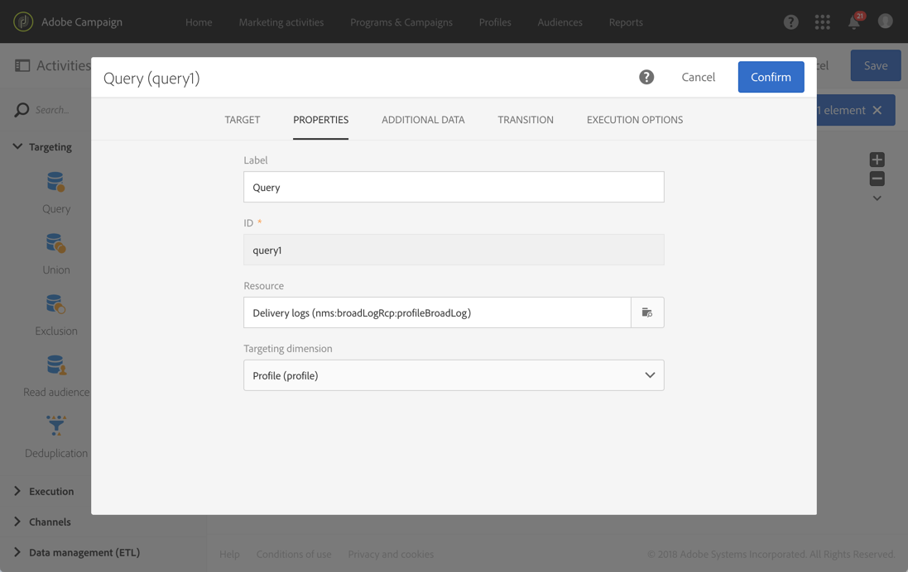
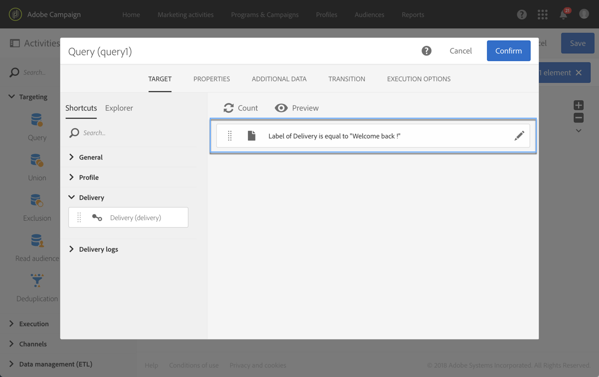
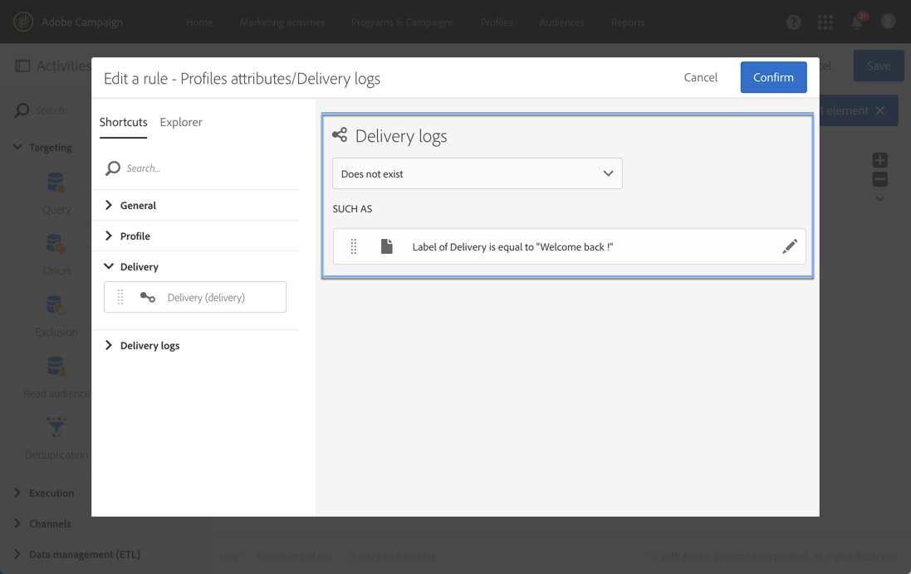

# Utilizzo di risorse diverse dalle dimensioni targeting {#using-resources-different-from-targeting-dimensions}

In questi casi d’uso viene illustrato come utilizzare una risorsa diversa dalla dimensione di targeting, ad esempio, per cercare un record specifico in una tabella lontana.

Per ulteriori informazioni sulle dimensioni di targeting e sulle risorse, consulta [questa sezione](../../automating/using/query.md#targeting-dimensions-and-resources)

**Esempio 1: identificazione dei profili target interessati dalla consegna con l’etichetta “Bentornato”**.

* In questo caso, desideri eseguire il targeting dei profili. Imposta la dimensione targeting su **[!UICONTROL Profiles (profile)]**.
* Desideri filtrare i profili selezionati in base all’etichetta di consegna. Pertanto, imposta la risorsa su **[!UICONTROL Delivery logs]**. In questo modo, filtra direttamente nella tabella dei registri di consegna, che offrirà prestazioni migliori.

**Esempio 2: identificazione dei profili target non interessati dalla consegna con l’etichetta “Bentornato”**

Nell’esempio precedente, hai utilizzato una risorsa diversa dalla dimensione targeting. Puoi eseguire questa operazione solo se desideri trovare un record **presente** nella tabella lontana (log di consegna nell’esempio).

Se desideri trovare un record **non presente** nella tabella lontana (ad esempio profili non interessati da una consegna specifica), devi utilizzare la stessa risorsa e la stessa dimensione targeting, in quanto il record non risulta presente nella tabella lontana (log di consegna).

* In questo caso, desideri eseguire il targeting dei profili. Imposta la dimensione targeting su **[!UICONTROL Profiles (profile)]**.
* Desideri filtrare i profili selezionati in base all’etichetta di consegna. Non puoi filtrare direttamente sui log di consegna perché stai cercando un record non presente in questa tabella. Pertanto, imposta la risorsa su **[!UICONTROL Profile (profile)]** e crea la query sulla tabella dei profili.

