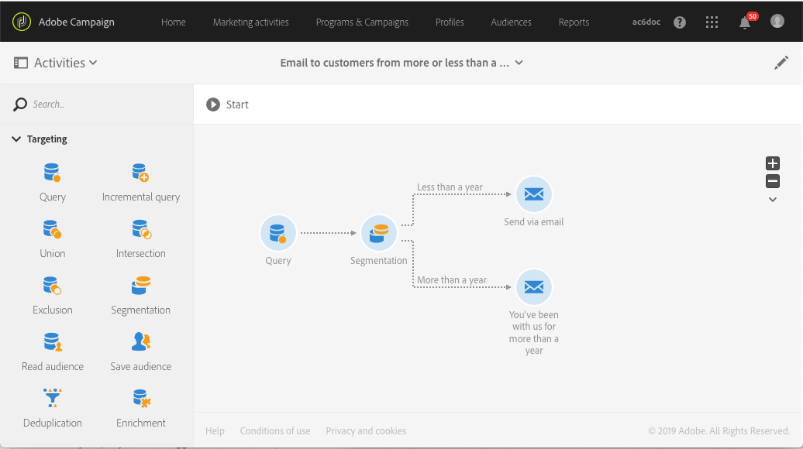

# Caso di utilizzo del flusso di lavoro: Creazione di consegne con un complemento {#deliveries-with-complement}

Potete inviare un messaggio e-mail ai clienti: uno per i clienti creati meno di un anno fa, uno per i clienti creati più di un anno fa.

1. In **[!UICONTROL Marketing Activities]**, fate clic **[!UICONTROL Create]** e selezionate **[!UICONTROL Workflow]**.
1. Selezionate **[!UICONTROL New Workflow]** come tipo di flusso di lavoro e fate clic su **[!UICONTROL Next]**.
1. Immettete le proprietà del flusso di lavoro e fate clic su **[!UICONTROL Create]**.

## Creazione di un'attività Query {#create-a-query-activity}

1. In **[!UICONTROL Activities]** &gt; **[!UICONTROL Targeting]**, trascinate e rilasciate una **[!UICONTROL Query activity]**.
1. Fate doppio clic sull'attività.
1. In **[!UICONTROL Shortcuts]**, trascinare **[!UICONTROL Profiles]** e selezionare **[!UICONTROL email]** con l'operatore **[!UICONTROL is not empty]**.
1. In **[!UICONTROL Shortcuts]**, trascinare **[!UICONTROL Profiles]** e selezionare **[!UICONTROL no longer contact by email]** con il valore **[!UICONTROL no]**.
1. Click **[!UICONTROL Confirm]**.

## Creazione di un'attività di segmentazione {#create-a-segmentation-activity}

1. In **[!UICONTROL Activities]** &gt; **[!UICONTROL Targeting]**, trascinate un' **[!UICONTROL Segmentation]** attività e fate doppio clic su di essa.
1. Passa il cursore del mouse sul segmento e fai clic  per individuare i clienti aggiunti quest'anno nel database.
1. Trascinare **[!UICONTROL Profiles]** e selezionare **[!UICONTROL Created]** con il tipo di filtro **[!UICONTROL Relative]**.
1. Modificate **[!UICONTROL Level of precision]** in **[!UICONTROL Year]** e selezionate **[!UICONTROL This year]**.
1. Fate clic **[!UICONTROL Confirm]** due volte.
1. In **[!UICONTROL Advanced Options]**, selezionate **[!UICONTROL Generate complement]** per creare un segmento con targeting per i destinatari rimanenti.
1. Click **[!UICONTROL Confirm]**.
1. Click **[!UICONTROL Save]**.

>[!NOTE]
>
>Per osservare la struttura della regola, fare clic su **[!UICONTROL Advanced Mode]**.

## Creazione di una consegna tramite e-mail {#create-an-email-delivery}

1. In **[!UICONTROL Activities]** &gt; **[!UICONTROL Channels]**, trascina e rilascia un messaggio di posta elettronica dopo ogni segmento.
1. Fate clic sull'attività e selezionate  per modificarla.
1. Selezionate **[!UICONTROL Single send email]** e fate clic su **[!UICONTROL Next]**.
1. Selezionate un modello e-mail e fate clic su **[!UICONTROL Next]**.
1. Immettete le proprietà e-mail e fate clic su **[!UICONTROL Next]**.
1. Per creare il layout del messaggio e-mail, fate clic su **[!UICONTROL Email Designer]**.
1. Inserite elementi o selezionate un modello esistente.
1. Personalizza la tua e-mail con offerte specifiche per ogni consegna.
1. Fate clic **[!UICONTROL Preview]** per controllare il layout.
1. Click **[!UICONTROL Save]**.

Per ulteriori informazioni, consultate [progettare un'e-mail](../../designing/using/designing-from-scratch.md#designing-an-email-content-from-scratch).

**Argomenti correlati:**

* [Query](../../automating/using/query.md)
* [Attività di segmentazione](../../automating/using/segmentation.md)
* [Recapito e-mail](../../automating/using/email-delivery.md)
