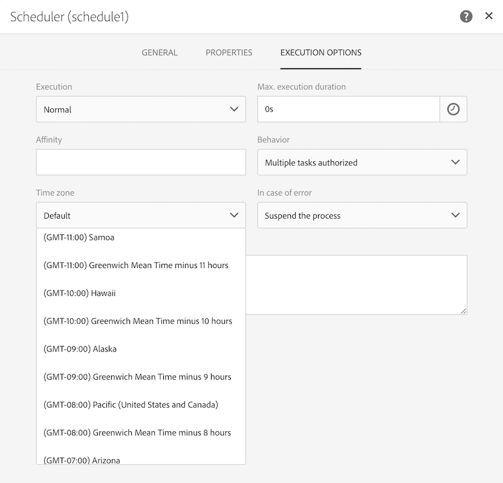
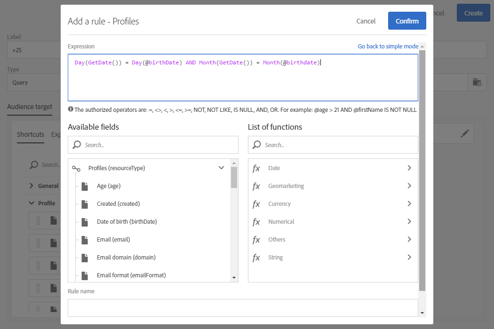

# Caso di utilizzo del flusso di lavoro: Creazione di consegne sulla data di creazione dei profili {#creation-date-query}

Potete inviare un'offerta via e-mail in occasione dell'anniversario della creazione del profilo del cliente.

1. In **[!UICONTROL Marketing Activities]**, fate clic **[!UICONTROL Create]** e selezionate **[!UICONTROL Workflow]**.
1. Selezionate **[!UICONTROL New Workflow]** come tipo di flusso di lavoro e fate clic su **[!UICONTROL Next]**.
1. Immettete le proprietà del flusso di lavoro e fate clic su **[!UICONTROL Create]**.

## Creazione di un'attività di Scheduler {#creating-a-scheduler-activity}

1. In **[!UICONTROL Activities]** &gt; **[!UICONTROL Execution]**, trascina e rilascia un **[!UICONTROL Scheduler activity]**.
1. Fate doppio clic sull'attività.
1. Configura l'esecuzione della consegna.
1. In **[!UICONTROL Execution frequency]**, selezionate **[!UICONTROL Daily]**.
1. Seleziona un **[!UICONTROL Time]** e l’ **[!UICONTROL Repetition frequency]** esecuzione del flusso di lavoro.
1. Seleziona una **[!UICONTROL Start]** data e **[!UICONTROL Expiration]** il flusso di lavoro.
1. Confermate l'attività e salvate il flusso di lavoro.

>[!NOTE]
>
>Per avviare il flusso di lavoro in un fuso orario specifico, nella **[!UICONTROL Execution options]** scheda impostare il fuso orario per il pianificatore nel **[!UICONTROL Time zone]** campo.



## Creazione di un'attività Query {#creating-a-query-activity}

1. Per selezionare i destinatari, trascinatene uno **[!UICONTROL Query activity]** e fate doppio clic.
1. Aggiungere **[!UICONTROL Profiles]** e selezionare **[!UICONTROL no longer contact by email]** con il valore **[!UICONTROL no]**.

### Profili di ripristino creati lo stesso giorno dell'esecuzione {#retriving-profiles-created-on-the-same-day}

1. In **[!UICONTROL Profile]**, trascinare il **[!UICONTROL Created]** campo. e fate clic su **[!UICONTROL Advanced Mode]**.
   
1. In **[!UICONTROL list of functions]**, fare doppio clic **[!UICONTROL Day]** dal **[!UICONTROL Date]** nodo.
1. Quindi, inserire il campo **[!UICONTROL Created]** come argomento.
1. Selezionare **[!UICONTROL equals to (=)]** come operatore.
1. Per Valore, selezionate **[!UICONTROL Day]** dal **[!UICONTROL Date]** nodo nella **[!UICONTROL List of functions]**.
1. Inserire la **[!UICONTROL GetDate()]** funzione come argomento.

Hai recuperato i profili il giorno di creazione corrispondente al giorno corrente.

Dovreste finire con:

```Day(@created) = Day(GetDate())```


Click **[!UICONTROL Confirm]**.

### Profili di ripristino creati lo stesso mese del mese di esecuzione{#retriving-profiles-created-on-the-same-month}

1. Nell’ **[!UICONTROL Query]** editor, selezionate la prima query e duplicatela.
1. Aprite il duplicato.
1. Sostituire **[!UICONTROL Day]** con **[!UICONTROL Month]** nella query.
1. Click **[!UICONTROL Confirm]**.


Dovreste finire con questo:

``` Month(@created) = Month(GetDate()) ```

Viene visualizzata la query finale:

```Day(@created) = Day(GetDate()) AND Month(@created) = Month(GetDate())```



## Creazione di una consegna tramite e-mail{#creating-an-email-delivery}

1. Trascinate e rilasciate un messaggio e-mail di consegna.
1. Fate clic sull'attività e selezionate  per modificarla.
1. Selezionate **[!UICONTROL Recurring email]** e fate clic su **[!UICONTROL Next]**.
1. Selezionate un modello e-mail e fate clic su **[!UICONTROL Next]**.
1. Immettete le proprietà e-mail e fate clic su **[!UICONTROL Next]**.
1. Per creare il layout del messaggio e-mail, fate clic su **[!UICONTROL Email Designer]**.
1. Inserite elementi o selezionate un modello esistente.
1. Personalizzate l'e-mail utilizzando campi e collegamenti.
Per ulteriori informazioni, consultate [progettare un'e-mail](../../designing/using/designing-from-scratch.md#designing-an-email-content-from-scratch).
1. Fate clic **[!UICONTROL Preview]** per controllare il layout.
1. Click **[!UICONTROL Save]**.

**Argomenti correlati:**

* [Query](../../automating/using/query.md)
* [Pianificazione](../../automating/using/scheduler.md)
* [Recapito e-mail](../../automating/using/email-delivery.md)
* [Canale e-mail](../../channels/using/creating-an-email.md)
