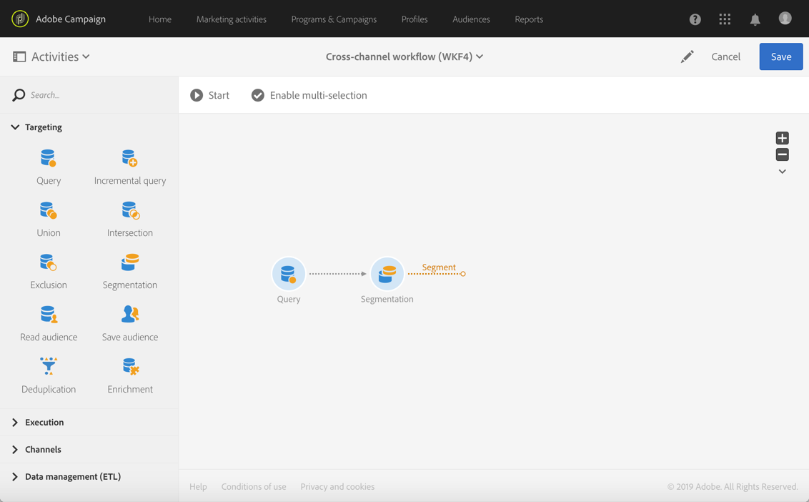
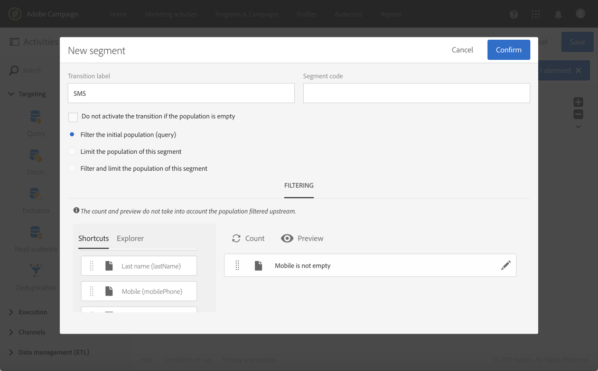

# Creazione di recapito messaggi cross-channel{#cross-channel-delivery}

Questo documento consente di scoprire le seguenti funzionalità di  Adobe Campaign tramite un caso di utilizzo standard: creazione di un flusso di lavoro per la distribuzione tra canali.

L&#39;obiettivo è selezionare un&#39;audience dai destinatari del database e segmentarla in due diversi gruppi allo scopo di inviare un&#39;e-mail al primo gruppo e un messaggio SMS al secondo gruppo.

Per ulteriori dettagli sui flussi di lavoro e sui diversi canali disponibili in  Adobe Campaign, consulta i documenti seguenti:

* [Esplorazione dei flussi di lavoro](../../automating/using/get-started-workflows.md)
* [Esplorazione dei canali di comunicazione](../../channels/using/get-started-communication-channels.md)

## Creazione di un flusso di lavoro {#creating-workflow}

Per inviare due consegne diverse a un determinato gruppo, è innanzitutto necessario definire la destinazione.

A tal fine, dovrete creare una query per identificare i destinatari, quindi dovrete creare un flusso di lavoro.

Crea un nuovo flusso di lavoro nel programma o nella campagna di tua scelta:

1. In **[!UICONTROL Marketing Activities]**, fate clic **[!UICONTROL Create]** e selezionate **[!UICONTROL Workflow]**.
1. Selezionate **[!UICONTROL New Workflow]** come tipo di flusso di lavoro e fate clic su **[!UICONTROL Next]**.
1. Immettete le proprietà del flusso di lavoro e fate clic su **[!UICONTROL Create]**.

I passaggi dettagliati per creare un flusso di lavoro sono descritti nella sezione [Creazione di un flusso di lavoro](../../automating/using/building-a-workflow.md) .

## Creazione di un&#39;attività Query {#creating-query-activity}

Una volta creato il flusso di lavoro, potete accedere alla relativa interfaccia.

Inserite un&#39;attività Query nel flusso di lavoro per eseguire il targeting dei profili che riceveranno le consegne.

1. In **[!UICONTROL Activities]** > **[!UICONTROL Targeting]**, trascinate e rilasciate un&#39;attività [Query](../../automating/using/query.md) .
1. Fate doppio clic sull&#39;attività.
1. Nella **[!UICONTROL Target]** scheda, individuate le scelte rapide da tastiera e selezionate una delle [audience](../../audiences/using/about-audiences.md).
1. Trascinate la scelta rapida nella zona di modifica. A seconda del tipo di scelta rapida selezionato, verrà visualizzata una finestra.
1. Configurate gli elementi di targeting e quindi confermate la query.

È possibile creare una query su uno o più elementi.

Utilizzate il **[!UICONTROL Count]** pulsante per visualizzare una stima del numero di profili interessati dalla query.

## Creazione di un&#39;attività di segmentazione {#creating-segmentation-activity}

Una volta identificato il target dall&#39;attività Query, è necessario selezionare un criterio per segmentare il target in due popolazioni diverse: uno riceverà un&#39;e-mail e l&#39;altro riceverà un SMS.

È necessario utilizzare un&#39;attività di [segmentazione](../../automating/using/segmentation.md) per creare uno o più segmenti da una popolazione calcolata a monte in una query.

Il gruppo **E-mail** verrà indirizzato ai destinatari con un indirizzo e-mail definito ma nessun numero di telefono cellulare. Il gruppo **SMS** conterrà i destinatari il cui numero di telefono cellulare è salvato nel loro profilo.

Per configurare la prima transizione (E-mail):

1. Nella **[!UICONTROL Segments]** scheda, per impostazione predefinita è presente un primo segmento. Modificatene le proprietà per configurare quel segmento.

   

1. Selezionare il profilo **[!UICONTROL Email]** come criterio di filtraggio.

   

1. Nella nuova finestra visualizzata sullo schermo, selezionare l&#39; **[!UICONTROL Is not empty]** operatore.

   

1. Aggiungere un secondo criterio di filtraggio **[!UICONTROL Mobile]**, quindi selezionare l&#39;operatore **[!UICONTROL Is empty]**.

   

   Tutti i profili provenienti dalla query che dispongono di un&#39;e-mail, ma non di un numero di telefono cellulare definito, saranno in questa transizione.

1. Per rendere più chiaro il flusso di lavoro, potete modificare l’etichetta della transizione. Confermate le modifiche.

   

La prima transizione è configurata. Per configurare la seconda transizione (SMS):

1. Fate clic sul **[!UICONTROL Add an element]** pulsante per aggiungere una nuova transizione.
1. Definire una condizione che consenta di recuperare tutti i profili i cui numeri di telefono cellulare sono stati forniti. A tal fine, creare una regola sul **[!UICONTROL Mobile]** campo con l&#39;operatore **[!UICONTROL Is not empty]** logico.

   

   Tutti i profili provenienti dalla query per i quali è stato definito un numero di telefono cellulare saranno in questa transizione.

1. Potete modificare l’etichetta della transizione. Confermate le modifiche.

Ora è configurata anche la seconda transizione.

## Creazione di consegne {#creating-deliveries}

Poiché sono già state create due transizioni, è ora necessario aggiungere due tipi di consegne alle transizioni in uscita dell&#39;attività Segmentazione: un&#39;attività di consegna [e-](../../automating/using/email-delivery.md) mail e un&#39;attività di consegna  SMS.

 Adobe Campaign consente di aggiungere consegne a un flusso di lavoro. A questo scopo, selezionate una consegna dalla **[!UICONTROL Channels]** categoria della palette Attività del flusso di lavoro.

Per creare una consegna tramite e-mail:

1. Trascinate e rilasciate un&#39;attività di consegna [e-](../../automating/using/email-delivery.md) mail dopo il primo segmento.
1. Fate doppio clic sull&#39;attività per modificarla.
1. Selezionare **[!UICONTROL Simple email]**.
1. Selezionate **[!UICONTROL Add an outbound transition with the population]** e fate clic su **[!UICONTROL Next]**.

   

   La transizione in uscita vi permetterà di recuperare la popolazione e i registri di tracciamento. Sarà possibile utilizzare questo, ad esempio, per inviare una seconda posta alle persone che non hanno fatto clic nella prima e-mail.

1. Selezionate un modello e-mail e fate clic su **[!UICONTROL Next]**.
1. Immettete le proprietà e-mail e fate clic su **[!UICONTROL Next]**.
1. Per creare il layout del messaggio e-mail, selezionate **[!UICONTROL Use the Email Designer]**.
1. Modificate e salvate il contenuto.
1. Nella **[!UICONTROL Schedule]** sezione del dashboard dei messaggi, deselezionate l&#39;opzione **[!UICONTROL Request Confirm before sent messages}** (Conferma richiesta CONTROL prima dell&#39;invio dei messaggi).

Per creare un invio SMS:

1. Trascina e rilascia un&#39;attività di consegna  SMS dopo l&#39;altro segmento.
1. Fate doppio clic sull&#39;attività per modificarla.
1. Selezionate **[!UICONTROL SMS]** e fate clic su **[!UICONTROL Next]**.
1. Selezionate un modello SMS e fate clic su **[!UICONTROL Next]**.
1. Immettete le proprietà SMS e fate clic su **[!UICONTROL Next]**.
1. Modificate e salvate il contenuto.

Una volta create e modificate le consegne, il flusso di lavoro è pronto per essere avviato.

## Esecuzione del flusso di lavoro {#running-the-workflow}

Dopo l&#39;avvio del flusso di lavoro, la popolazione di destinazione dell&#39; **[!UICONTROL Query]** attività verrà segmentata per ricevere un&#39;e-mail o un SMS.

Per eseguire il flusso di lavoro, fate clic sul **[!UICONTROL Start]** pulsante nella barra delle azioni.

Potete accedere alle vostre consegne dal menu **[!UICONTROL Marketing plans]** > **[!UICONTROL Marketing activities]** avanzato tramite il logo del Adobe Campaign . Fate clic sul **[!UICONTROL Reports]** pulsante consegna e quindi sul pulsante per accedere ai rapporti [di](../../reporting/using/about-dynamic-reports.md#accessing-dynamic-reports)consegna, ad esempio il riepilogo della consegna, il tasso di apertura o il rendering dell&#39;e-mail in base alla inbox del messaggio dei destinatari.
