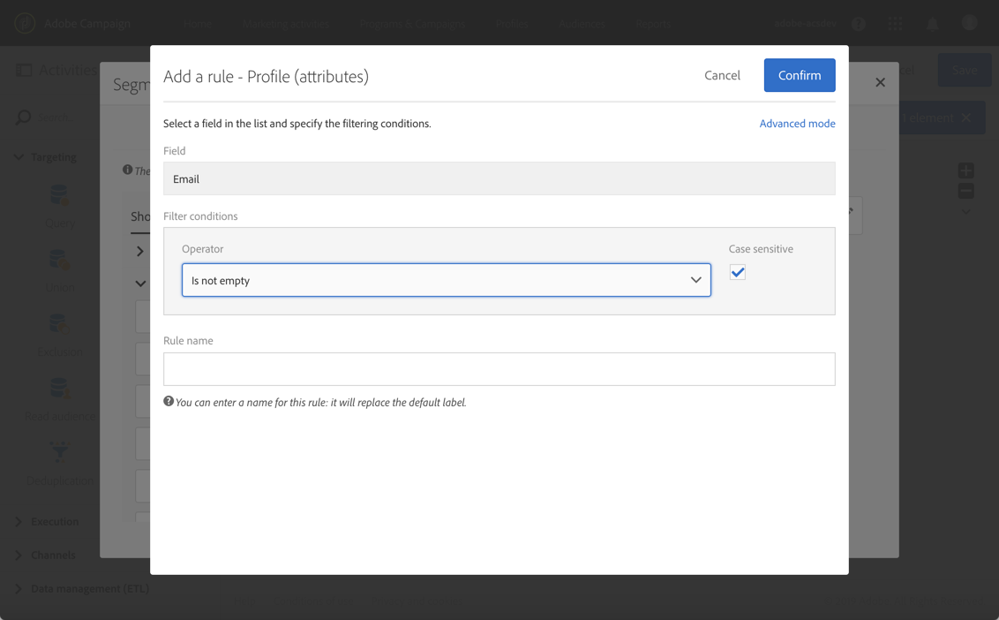

# Creazione di consegna messaggi cross-channel{#cross-channel-delivery}

Il presente documento ti consente di scoprire le seguenti funzionalità di Adobe Campaign tramite un caso d’uso standard: la creazione di un flusso di lavoro di consegna cross-channel.

L’obiettivo è selezionare un pubblico dai destinatari del database, quindi segmentarlo in due diversi gruppi allo scopo di inviare un’e-mail al primo gruppo e un messaggio SMS al secondo.

Per maggiori dettagli sui flussi di lavoro e sui diversi canali disponibili in Adobe Campaign, consulta i seguenti documenti:

* [Esplorazione dei flussi di lavoro](../../automating/using/get-started-workflows.md)
* [Esplorazione dei canali di comunicazione](../../channels/using/get-started-communication-channels.md)

## Creazione di un flusso di lavoro {#creating-workflow}

Per inviare due recapiti diversi a un determinato gruppo, devi innanzitutto definire il target.

A tal fine, dovrai creare una query per identificare i destinatari, quindi procedere con la creazione di un flusso di lavoro.

Crea un nuovo flusso di lavoro nel programma o nella campagna a tua scelta:

1. In **[!UICONTROL Marketing Activities]**, fai clic su **[!UICONTROL Create]** e seleziona **[!UICONTROL Workflow]**.
1. Seleziona **[!UICONTROL New Workflow]** come tipo di flusso di lavoro e fai clic su **[!UICONTROL Next]**.
1. Inserisci le proprietà del flusso di lavoro e fai clic su **[!UICONTROL Create]**.

I passaggi dettagliati per la creazione di un flusso di lavoro sono descritti nella sezione [Creazione di un flusso di lavoro](../../automating/using/building-a-workflow.md).

## Creazione di un’attività query {#creating-query-activity}

Una volta creato il flusso di lavoro, puoi accedere alla relativa interfaccia.

Per eseguire il targeting dei profili che riceveranno le tue consegne, inserisci un’attività query nel flusso di lavoro.

1. In **[!UICONTROL Activities]** > **[!UICONTROL Targeting]**, trascinate e rilasciate un&#39;attività [Query](../../automating/using/query.md) .
1. Fai doppio clic sull’attività.
1. Nella scheda **[!UICONTROL Target]**, sfoglia le scelte rapide e seleziona uno dei tuoi [tipi di pubblico](../../audiences/using/about-audiences.md).
1. Trascina e rilascia la scelta rapida nella zona di modifica. A seconda del tipo di scelta rapida selezionato, verrà visualizzata una finestra.
1. Configura gli elementi di targeting, infine conferma la query.

Puoi creare una query su uno o più elementi.

Per visualizzare una stima del numero di profili interessati dalla query, utilizza il pulsante **[!UICONTROL Count]**.

## Creazione di un’attività di segmentazione {#creating-segmentation-activity}

Una volta che l’attività di query ha identificato il target, devi selezionare un criterio in base a cui segmentarlo in due popolazioni diverse: una riceverà un’e-mail e l’altra invece un SMS.

You have to use a [Segmentation](../../automating/using/segmentation.md) activity to create one or several segments from a population computed upstream in a query.

Il gruppo **E-mail** eseguirà il targeting dei destinatari che presentano un indirizzo e-mail definito, ma privi di numero di telefono cellulare. Il gruppo **SMS** conterrà i destinatari il cui numero di telefono cellulare è salvato nel loro profilo.

Per configurare la prima transizione (E-mail):

1. Nella scheda **[!UICONTROL Segments]** è presente un primo segmento per impostazione predefinita. Per configurarlo, modifica le proprietà del segmento.

   

1. Seleziona il profilo **[!UICONTROL Email]** come criterio di filtraggio.

   

1. Nella nuova finestra visualizzata sullo schermo, seleziona l’operatore **[!UICONTROL Is not empty]**.

   

1. Aggiungi un secondo criterio di filtraggio **[!UICONTROL Mobile]**, quindi seleziona l’operatore **[!UICONTROL Is empty]**.

   

   In questa transizione si troveranno tutti i profili provenienti dalla query per cui è definito l’indirizzo e-mail ma non il numero di telefono cellulare.

1. Per rendere più chiaro il flusso di lavoro, puoi modificare l’etichetta della transizione. Conferma le modifiche.

   

La prima transizione è configurata. Per configurare la seconda transizione (SMS):

1. Fai clic sul pulsante **[!UICONTROL Add an element]** per aggiungere una nuova transizione.
1. Definisci una condizione che consenta di recuperare tutti i profili a cui è associato un numero di telefono cellulare. A tal fine, crea una regola sul campo **[!UICONTROL Mobile]** con l’operatore logico **[!UICONTROL Is not empty]**.

   

   In questa transizione si troveranno tutti i profili provenienti dalla query per cui è definito il numero di telefono cellulare.

1. Puoi modificare l’etichetta della transizione. Conferma le modifiche.

Adesso è configurata anche la seconda transizione.

## Creazione di consegne {#creating-deliveries}

As two transitions were already created, you must now add two types of deliveries to the outbound transitions of the Segmentation activity: an [Email delivery](../../automating/using/email-delivery.md) activity and an [SMS delivery](../../automating/using/sms-delivery.md) activity.

Adobe Campaign ti consente di aggiungere le consegne a un flusso di lavoro. A questo scopo, seleziona una consegna dalla categoria **[!UICONTROL Channels]** della palette attività del flusso di lavoro.

Per creare un’attività Email delivery:

1. Trascinate e rilasciate un&#39;attività di consegna [e-](../../automating/using/email-delivery.md) mail dopo il primo segmento.
1. Fai doppio clic sull’attività per modificarla.
1. Seleziona **[!UICONTROL Simple email]**.
1. Seleziona **[!UICONTROL Add an outbound transition with the population]** e fai clic su **[!UICONTROL Next]**.

   

   La transizione in uscita ti permetterà di recuperare la popolazione e i registri di tracciamento. In tal modo potrai, ad esempio, inviare una seconda e-mail alle persone che non hanno selezionato la prima e-mail.

1. Seleziona un modello di e-mail e fai clic su **[!UICONTROL Next]**.
1. Immetti le proprietà dell’e-mail e fai clic su **[!UICONTROL Next]**.
1. Per creare il layout del messaggio e-mail, seleziona **[!UICONTROL Use the Email Designer]**.
1. Modifica e salva il contenuto.
1. Nella sezione **[!UICONTROL Schedule]** del dashboard dei messaggi, deseleziona l’opzione **[!UICONTROL Richiedi conferma prima dell’invio dei messaggi}**.

Per creare una consegna di SMS:

1. Trascina e rilascia un&#39;attività di consegna  SMS dopo l&#39;altro segmento.
1. Fai doppio clic sull’attività per modificarla.
1. Seleziona **[!UICONTROL SMS]** e fai clic su **[!UICONTROL Next]**.
1. Seleziona un modello SMS e fai clic su **[!UICONTROL Next]**.
1. Immetti le proprietà SMS e seleziona **[!UICONTROL Next]**.
1. Modifica e salva il contenuto.

Una volta create e modificate le consegne, il flusso di lavoro è pronto per essere avviato.

## Esecuzione del flusso di lavoro {#running-the-workflow}

Once the workflow is started, the population targeted by the **[!UICONTROL Query]** activity will be segmented to receive an Email or SMS delivery.

Per eseguire il flusso di lavoro, fai clic sul pulsante **[!UICONTROL Start]** nella barra delle azioni.

Puoi accedere alle tue consegne dal menu avanzato **[!UICONTROL Marketing plans]** > **[!UICONTROL Marketing activities]** facendo clic sul logo Adobe Campaign. Fai clic sul pulsante di consegna e quindi sul pulsante **[!UICONTROL Reports]** per accedere ai [rapporti di consegna](../../reporting/using/about-dynamic-reports.md#accessing-dynamic-reports), ad esempio il riepilogo della consegna, il tasso di apertura o il rendering dell’e-mail in base alla casella in entrata del messaggio dei destinatari.
