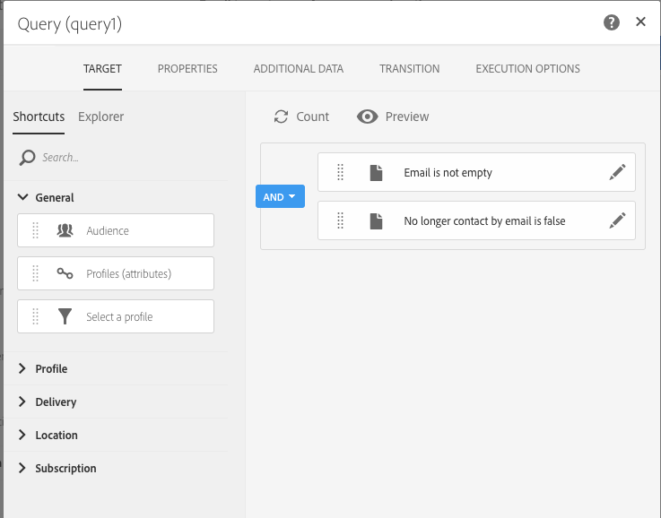

# Esempio di utilizzo del flusso di lavoro: Flusso di lavoro di retargeting che invia una nuova consegna a non-openers{#retargeting-delivery-to-non-openers}

Potete inviare un messaggio e-mail ai clienti e quindi inviarli a coloro che non hanno aperto il messaggio.

1. In **[!UICONTROL Marketing Activities]**, fate clic **[!UICONTROL Create]** e selezionate **[!UICONTROL Workflow]**.
1. Selezionate **[!UICONTROL New Workflow]** il tipo di flusso di lavoro e fate clic **[!UICONTROL Next]** su.
1. Immettete le proprietà del flusso di lavoro e fate clic **[!UICONTROL Create]** su.

## Creazione di un'attività di query{#creating-a-query-activity}

1. In **[!UICONTROL Activities]** &gt; **[!UICONTROL Targeting]**, trascina e rilascia un **[!UICONTROL Query activity]**.
1. Fate doppio clic sull'attività.
1. In **[!UICONTROL Shortcuts]**, trascinate **[!UICONTROL Profiles]** e selezionate **[!UICONTROL email]** con l'operatore **[!UICONTROL is not empty]**.
1. In **[!UICONTROL Shortcuts]**, trascinate **[!UICONTROL Profiles]** e selezionate **[!UICONTROL no longer contact by email]** con il valore **[!UICONTROL no ]**.
1. Click **[!UICONTROL Confirm]**.

## Creazione di un'e-mail di consegna{#creating-an-email-delivery}

1. Trascina un****[!UICONTROL Email delivery]e-mail di consegna dopo ogni segmento.
1. Fate clic sull'attività e  selezionatela.
1. Selezionate **[!UICONTROL Simple email]** e fate clic **[!UICONTROL Next]** su.
1. Selezionate **[!UICONTROL Add an outbound transition without the population]** e fate clic **[!UICONTROL Next]** su.
1. Selezionate un modello e-mail e fate clic **[!UICONTROL Next]** su.
1. Immettete le proprietà e-mail e fate clic **[!UICONTROL Next]** su.
1. Per creare il layout dell'e-mail, fai clic **[!UICONTROL Using the Email Designer]** su.
1. Inserire elementi o selezionare un modello esistente.
1. Personalizzate l'e-mail con offerte specifiche per ogni posizione. Per ulteriori informazioni, consultate [la progettazione di un'e-mail](../../designing/using/about-email-content-design.md#designing-an-email-content-from-scratch).
1. Fate clic su **[!UICONTROL Preview]** per controllare il layout.
1. Click **[!UICONTROL Save]**.

## Targeting non-apertura in un'attività query{#targeting-non-openers-in-a-query-activity}

1. In **[!UICONTROL Activities]** &gt; **[!UICONTROL Execution]**, trascina e rilascia un **[!UICONTROL Wait activity]**.
1. In **[!UICONTROL Duration]**, fai clic su  e seleziona un giorno.
1. In **[!UICONTROL Activities]** &gt; **[!UICONTROL Targeting]**, trascina e rilascia un **[!UICONTROL Query activity]**.
1. Fate doppio clic sull'attività.
1. In **[!UICONTROL Shortcuts]**, trascinate e **[!UICONTROL Tracking Logs]** rilasciate l'operatore **[!UICONTROL exists]**.
1. In **[!UICONTROL Shortcuts]**&gt; **[!UICONTROL Delivery]**, trascinate **[!UICONTROL delivery]** insieme all'operatore **[!UICONTROL is equal to]** e selezionate la consegna come valore.
1. In **[!UICONTROL Shortcuts]**&gt; **[!UICONTROL Delivery]**, trascinate e **[!UICONTROL type]** verificate **[!UICONTROL Open]** il valore.
1. Seleziona l'operatore tra le regole.**[!UICONTROL except]**
1. Click **[!UICONTROL Confirm]**.

## Creazione di una consegna di SMS{#creating-a-sms-delivery}

1. Trascina una consegna di SMS dopo ogni segmento.
1. Fate clic sull'attività e  selezionatela.
1. Selezionate **[!UICONTROL Simple sms]** e fate clic **[!UICONTROL Next]** su.
1. Selezionate un modello SMS e fate clic **[!UICONTROL Next]** su.
1. Immettete le proprietà sms e fate clic **[!UICONTROL Next]** su.
1. Per creare il layout del SMS, fai clic **[!UICONTROL Email Designer]** su.
1. Inserire elementi o selezionare un modello esistente.
1. Personalizzate l'SMS con offerte specifiche per ogni posizione.
Per ulteriori informazioni, fare riferimento [alla progettazione di un SMS](../../channels/using/creating-an-sms-message.md).
1. Fate clic su **[!UICONTROL Preview]** per controllare il layout.
1. Click **[!UICONTROL Save]**.

**Argomenti correlati:**

* [Query](../../automating/using/query.md)
* [Consegna SMS](../../automating/using/sms-delivery.md)
* [Consegna e-mail](../../automating/using/email-delivery.md)
* [Canale e-mail](../../channels/using/creating-an-email.md)
