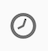

# Retargeting workflow invio di una nuova consegna a non-openers{#retargeting-delivery-to-non-openers}

Puoi inviare un’e-mail ai clienti e quindi un sms a coloro che non hanno aperto l’e-mail.

1. In **[!UICONTROL Marketing Activities]**, fai clic su **[!UICONTROL Create]** e seleziona **[!UICONTROL Workflow]**.
1. Seleziona **[!UICONTROL New Workflow]** come tipo di flusso di lavoro e fai clic su **[!UICONTROL Next]**.
1. Inserisci le proprietà del flusso di lavoro e fai clic su **[!UICONTROL Create]**.

## Creazione di un&#39;attività query{#creating-a-query-activity}

1. In **[!UICONTROL Activities]** > **[!UICONTROL Targeting]**, trascina e rilascia un’attività [Query](../../automating/using/query.md) .
1. Fai doppio clic sull’attività.
1. In **[!UICONTROL Shortcuts]**, trascina **[!UICONTROL Profiles]** e seleziona **[!UICONTROL email]** con l’operatore **[!UICONTROL is not empty]**.
1. In **[!UICONTROL Shortcuts]**, trascina **[!UICONTROL Profiles]** e seleziona **[!UICONTROL no longer contact by email]** con il valore **[!UICONTROL no ]**.
1. Fai clic su **[!UICONTROL Confirm]**.

## Creazione di una consegna e-mail{#creating-an-email-delivery}

1. Trascina e rilascia una [Consegna e-mail](../../automating/using/email-delivery.md) dopo ogni segmento.
1. Fai clic sull’attività e seleziona  per modificarla.
1. Seleziona **[!UICONTROL Simple email]** e fai clic su **[!UICONTROL Next]**.
1. Seleziona **[!UICONTROL Add an outbound transition without the population]** e fai clic su **[!UICONTROL Next]**.
1. Seleziona un modello di e-mail e fai clic su **[!UICONTROL Next]**.
1. Immetti le proprietà dell’e-mail e fai clic su **[!UICONTROL Next]**.
1. Per creare il layout dell’e-mail, fai clic su **[!UICONTROL Using the Email Designer]**.
1. Inserisci elementi o seleziona un modello esistente.
1. Personalizza il tuo messaggio e-mail con offerte specifiche per ogni posizione.Per ulteriori informazioni, consulta [progettazione di un messaggio e-mail](../../designing/using/designing-from-scratch.md#designing-an-email-content-from-scratch).
1. Seleziona **[!UICONTROL Preview]** per controllare il layout.
1. Fai clic su **[!UICONTROL Save]**.

## Targeting di non-openers in un&#39;attività di query{#targeting-non-openers-in-a-query-activity}

1. In **[!UICONTROL Activities]** > **[!UICONTROL Execution]**, trascina e rilascia un’attività [Wait](../../automating/using/wait.md) .
1. In **[!UICONTROL Duration]**, fai clic su  e seleziona un giorno.
1. In **[!UICONTROL Activities]** > **[!UICONTROL Targeting]**, trascina e rilascia una **[!UICONTROL Query activity]**.
1. Fai doppio clic sull’attività.
1. In **[!UICONTROL Shortcuts]**, trascina **[!UICONTROL Tracking Logs]** e con l’operatore **[!UICONTROL exists]**.
1. In **[!UICONTROL Shortcuts]**> **[!UICONTROL Delivery]**, trascina **[!UICONTROL delivery]** con l’operatore **[!UICONTROL is equal to]** e seleziona la consegna come valore.
1. In **[!UICONTROL Shortcuts]**> **[!UICONTROL Delivery]**, trascina **[!UICONTROL type]** e seleziona **[!UICONTROL Open]** come valore.
1. Seleziona l’operatore tra le regole come **[!UICONTROL except]**.
1. Fai clic su **[!UICONTROL Confirm]**.

## Creazione di una consegna sms{#creating-a-sms-delivery}

1. Trascina e rilascia una consegna sms dopo ogni segmento.
1. Fai clic sull’attività e seleziona  per modificarla.
1. Seleziona **[!UICONTROL Simple sms]** e fai clic su **[!UICONTROL Next]**.
1. Seleziona un modello sms e fai clic su **[!UICONTROL Next]**.
1. Immetti le proprietà sms e fai clic su **[!UICONTROL Next]**.
1. Per creare il layout del proprio sms, fai clic su **[!UICONTROL Email Designer]**.
1. Inserisci elementi o seleziona un modello esistente.
1. Personalizza gli sms con offerte specifiche per ogni posizione.
Per ulteriori informazioni, consulta la sezione [Progettazione di un sms](../../channels/using/creating-an-sms-message.md) .
1. Seleziona **[!UICONTROL Preview]** per controllare il layout.
1. Fai clic su **[!UICONTROL Save]**.

**Argomenti correlati:**

* [Canale e-mail](../../channels/using/creating-an-email.md)
