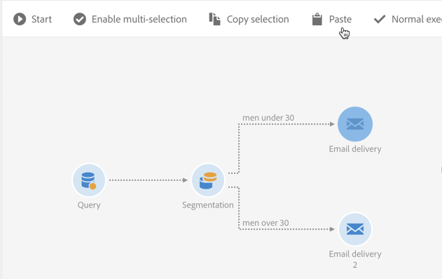

# Interfaccia dei flussi di lavoro{#workflow-interface}

Puoi creare flussi di lavoro per gestire interi processi nelle campagne e nei programmi.

La schermata di modifica del flusso di lavoro è composta dai seguenti elementi:

* La [Palette](#palette), che fa riferimento alle attività disponibili.
* L’ [Area di lavoro](#workspace), in cui le attività sono configurate e organizzate.
* La [barra delle azioni](#action-bar), costituita da pulsanti che consentono di interagire con il flusso di lavoro e/o i relativi componenti.
* Le [Azioni rapide](#quick-actions), visualizzate intorno a un&#39;attività selezionata, consentono di interagire con essa.

## Palette {#palette}

La palette si trova sul lato sinistro dello schermo. Tutte le attività disponibili sono suddivise in diverse categorie:

* [Targeting](../../automating/using/about-targeting-activities.md): attività specifiche per il targeting, la manipolazione dei dati sulla popolazione e le attività di filtraggio
* [Esecuzione](../../automating/using/about-execution-activities.md): attività specifiche per l’organizzazione e l’esecuzione dei flussi di lavoro
* [Canali](../../automating/using/about-channel-activities.md): attività che rappresentano i diversi canali di comunicazione disponibili
* [Gestione dati (ETL)](../../automating/using/about-data-management-activities.md): attività specifiche per la manipolazione dei dati

Per utilizzare un’attività dalla palette nel flusso di lavoro, trascinala nell’area di lavoro.

Devi configurare ogni attività aggiunta dalla palette prima di avviare il flusso di lavoro.

## Area di lavoro {#workspace}

L’area di lavoro è la zona centrale nell’editor del flusso di lavoro. È in questa zona che puoi rilasciare le tue attività, collegarle utilizzando le transizioni e configurarle.

Per collegare due attività, sposta la fine della freccia dalla prima attività all’attività seguente fino a quando non si connettono. Puoi anche spostare l’attività verso il punto della freccia dietro di essa per collegarla all’attività precedente. Se sposti una delle attività, queste rimarranno collegate.

Transizioni successive alle attività che elaborano i dati contenenti le popolazioni intermedie. Puoi accedervi selezionando l’opzione **[!UICONTROL Keep interim results]** nella sezione **[!UICONTROL Execution]** delle proprietà del flusso di lavoro.

>[!CAUTION]
>
>Questa opzione consuma molto spazio su disco ed è progettata per consentire la creazione di un flusso di lavoro, garantendone la corretta configurazione e il giusto comportamento. Lascia deselezionata questa opzione nelle istanze di produzione.

Quando un’attività viene selezionata, intorno all’attività vengono visualizzate azioni rapide, che consentono di interagire con essa. Ad esempio, per configurare un’attività, selezionala e aprila utilizzando il pulsante  nelle azioni rapide.

Alcune funzioni sono abilitate solo nell’area di lavoro:

* Seleziona diverse attività e transizioni disegnando una zona intorno a loro.
* Premi **Ctrl** + clic a sinistra per selezionare diverse attività e/o transizioni.
* Premi **Invio** per visualizzare i dettagli dell&#39;attività o della transizione attualmente selezionata.
* Premi **Elimina** per eliminare l&#39;attività attualmente selezionata.
* Premere **Ctrl + C** per copiare le attività selezionate e **Ctrl + V** per incollarle nell&#39;area di lavoro.

## Barra delle azioni {#action-bar}

A seconda degli elementi selezionati nell’area di lavoro o dello stato di esecuzione del flusso di lavoro, i pulsanti disponibili nella barra delle azioni possono variare.

 **[!UICONTROL Open activity]** Consente di modificare le proprietà del flusso di lavoro.

 **[!UICONTROL Start]** Avvia il flusso di lavoro.

 **[!UICONTROL Pause]** Sospende il flusso di lavoro.

 **[!UICONTROL Stop]** Interrompe l’esecuzione del flusso di lavoro. Impossibile riprendere da dove è stato interrotto.

 **[!UICONTROL Restart]** Riavvia il flusso di lavoro.

 **[!UICONTROL Log and tasks]** Apre il registro di esecuzione del flusso di lavoro.

 **[!UICONTROL Enable multi-selection]** Abilita la modalità di selezione multipla. Il flusso di lavoro deve essere composto da almeno due attività.

 **[!UICONTROL Disable multi-selection]** Disattiva la modalità di selezione multipla. 

 **[!UICONTROL Open transition]** Apre la transizione selezionata. 

  **[!UICONTROL Normal execution]** Abilita nuovamente la selezione se in precedenza è stata disabilitata o contrassegnata come sospesa. 

 **[!UICONTROL Execution suspended]** Sospende il flusso di lavoro nell’attività selezionata. 

 **[!UICONTROL No execution]** Disattiva l’attività. 

 **[!UICONTROL Delete selection]** Elimina le attività selezionate. 

 **[!UICONTROL Copy selection]** Copia le attività selezionate.

 **[!UICONTROL Paste]** Incolla le attività che sono state copiate.

## Azioni rapide {#quick-actions}

Quando un’attività è selezionata, intorno all’attività vengono visualizzati i pulsanti di azione rapida, che consentono di interagire con essa.

 **[!UICONTROL Open activity]** Apre l’attività selezionata.

 **[!UICONTROL Copy selection]** Copia l’attività selezionata.

 **[!UICONTROL Open the activity's advanced options]** Apre le opzioni avanzate dell’attività Email o SMS delivery selezionata.

 **[!UICONTROL Normal execution]** Abilita nuovamente la selezione se in precedenza è stata disabilitata o contrassegnata come sospesa.

 **[!UICONTROL Execution suspended]** Sospende il flusso di lavoro nell’attività selezionata.

 **[!UICONTROL No execution]** Disattiva l’attività.

 **[!UICONTROL Immediate execution]** Forza l&#39;elaborazione immediata della selezione. Questo pulsante è disponibile solo per le attività Scheduler e Wait .

 **[!UICONTROL Delete selection]** Elimina le attività selezionate.

## Duplicazione delle attività del flusso di lavoro {#duplicating-workflow-activities}

L’area di lavoro ti consente di duplicare le attività del flusso di lavoro copiandole e incollandole nello stesso flusso di lavoro o in un altro flusso di lavoro dalla stessa istanza Campaign.

Una volta duplicata un’attività, viene mantenuta l’intera configurazione. Per le attività di consegna (e-mail, SMS, notifica push..), l’oggetto di consegna allegato all’attività viene duplicato.

>[!NOTE]
>
>Le attività del flusso di lavoro non possono essere duplicate da un’istanza a un’altra. Non è possibile duplicare le attività dai flussi di lavoro tecnici.

Per duplicare un’attività, segui i passaggi seguenti:

1. Seleziona l’attività, quindi fai clic sul pulsante **[!UICONTROL Copy selection]** dalle azioni rapide.

   È inoltre possibile utilizzare la scelta rapida da tastiera **Ctrl + C**.

   

1. Fai clic con il pulsante destro del mouse nell’area di lavoro del flusso di lavoro di destinazione, quindi fai clic sul pulsante **[!UICONTROL Paste]** .

   È inoltre possibile utilizzare la scelta rapida da tastiera **CTRL+V**.

   

1. L’attività viene duplicata, con tutte le impostazioni inizialmente configurate.

È inoltre possibile copiare e incollare più attività, consentendo di duplicare un intero flusso di lavoro.

A questo scopo, seleziona le attività disegnando una zona intorno a esse. quindi fai clic sul pulsante **[!UICONTROL Copy selection]** dalla barra delle azioni (oppure premi **Ctrl + C**). Puoi quindi incollarli nella posizione desiderata.

