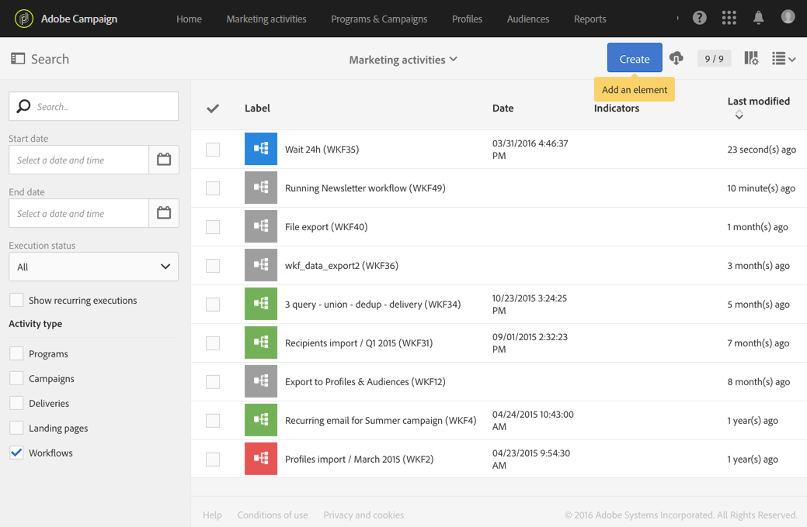

# Ciclo di vita di un flusso di lavoro {#life-cycle}

Il ciclo di vita di un flusso di lavoro include tre passaggi principali e ogni passaggio è collegato a uno stato e a un colore:

* **Modifica** (grigio)

  Questa è la fase di progettazione iniziale di un flusso di lavoro (fare riferimento a [Creazione di un flusso di lavoro](../../automating/using/building-a-workflow.md#creating-a-workflow)). Il flusso di lavoro non è ancora gestito dal server e può essere modificato senza alcun rischio.

* **In corso** (blu)

  Una volta completata la fase di progettazione iniziale, il flusso di lavoro può essere avviato e gestito dal server.

* **Completato** (verde)

  Un flusso di lavoro viene completato una volta che non sono più presenti attività in corso o quando un operatore ha esplicitamente arrestato l’istanza.

Una volta avviato, un flusso di lavoro può avere anche altri due stati:

* **Avviso** (giallo)

  Impossibile completare o sospendere il flusso di lavoro utilizzando i pulsanti  o .

* **Errato** (rosso)

  Si è verificato un errore durante l’esecuzione di un flusso di lavoro. Il flusso di lavoro è stato interrotto e l’utente deve eseguire un’azione. Per ulteriori informazioni sull&#39;errore, utilizzare il pulsante  per accedere al registro del flusso di lavoro (consultare [Monitoraggio](../../automating/using/monitoring-workflow-execution.md)).

L’elenco delle attività di marketing ti consente di visualizzare tutti i flussi di lavoro e i relativi stati. Per ulteriori informazioni, consulta [Gestione delle attività di marketing](../../start/using/marketing-activities.md#about-marketing-activities).

