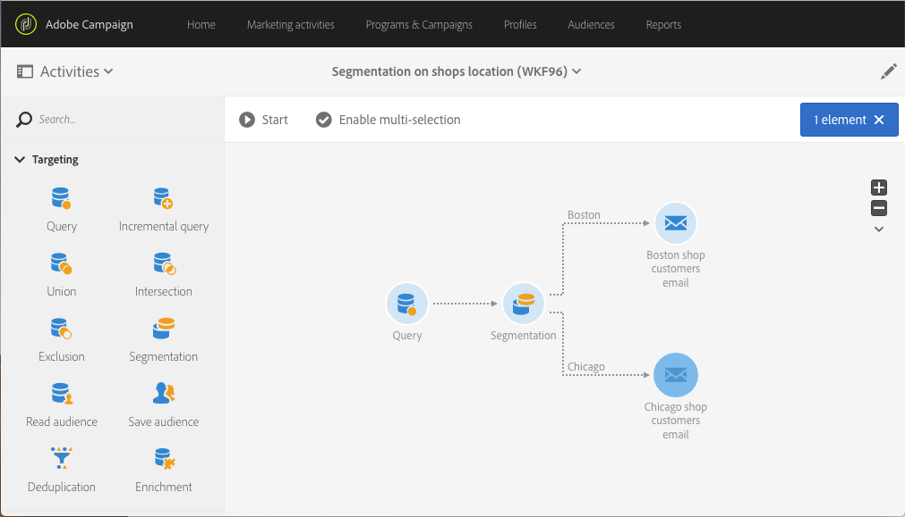

# Segmentazione sulla posizione {#segmentation-on-location}

Puoi inviare un’e-mail di targeting ai clienti contenente le offerte sui loro negozi locali.

1. In **[!UICONTROL Marketing Activities]**, fai clic su **[!UICONTROL Create]** e seleziona **[!UICONTROL Workflow]**.
1. Seleziona **[!UICONTROL New Workflow]** come tipo di flusso di lavoro e fai clic su **[!UICONTROL Next]**.
1. Inserisci le proprietà del flusso di lavoro e fai clic su **[!UICONTROL Create]**.

## Selezione dei destinatari contattabili tramite e-mail{#selecting-recipients-contactable-via-email}

1. In **[!UICONTROL Activities]** > **[!UICONTROL Targeting]**, trascinate e rilasciate un&#39;attività [Query](../../automating/using/query.md) .
1. Fai doppio clic sull’attività.
1. In **[!UICONTROL Shortcuts]**, trascina e rilascia **[!UICONTROL Profiles]** e seleziona il campo **[!UICONTROL email]** con l’operatore **[!UICONTROL is not empty]**.
1. In **[!UICONTROL Shortcuts]**, trascina e rilascia **[!UICONTROL Profiles]** e seleziona il campo **[!UICONTROL no longer contact by email]** con il valore **[!UICONTROL no]**.
1. Fai due volte clic su **[!UICONTROL Confirm]**.

## Creazione di un’attività di segmentazione{#creating-a-segmentation-activity}

1. Drag and drop a [Segmentation](../../automating/using/segmentation.md) activity and double-click it.
1. Per eseguire il targeting delle persone nella prima città, seleziona il segmento e quindi apri la transizione. In questo caso si tratta di Boston.
1. Trascina e rilascia **[!UICONTROL Location]** e seleziona **[!UICONTROL City]** con l’operatore **[!UICONTROL equals to]** e il valore **[!UICONTROL Boston]**.
Nota: per raggiungere tutte le persone che sono entrate a Boston, senza far distinzione tra maiuscole e minuscole, deseleziona l’opzione che effettua tale distinzione.
1. Fai clic su **[!UICONTROL Confirm]**.
1. In **[!UICONTROL List of outbound segments]**, fai clic su **[!UICONTROL Add an element]** e su  per creare un segmento che esegue il targeting delle persone nella seconda città. In questo caso si tratta di Chicago.
1. Trascina e rilascia **[!UICONTROL Location]** e seleziona **[!UICONTROL City]** con l’operatore **[!UICONTROL equals to]**, inserendo **[!UICONTROL Chicago]** nel valore.
1. Per raggiungere tutte le persone che sono entrate a Chicago, senza far distinzione tra maiuscole e minuscole, deselezionare l’opzione che effettua tale distinzione.
1. Fai clic su **[!UICONTROL Confirm]**.

## Creazione di una consegna e-mail{#creating-an-email-delivery}

1. In **[!UICONTROL Activities]** > **[!UICONTROL Channels]**, trascina e rilascia un&#39;attività di consegna  e-mail dopo ogni segmento.
1. Fai clic sull’attività e seleziona  per modificarla.
1. Seleziona **[!UICONTROL Simple email]** e fai clic su **[!UICONTROL Next]**.
1. Seleziona un modello di e-mail e fai clic su **[!UICONTROL Next]**.
1. Immetti le proprietà dell’e-mail e fai clic su **[!UICONTROL Next]**.
1. Per creare il layout dell’e-mail, fai clic su **[!UICONTROL Email Designer]**.
1. Inserisci elementi o seleziona un modello esistente.
1. Personalizza l’e-mail con le offerte specifiche per ogni posizione.

   Per ulteriori informazioni, consulta [progettazione di un’e-mail](../../designing/using/designing-from-scratch.md#designing-an-email-content-from-scratch).

1. Seleziona **[!UICONTROL Preview]** per controllare il layout.
1. Fai clic su **[!UICONTROL Save]**.

