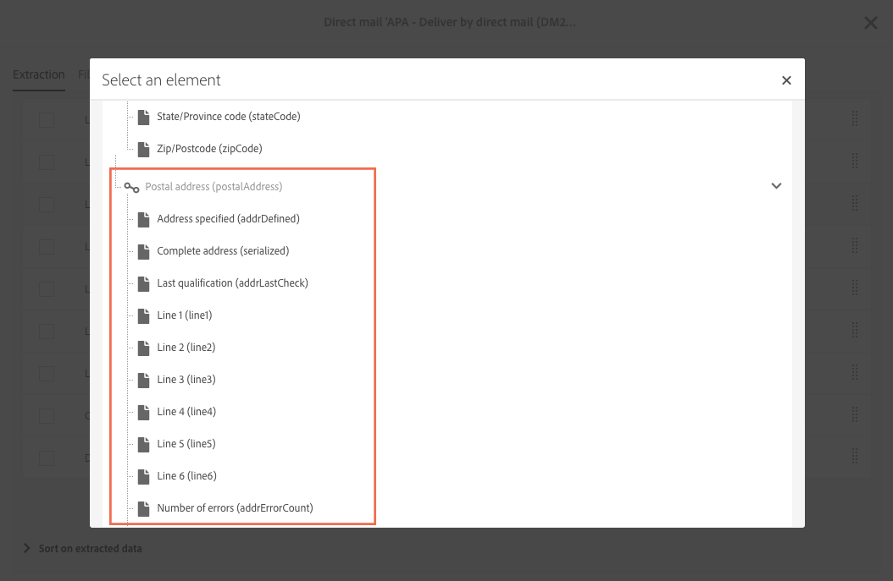

# Informazioni sulla direct mail{#about-direct-mail}

La posta diretta è un canale offline che consente di personalizzare e generare il file richiesto dai provider di posta diretta. Offre la possibilità di combinare canali online e offline nei viaggi dei clienti.

>[!NOTE]
>
>Questa funzione è facoltativa. Controllare il contratto di licenza. Il **[!UICONTROL Export]** ruolo è necessario per utilizzare la posta diretta. Contattare l&#39;amministratore.

I canali online consentono di creare i messaggi (e-mail, SMS, distribuzione di app mobili, ecc.) e inviali al tuo pubblico direttamente da Adobe Campaign. Con i canali offline, è diverso. Quando prepari la consegna diretta per posta, Adobe Campaign genera un file contenente tutti i profili di destinazione e le informazioni di contatto scelte (ad esempio l&#39;indirizzo postale). Sarà quindi possibile inviare questo file al provider di posta diretta che si occuperà dell&#39;invio effettivo.

Nella sezione seguente viene illustrato come creare e generare una distribuzione di posta diretta con un solo colpo. È inoltre possibile includere un&#39;attività di posta diretta in un flusso di lavoro per orchestrare campagne che combinano canali online e offline. Per ulteriori informazioni, consulta la guida [Flussi](../../automating/using/get-started-workflows.md) di lavoro.

Il processo utente in Adobe Campaign è il seguente:

1. Creazione della consegna
1. Scelta dell&#39;audience
1. Definizione del contenuto
1. Impostazione della data del contatto
1. Generazione del file

## Recommendations {#recommendations}

### Fornitori di posta diretta {#direct-mail-providers}

Prima di tutto, dovete contattare il vostro fornitore di posta diretta e raccogliere le loro raccomandazioni. Identificare le informazioni di profilo da includere nel file di estrazione in modo che possano personalizzare la comunicazione e inviarla al pubblico. Ad esempio, il nome e il cognome, l&#39;indirizzo postale, un codice di promozione ecc. Questi campi sono quelli che verranno aggiunti nella scheda [Definizione dell&#39;estrazione](../../channels/using/defining-the-direct-mail-content.md#defining-the-extraction) del contenuto della posta diretta.

Accertatevi di aver selezionato la **[!UICONTROL Address specified]** casella nelle informazioni dei profili. Se questa opzione è attivata, il profilo verrà aggiunto alla destinazione. Non lo è, sarà escluso da una regola di tipologia durante la fase di preparazione (vedere [Creazione della posta](../../channels/using/creating-the-direct-mail.md)diretta). Durante l&#39;importazione del profilo, non dimenticare di aggiornare il campo.

### Indirizzi postali {#postal-addresses}

Quando si aggiungono i campi da includere nel file di estrazione, i campi dell&#39;indirizzo postale sono disponibili nel **[!UICONTROL Location]** nodo.

Adobe Campaign offre una serie di campi calcolati predefiniti che seguono le normalizzazioni degli indirizzi postali più comuni. I campi sono disponibili nel **[!UICONTROL Postal address]** nodo.

Per impostazione predefinita, un indirizzo può contenere fino a sei righe: il primo campo calcolato (**[!UICONTROL Line 1]** contiene il nome e il cognome, le righe successive contengono l&#39;indirizzo postale (strada, ecc.), e l&#39;ultima riga contiene il codice postale ZIP e la città o città.

