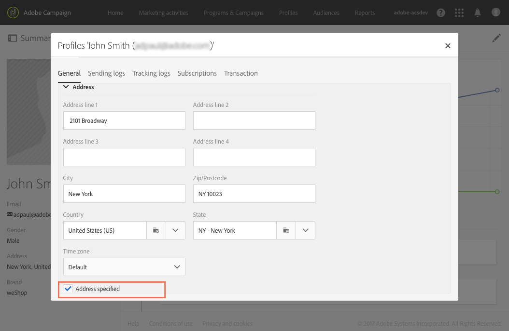

# Informazioni sul direct mailing{#about-direct-mail}

La direct mailing è un canale offline che ti consente di personalizzare e generare il file richiesto dai provider di direct mailing. Offre la possibilità di combinare i canali online e offline all’interno dei percorsi dei clienti.

>[!NOTE]
>
>Questa funzione è facoltativa. Controlla il contratto di licenza. Il ruolo **[!UICONTROL Export]** è obbligatorio per l’utilizzo della direct mailing. Contatta l’amministratore.

I canali online ti consentono di creare i messaggi (e-mail, SMS, consegna in app mobile, ecc.) e inviali al tuo pubblico direttamente da Adobe Campaign. Con i canali offline, la situazione è diversa. Quando prepari una consegna di direct mailing, Adobe Campaign genera un file contenente tutti i profili target e le informazioni del contatto selezionato, ad esempio l’indirizzo postale. Potrai quindi inviare questo file al provider di direct mailing, che si occuperà dell’invio effettivo.

Nella sezione seguente viene illustrato come creare e generare un’unica consegna direct mailing. Puoi inoltre includere un’attività di direct mailing all’interno di flusso di lavoro per orchestrare campagne che combinano canali online e offline. Per ulteriori informazioni, consulta la guida [Flussi di lavoro](../../automating/using/get-started-workflows.md).

All’interno di Adobe Campaign, la procedura utente è la seguente:

1. Creazione della consegna
1. Scelta del pubblico
1. Definizione del contenuto
1. Impostazione della data del contatto
1. Generazione del file

**Argomenti correlati:**

* [Caso d’uso: abbinamento delle consegne di e-mail e direct mail](../../automating/using/coupling-email-direct-mail.md)

## Consigli {#recommendations}

### Provider di direct mail {#direct-mail-providers}

Prima di tutto, devi contattare il tuo provider di direct mailing e raccogliere le sue raccomandazioni. Per personalizzare la comunicazione, identifica le informazioni di profilo da includere nel file di estrazione, quindi invialo al pubblico. Ad esempio, nome e cognome, indirizzo postale, codice promozionale e così via. Questi campi sono quelli che verranno aggiunti nella scheda [Definizione dell&#39;estrazione](../../channels/using/defining-the-direct-mail-content.md#defining-the-extraction) del contenuto della direct mailing.

Accertati di aver selezionato la casella **[!UICONTROL Address specified]** nelle informazioni del profilo. Se questa opzione è attivata, il profilo verrà aggiunto al target. Se non lo è, il profilo sarà escluso da una regola di tipologia durante la fase di preparazione (consulta [Creazione della direct mailing](../../channels/using/creating-the-direct-mail.md)). Durante l’importazione del profilo, non dimenticarti di aggiornare questo campo.

### Indirizzi postali {#postal-addresses}

Quando aggiungi i campi da includere nel file di estrazione, i campi dell’indirizzo postale sono disponibili nel nodo **[!UICONTROL Location]**.

Adobe Campaign offre una serie di campi calcolati predefiniti che seguono le normalizzazioni degli indirizzi postali più comuni. I campi sono disponibili nel nodo **[!UICONTROL Postal address]**.

Per impostazione predefinita, un indirizzo può contenere fino a sei righe: il primo campo calcolato (**[!UICONTROL Line 1]**) contiene il nome e il cognome, le righe successive contengono l’indirizzo postale (strada, ecc.) e l’ultima riga contiene il codice postale o ZIP e la cittadina o città.

