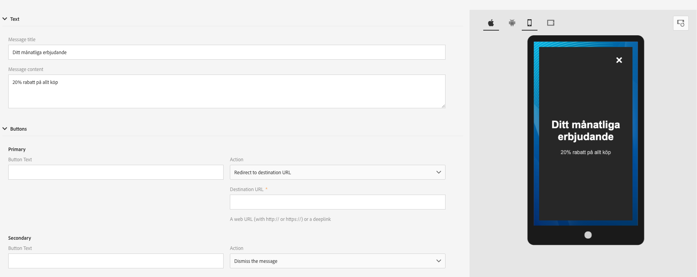

# Informazioni sulla messaggistica in-app{#about-in-app-messaging}

Messaggistica in-app è un canale di messaggistica che consente di visualizzare un messaggio quando l&#39;utente è attivo all&#39;interno dell&#39;applicazione mobile. Questo tipo di messaggio è complementare alle notifiche push inviate al centro di notifica del telefono degli utenti. Per ulteriori informazioni sul canale di notifica push, consulta questa [sezione](../../channels/using/about-push-notifications.md).

Questo canale richiede l&#39;integrazione delle applicazioni mobili con  SDK del Adobe Experience Platform. Queste app devono essere attivate  lancio Adobe Experience Platform prima di essere disponibili  Adobe Campaign per le consegne in-app.

Per iniziare a inviare messaggi in-app sulle applicazioni mobili utilizzando  SDK Experience Platform, devi soddisfare i seguenti prerequisiti:

1. In  Adobe Campaign, accertatevi di poter accedere al **[!UICONTROL In-App]** canale. Se non riuscite ad accedere a questi canali, contattate il team di account.

1. Per sfruttare i casi d’uso per dispositivi mobili in  Adobe Campaign Standard con un’applicazione Experience Cloud SDK , è necessario creare un’app mobile  Launch Adobe Experience Platform e configurarla in  Adobe Campaign Standard. Per la guida passo-passo, fai riferimento a questa [pagina](https://helpx.adobe.com/campaign/kb/configuring-app-sdk.html).

1. Una volta configurato, ora puoi preparare il messaggio in-app. For more on this, refer to this [page](../../channels/using/preparing-and-sending-an-in-app-message.md#preparing-your-in-app-message).

1. Potete quindi decidere di inviare un messaggio  In-App o [Personalizzare un tipo](../../channels/using/customizing-an-in-app-message.md#customizing-a-local-notification-message-type)di messaggio di notifica locale.

1. La consegna è ora pronta per essere inviata. Per ulteriori informazioni, fare riferimento a questa [pagina](../../channels/using/preparing-and-sending-an-in-app-message.md#sending-your-in-app-message).

**Contenuto correlato:**

* [Report in-app](../../reporting/using/in-app-report.md)
* [Casi di utilizzo per dispositivi mobili supportati in  Adobe Campaign Standard](https://helpx.adobe.com/campaign/kb/configure-launch-rules-acs-use-cases.html)
* [Guida di Campaign Standard Mobile](https://helpx.adobe.com/it/campaign/kb/acs-mobile.html)

## Domande frequenti in-app {#in-app-faq}

### Quali sono le raccomandazioni utili per ottenere ulteriori informazioni sul canale in-app in  Adobe Campaign Standard? {#resources-inapp}

Consulta le risorse seguenti:

* [Esercitazioni video](https://docs.adobe.com/content/help/en/campaign-standard-learn/tutorials/communication-channels/mobile/in-app/in-app-message-overview.html)
* [Post blog](https://theblog.adobe.com/get-more-out-of-the-new-in-app-message-channel-from-adobe-campaign/)
* [Pagina community](https://experienceleaguecommunities.adobe.com/t5/adobe-campaign-standard/ct-p/adobe-campaign-standard-community)

### Qual è lo scopo delle API delle estensioni campagna setLinkageField e resetLinkageField? {#extensions-apis}

Poiché i messaggi in-app vengono richiamati dall’SDK di Campaign, desideriamo fornire un meccanismo sicuro per garantire che i messaggi in-app contenenti dati PII non cadessero in mani malevoli. Di conseguenza, è stato implementato il seguente meccanismo per garantire la consegna sicura dei messaggi al dispositivo:

* I clienti contrassegnano i campi del profilo mobile (tabella appSubscriberRcp) come Personale e Sensibile se desiderano garantire che queste informazioni specifiche vengano fornite in modo sicuro.
* I campi contrassegnati come tali possono essere utilizzati solo nel modello di profilo (non nel modello appSubscriber o nel modello di trasmissione) che dispone di un meccanismo di protezione aggiuntivo incorporato.
* I messaggi generati utilizzando il modello di profilo possono essere serviti solo quando l&#39;utente ha eseguito l&#39;accesso all&#39;app.
* Per facilitare questo handshake protetto, gli sviluppatori di app mobili devono trasmettere ulteriori dettagli di autenticazione tramite l&#39;API setLinkageField. Tieni presente che il campo di collegamento sono quelli identificati come collegamento tra profilo mobile e profilo CRM durante l&#39;estensione della tabella appSubscriberRcp.
* Devono cancellare i messaggi in-app memorizzati sul dispositivo e reimpostareLinkagefields quando l&#39;utente si disconnette dall&#39;app utilizzando resetLinkageField. In questo modo, se un altro utente accede all&#39;app, non vede i messaggi previsti per l&#39;utente precedente.
* Per implementare questo meccanismo di sicurezza lato client, fai riferimento alle API [SDK di](https://aep-sdks.gitbook.io/docs/using-mobile-extensions/adobe-campaign-standard/adobe-campaign-standard-api-reference) Mobile.

### Cosa devo fare per abilitare il reporting in-app in Campaign? {#enable-inapp-reporting}

Devi configurare il postback di tracciamento in-app. Le istruzioni sono disponibili [qui](https://helpx.adobe.com/campaign/kb/config-app-in-launch.html#InApptrackingpostback).

Per implementare il tracciamento delle notifiche locali, fai riferimento a questa [pagina](../../administration/using/local-tracking.md).

### Quali rapporti sono disponibili per il canale in-app? {#report-inapp}

Un rapporto out-of-the-box è disponibile in  Adobe Campaign per il canale in-app. Fare riferimento a questa [documentazione](../../reporting/using/in-app-report.md).

Consultate questa [pagina](../../reporting/using/indicator-calculation.md#in-app-delivery) per comprendere come vengono calcolate le metriche in-app.

### Supportate varianti di contenuto multilingue per In-App simili a quella push? {#multilingual-inapp}

Al momento non sono disponibili modelli multilingue per la messaggistica in-app.

Tuttavia, se l&#39;obiettivo è quello di inviare un messaggio in-app in una lingua diversa dall&#39;inglese, il contenuto può essere incollato direttamente nelle caselle di testo disponibili.

### I campi di personalizzazione delle campagne possono essere aggiunti al codice HTML personalizzato? {#custom-html-inapp}

No, non è ancora supportato.

### Ho configurato un messaggio di avviso ma non viene visualizzato sul dispositivo. {#alert-message}

Per i messaggi di avviso, è richiesto almeno un pulsante di disattivazione (primario o secondario con azione di chiusura). In caso contrario, è possibile salvare il messaggio ma non verrà ricevuto.

### Se le notifiche locali l&#39;audio personalizzato iOS non viene riprodotto; verrà riprodotto il suono predefinito? {#local-notification-sound}

Per l&#39;audio personalizzato su iOS, è necessario fornire un nome di file con estensione al momento della creazione di una notifica locale (ad esempio, sound.caf). Se questa estensione non viene fornita, viene utilizzato l&#39;audio predefinito.

### I collegamenti profondi sono supportati nei messaggi in-app? {#inapp-deeplinks}

Sì, i collegamenti profondi sono supportati nei messaggi in-app. I collegamenti di dettaglio devono includere:

* la lingua in cui si afferma che il tracciamento della consegna deve essere disabilitato per consentire il funzionamento dei collegamenti dettagliati.
* Applicate un&#39;applicazione con il ramo come partner in grado di eseguire il tracciamento del collegamento profondo. Per ulteriori informazioni sull&#39;integrazione di ramo e  Adobe Campaign Standard, fare riferimento a questa [pagina](https://help.branch.io/using-branch/docs/adobe-campaign-standard-1).

### È possibile attivare un messaggio in-app quando l&#39;utente avvia l&#39;app da una notifica push? {#inapp-push-trigger}

Sì, questi messaggi sono denominati anche messaggi catena a margherita. Seguite la procedura indicata di seguito:

1. Crea un messaggio in-app.

1. Definite un evento personalizzato e selezionatelo come attivatore evento per questo IAM, ad esempio &quot;Trigger from fall preview Push&quot; (Attiva da push con anteprima autunno).

1. Durante la creazione del messaggio push, definite una variabile personalizzata il cui valore può essere impostato come un evento utilizzato per attivare IAM, ad esempio Key = &quot;inappkey&quot; e value = &quot;Trigger from fall preview Push&quot; (Attiva da push di anteprima autunno).

1. Nel codice dell&#39;app mobile, implementa l&#39;attivazione dell&#39;evento come segue:

   
