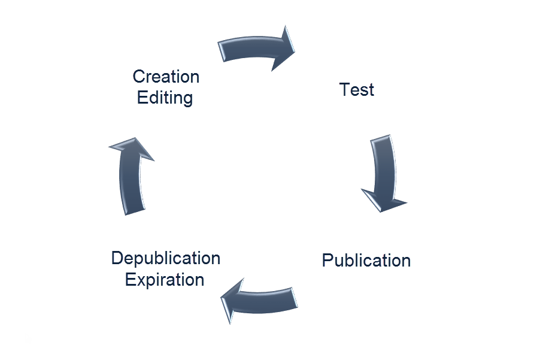

# Informazioni sulle pagine di destinazione{#about-landing-pages}

Campaign viene fornito con pagine di destinazione, moduli Web che possono essere utilizzati per acquisire informazioni sui tipi di pubblico, offrire iscrizioni a un servizio, visualizzare i dati e ampliare il database. Le pagine di destinazione possono essere utilizzate anche per acquisire o aggiornare i profili esistenti.

>[!CAUTION]
>
>Le pagine di destinazione possono essere utilizzate solo per aggiornare i profili.

Campaign viene fornito con un set di modelli di pagina di destinazione incorporati:

* **[!UICONTROL Acquisition]**: questo è il modello predefinito per le pagine di destinazione, che consente di acquisire e aggiornare i dati nel database Campaign.
* **[!UICONTROL Subscription]**: questo modello deve essere utilizzato per offrire iscrizioni a un servizio.
* **[!UICONTROL Unsubscription]**: questo modello può essere collegato da un’e-mail inviata agli abbonati a un servizio per consentire loro di annullare l’iscrizione a questo servizio.
* **[!UICONTROL Blacklist]**: questo modello deve essere utilizzato quando un profilo non vuole più essere contattato da Campaign. Per ulteriori informazioni sull'inserimento in blacklist, consultate [Informazioni sull'opt-in e l'opt-out in Campaign](../../audiences/using/about-opt-in-and-opt-out-in-campaign.md).

Questi modelli sono proposti per impostazione predefinita quando si crea una nuova pagina di destinazione.

Adobe consiglia di creare modelli personalizzati duplicando un modello incorporato. Alcuni parametri possono essere impostati solo nei modelli delle pagine di destinazione e non possono essere modificati direttamente nelle pagine di destinazione.

>[!NOTE]
>
>Per accedere ai modelli della pagina di destinazione, fai clic sul logo Adobe Campaign in alto a sinistra e seleziona **[!UICONTROL Resources]** &gt; **[!UICONTROL Templates]** &gt; **[!UICONTROL Landing page templates]**.

L’intero ciclo di vita di una pagina di destinazione è il seguente:

1. Creazione: progettate e impostate il contenuto della pagina di destinazione.
1. Prova: simulare l’esecuzione della pagina di destinazione su un profilo di test.
1. Pubblicazione: pubblicate la pagina di destinazione per renderla live.
1. Scadenza o depubblicazione: annulla la pubblicazione manualmente o attendi la scadenza della pagina di destinazione, per cui non è più disponibile.

Una volta creata e pubblicata, potete rendere la pagina di destinazione accessibile tramite un sito Web o [inserire un collegamento diretto alla pagina di destinazione in un messaggio e-mail](../../designing/using/links.md#inserting-a-link).

**Argomenti correlati:**

* [Video sulla creazione di una pagina](https://helpx.adobe.com/campaign/kt/acs/using/acs-create-edit-landing-page-feature-video-use.html) di destinazione
* [Utilizzo di una pagina di destinazione per sottoscrivere un servizio](../../audiences/using/creating-a-service.md)