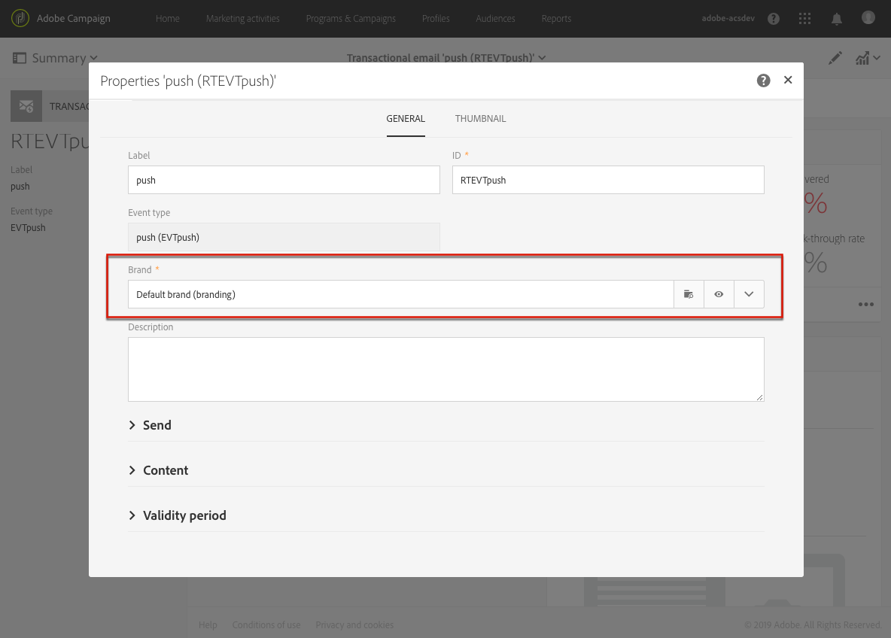

# Informazioni sui messaggi transazionali{#about-transactional-messaging}

Puoi creare e gestire messaggi transazionali personalizzati in Adobe Campaign.

Un messaggio transazionale è una comunicazione singola e univoca inviata a un utente da un fornitore, ad esempio un sito Web.

* Questo tipo di messaggio è particolarmente atteso, in quanto contiene informazioni che il destinatario desidera controllare o confermare. Potrebbe trattarsi di un messaggio di benvenuto dopo la creazione di un account, ad esempio, o di una conferma della spedizione di un ordine, di una fattura o di un messaggio di conferma della modifica della password.
* È un messaggio importante che definisce la relazione del cliente: l&#39;utente prevede che venga inviato in tempo reale. Il ritardo tra l&#39;attivazione dell&#39;evento e l&#39;arrivo del messaggio deve quindi essere molto breve.
* I messaggi transazionali generalmente hanno tassi di apertura elevati.

Adobe Campaign consente di integrare questa funzionalità con un sistema di informazioni che invia gli eventi da trasformare in messaggi transazionali personalizzati.

>[!NOTE]
>
>I messaggi transazionali possono essere inviati tramite e-mail, SMS o notifiche push, a seconda delle opzioni. Controllare il contratto di licenza.

In Adobe Campaign sono disponibili due tipi di messaggi transazionali:

* [Messaggi](../../channels/using/event-transactional-messages.md) transazionali evento indirizzati a un evento. I dati contenuti nell&#39;evento stesso vengono utilizzati per definire il target di consegna.
* [Profili di targeting dei messaggi](../../channels/using/profile-transactional-messages.md) transazionali dal database di marketing di Adobe Campaign. Puoi utilizzare le informazioni contenute nel database di Adobe Campaign per inviare un messaggio transazionale basato sui profili di marketing dei clienti.

Il tipo di messaggio viene definito durante la configurazione dell&#39;evento che verrà trasformato in un messaggio transazionale. Consulta Configurazione dei messaggi [transazionali](../../administration/using/configuring-transactional-messaging.md).

>[!NOTE]
>
>Adobe Campaign dà priorità all&#39;elaborazione dei messaggi transazionali rispetto a qualsiasi altra consegna.

I messaggi transazionali sono disponibili anche dall&#39;API Adobe Campaign Standard. Per ulteriori informazioni, consulta la documentazione dedicata.

>[!IMPORTANT]
>
>Dopo l&#39;aggiornamento all&#39;MTA avanzata, tutti i messaggi transazionali vengono inviati con l&#39;MTA avanzata di Adobe Campaign per migliorare la recapito, il throughput e la gestione dei bounce. Tutti gli impatti sono gli stessi dei messaggi di marketing standard e sono descritti nel documento MTA [avanzato di](https://helpx.adobe.com/campaign/kb/campaign-enhanced-mta.html) Adobe Campaign.

## Principio operativo della messaggistica transattiva {#transactional-messaging-operating-principle}

Prendiamo l&#39;esempio di un&#39;azienda che ha un sito web e su questo sito i suoi utenti possono acquistare prodotti.

Adobe Campaign consente di inviare un messaggio e-mail di notifica agli utenti del sito che hanno aggiunto prodotti al carrello: quando uno di loro lascia il sito senza andare attraverso con i loro acquisti, un&#39;e-mail di abbandono del carrello viene inviata automaticamente a loro.

I passi per la realizzazione di questo progetto sono:

1. Configurate un evento denominato &quot;abbandono del carrello&quot; e pubblicate la configurazione dell&#39;evento, che crea automaticamente un messaggio transazionale. La creazione e la pubblicazione di un evento sono presentate nella sezione [Configurazione di un evento per l’invio di un messaggio](../../administration/using/configuring-transactional-messaging.md#use-case--configuring-an-event-to-send-a-transactional-message) transazionale dell’evento.
1. Il messaggio transazionale deve essere personalizzato, testato e pubblicato. See [Event transactional messages](../../channels/using/event-transactional-messages.md).
1. Inoltre, affinché l&#39;evento possa essere attivato quando un cliente abbandona il carrello, questo evento deve essere inviato dal sito Web della società tramite l&#39;API REST di Adobe Campaign Standard. Consultate Integrazione del sito.

Una volta che tutti questi passaggi sono stati eseguiti, non appena un utente lascia il sito senza ordinare i prodotti nel suo carrello, riceve automaticamente un&#39;e-mail di notifica.

## Processo di pubblicazione di messaggi transazionali {#transactional-messaging-pub-process}

Il grafico seguente illustra il processo di pubblicazione dei messaggi transazionali.

Per ulteriori informazioni sui passaggi di configurazione dell&#39;evento, consulta Configurazione dei messaggi [transazionali](../../administration/using/configuring-transactional-messaging.md).

## Limitazioni per i messaggi transazionali {#transactional-messaging-limitations}

>[!NOTE]
>
>Per accedere ai messaggi transazionali, è necessario disporre dei diritti di amministrazione.

### Progettazione e pubblicazione {#design-and-publication}

Durante la progettazione e la pubblicazione di messaggi transazionali, alcuni dei passaggi da eseguire non possono essere ripristinati. È necessario essere consapevoli dei seguenti limiti:

* Per ogni configurazione dell&#39;evento è possibile utilizzare un solo canale. Consultate [Creazione di un evento](../../administration/using/configuring-transactional-messaging.md#creating-an-event).
* Una volta creato l&#39;evento, non potete cambiare il canale. Pertanto, se un messaggio non viene inviato correttamente, è necessario progettare il meccanismo che consenta di inviarlo da un altro canale utilizzando un flusso di lavoro. See [Workflow data and processes](../../automating/using/workflow-data-and-processes.md).
* Non potete modificare la dimensione di targeting ( **[!UICONTROL Real-time event]** o **[!UICONTROL Profile]** ) dopo la creazione dell&#39;evento. Consultate [Creazione di un evento](../../administration/using/configuring-transactional-messaging.md#creating-an-event).
* Non è possibile ripristinare una pubblicazione, ma è possibile annullare la pubblicazione di un evento: questa operazione rende inaccessibili l&#39;evento e il messaggio di transazione associato. Consultate [Annullamento della pubblicazione di un evento](../../administration/using/configuring-transactional-messaging.md#unpublishing-an-event).
* L&#39;unico messaggio transazionale che può essere associato a un evento è il messaggio creato automaticamente al momento della pubblicazione dell&#39;evento. Consultate [Anteprima e pubblicazione dell’evento](../../administration/using/configuring-transactional-messaging.md#previewing-and-publishing-the-event).

### Personalizzazione {#personalization}

Il modo in cui puoi personalizzare il contenuto di un messaggio dipende dal tipo di messaggio transazionale. Le specifiche sono elencate di seguito:

**Messaggi** transazionali basati su eventi:

* Le informazioni sulla personalizzazione provengono dai dati contenuti nell&#39;evento stesso. See [Event transactional messages](../../channels/using/event-transactional-messages.md).
* Non potete utilizzare blocchi di contenuto di collegamento **** Annulla iscrizione in un messaggio transazionale evento.
* I messaggi transazionali basati su eventi dovrebbero utilizzare solo i dati presenti nell&#39;evento inviato per definire il destinatario e la personalizzazione del contenuto del messaggio. Tuttavia, puoi arricchire il contenuto del messaggio transazionale utilizzando le informazioni contenute nel database di Adobe Campaign. Consultate [Arricchimento del contenuto](../../administration/using/configuring-transactional-messaging.md#enriching-the-transactional-message-content)dei messaggi transazionali.
* Poiché i messaggi relativi alle transazioni di evento non contengono informazioni sul profilo, non sono compatibili con le regole di affaticamento, anche nel caso di un arricchimento con i profili. Consultate [Regole](../../sending/using/fatigue-rules.md)di fatica.

**Messaggi** transazionali basati su profilo:

* Le informazioni sulla personalizzazione possono provenire dai dati contenuti nell&#39;evento o dal record di profilo riconciliato. See [Profile transactional messages](../../channels/using/profile-transactional-messages.md).
* Puoi utilizzare i blocchi di contenuto dei collegamenti **** Annulla iscrizione in un messaggio di transazione profilo. Consultate [Aggiunta di un blocco](../../designing/using/personalization.md#adding-a-content-block)di contenuto.
* Le regole di Fatigue sono compatibili con i messaggi transazionali del profilo. Consultate [Regole](../../sending/using/fatigue-rules.md)di fatica.

Gli elenchi di prodotti sono disponibili solo nei messaggi e-mail transazionali. Consulta [Utilizzo degli elenchi di prodotti in un messaggio](../../channels/using/event-transactional-messages.md#using-product-listings-in-a-transactional-message)transazionale.

### Autorizzazioni e marchio {#permissions-and-branding}

Per quanto riguarda la gestione dei [marchi](../../administration/using/branding.md) , i messaggi transazionali offrono una flessibilità inferiore rispetto ai messaggi standard. Adobe consiglia di collegare tutti i marchi utilizzati nei messaggi transazionali all&#39;unità **[!UICONTROL All]** organizzativa. Per ulteriori informazioni, consulta la spiegazione dettagliata riportata di seguito.

Quando modificate un messaggio transazionale, potete collegarlo a un marchio per applicare automaticamente alcuni parametri, ad esempio il nome del marchio o il logo del marchio. L&#39;opzione **[!UICONTROL Default brand]** è selezionata per impostazione predefinita nelle proprietà dei messaggi transazionali.

Tutti gli oggetti (compreso il marchio) utilizzati in un messaggio di transazione devono essere visibili dall&#39;unità **[!UICONTROL Message Center]** organizzativa, il che significa che tali oggetti devono trovarsi nelle unità **[!UICONTROL Message Center]** o **[!UICONTROL All]** organizzazione.

Tuttavia, se il marchio selezionato nelle proprietà del messaggio è collegato a un&#39;unità organizzativa diversa da **[!UICONTROL Message Center]** o **[!UICONTROL All]**, si verificherà un errore e non sarà possibile inviare il messaggio transazionale.

Pertanto, se si desidera utilizzare il multi-branding nel contesto dei messaggi transazionali, è necessario collegare tutti i marchi all&#39;unità **[!UICONTROL Message Center]** organizzativa o all&#39;unità **[!UICONTROL All]** organizzativa.

### Esportazione e importazione di messaggi transazionali {#exporting-and-importing-transactional-messages}

* Per esportare un messaggio transazionale, è necessario includere la configurazione dell&#39;evento corrispondente al momento della [creazione dell&#39;esportazione](../../automating/using/managing-packages.md#creating-a-package)del pacchetto.
* Una volta [importato il messaggio transazionale tramite un pacchetto](../../automating/using/managing-packages.md#importing-a-package), non viene visualizzato nell&#39;elenco dei messaggi transazionali. Per rendere disponibile il messaggio transazionale associato, è necessario [pubblicare](../../administration/using/configuring-transactional-messaging.md#previewing-and-publishing-the-event) la configurazione dell&#39;evento.

