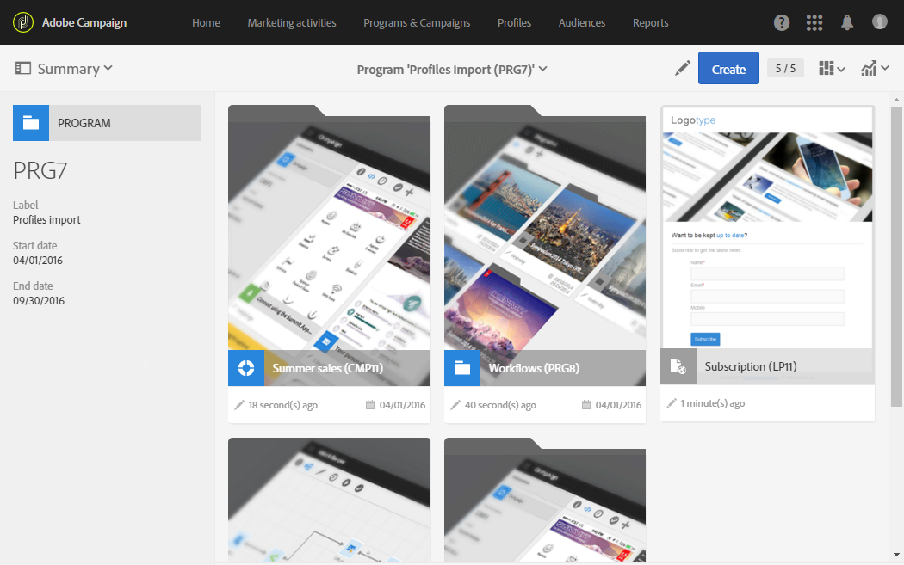

# Accesso ai messaggi{#accessing-messages}

Puoi accedere a una serie di funzionalità avanzate, dal targeting, dalla creazione e personalizzazione di messaggi, dall&#39;esecuzione di comunicazioni, ai relativi rapporti operativi.

È possibile accedere ai messaggi:

* all&#39;interno di una campagna
* dalla home page di  Adobe Campaign
* dall&#39;elenco delle attività di marketing

## Accesso ai messaggi nelle campagne {#accessing-messages-in-campaigns}

Per accedere all&#39;elenco delle attività di marketing di una campagna:

1. Passate **[!UICONTROL Marketing activities]** alla barra di navigazione superiore.
1. Seleziona **[!UICONTROL Marketing activities > Marketing plans > Programs & Campaigns]**.

   Potete anche fare clic direttamente sulla **[!UICONTROL Programs & Campaigns]** scheda dalla home page. Per ulteriori informazioni sulle campagne, consulta la sezione [Programmi e campagne](../../start/using/programs-and-campaigns.md) .

1. Selezionate un programma, quindi una campagna.

   

1. Fare clic sull&#39;elenco a **[!UICONTROL Summary]** discesa.
1. Fai clic **[!UICONTROL Search]** per filtrare il modo in cui vengono visualizzati i messaggi (per nome, data o stato).

   Per filtrare i messaggi ricorrenti, è possibile selezionare la casella corrispondente.

## Accesso all&#39;elenco dei messaggi {#accessing-the-message-list}

Per accedere all&#39;elenco completo delle attività di marketing da tutte le campagne combinate:

1. Selezionate **[!UICONTROL Marketing activities]** dalla barra di navigazione superiore.

   Potete accedervi anche dalla **[!UICONTROL Marketing activities]** scheda nella home page. Per ulteriori informazioni sull&#39;elenco delle attività di marketing, consulta la sezione [Gestione delle attività](../../start/using/marketing-activities.md#creating-a-marketing-activity) di marketing.

1. Per filtrare le attività di marketing (per nome, data, stato o tipo di attività), utilizzate i **[!UICONTROL Search]** campi a sinistra dell&#39;elenco delle attività di marketing.

## Ciclo di vita del messaggio {#message-life-cycle}

Lo stato di un messaggio è rappresentato da un colore specifico negli elenchi. Gli stati possibili sono:

* **[!UICONTROL Editing]** (grigio): il messaggio è in fase di modifica.
* **[!UICONTROL In progress]** (blu): il messaggio viene inviato.
* **[!UICONTROL Finished]** (verde): l&#39;invio è terminato senza errori.
* **[!UICONTROL Erroneous]** (rosso): l&#39;invio è stato annullato o si è verificato un errore durante la preparazione o l&#39;invio del messaggio.

   >[!NOTE]
   >
   >Un banner di notifica giallo potrebbe apparire sopra la scheda quando è necessaria un&#39;azione, ad esempio quando è necessario confermare l&#39;invio di un messaggio.
