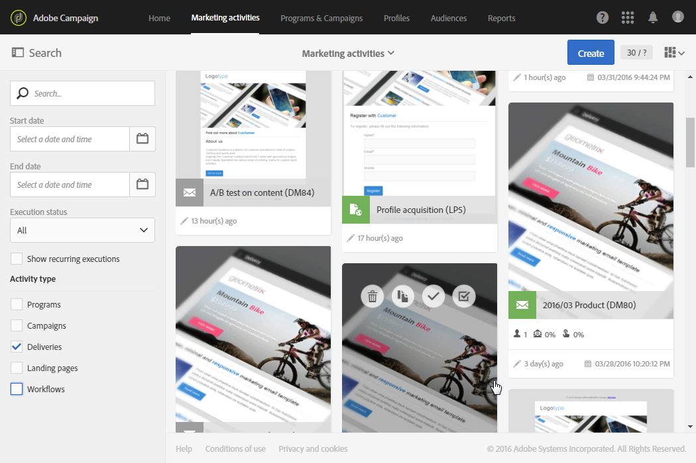

# Accesso ai messaggi{#accessing-messages}

Puoi accedere a una serie di funzionalità avanzate, dal targeting, alla creazione e personalizzazione di messaggi, all’esecuzione di comunicazioni, ai relativi rapporti operativi.

È possibile accedere ai messaggi:

* in una campagna
* dalla home page di Adobe Campaign
* dall’elenco delle attività di marketing

## Accesso ai messaggi nelle campagne {#accessing-messages-in-campaigns}

Per accedere all’elenco delle attività di marketing di una campagna:

1. Passa a **[!UICONTROL Marketing activities]** dalla barra di navigazione superiore.
1. Seleziona **[!UICONTROL Marketing activities > Marketing plans > Programs & Campaigns]**.

   È inoltre possibile fare clic direttamente sulla scheda **[!UICONTROL Programs & Campaigns]** dalla home page. Per ulteriori informazioni sulle campagne, consulta la sezione [Programmi e campagne](../../start/using/programs-and-campaigns.md).

1. Seleziona un programma, quindi una campagna.

   

1. Fare clic sull&#39;elenco a discesa **[!UICONTROL Summary]**.
1. Fare clic su **[!UICONTROL Search]** per filtrare la modalità di visualizzazione dei messaggi (per nome, data o stato).

   Per filtrare i messaggi ricorrenti, seleziona la casella corrispondente.

## Accesso all’elenco dei messaggi {#accessing-the-message-list}

Per accedere all’elenco completo delle attività di marketing da tutte le campagne combinate:

1. Selezionare **[!UICONTROL Marketing activities]** dalla barra di navigazione superiore.

   È inoltre possibile accedervi dalla scheda **[!UICONTROL Marketing activities]** nella home page. Per ulteriori informazioni sull&#39;elenco delle attività di marketing, consulta la sezione [Gestione delle attività di marketing](../../start/using/marketing-activities.md#creating-a-marketing-activity).

1. Per filtrare le attività di marketing (per nome, data, stato o tipo di attività), utilizzare i campi **[!UICONTROL Search]** a sinistra dell&#39;elenco delle attività di marketing.

## Ciclo di vita del messaggio {#message-life-cycle}

Lo stato di un messaggio è rappresentato da un colore specifico negli elenchi. I possibili stati sono:

* **[!UICONTROL Editing]** (grigio): modifica del messaggio in corso.
* **[!UICONTROL In progress]** (blu): invio del messaggio.
* **[!UICONTROL Finished]** (verde): l&#39;invio è terminato senza errori.
* **[!UICONTROL Erroneous]** (rosso): l&#39;invio è stato annullato o si è verificato un errore durante la preparazione o l&#39;invio del messaggio.

  >[!NOTE]
  >
  >Un banner di notifica giallo potrebbe apparire sopra la scheda quando è necessaria un’azione, ad esempio quando devi confermare l’invio di un messaggio.
