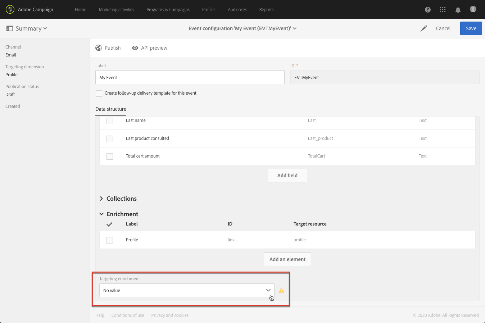

# Configurazione di un evento transazionale {#configuring-transactional-event}

Per inviare un messaggio transazionale con Adobe Campaign, devi innanzitutto descrivere la struttura dei dati dell’evento creando e configurando un evento.

>[!IMPORTANT]
>
>Solo [Amministratori funzionali](../../administration/using/users-management.md#functional-administrators) <!--being part of the **[!UICONTROL All]** [organizational unit](../../administration/using/organizational-units.md) -->disporre dei diritti appropriati per creare e modificare le configurazioni degli eventi.

La configurazione varia a seconda della [tipo di messaggio transazionale](../../channels/using/getting-started-with-transactional-msg.md#transactional-message-types) desideri inviare e sul canale che verrà utilizzato. Per ulteriori informazioni, consulta [Configurazioni specifiche](#transactional-event-specific-configurations).

Al termine della configurazione, l’evento deve essere pubblicato. Consulta [Pubblicazione di un evento transazionale](../../channels/using/publishing-transactional-event.md).

## Creazione di un evento {#creating-an-event}

Per iniziare, crea l’evento corrispondente alle tue esigenze.

1. Fai clic su **Adobe** nell&#39;angolo in alto a sinistra, quindi seleziona **[!UICONTROL Marketing plans]** > **[!UICONTROL Transactional messages]** > **[!UICONTROL Event configuration]**.
1. Fai clic sul pulsante **[!UICONTROL Create]**.
1. Immetti un **[!UICONTROL Label]** e un **[!UICONTROL ID]** per l’evento. Il **[!UICONTROL ID]** è obbligatorio e deve iniziare con il prefisso &quot;EVT&quot;. Se non utilizzi questo prefisso, viene aggiunto automaticamente dopo aver fatto clic su **[!UICONTROL Create]**.

   

   >[!IMPORTANT]
   >
   >L’ID non può superare i 64 caratteri, incluso il prefisso EVT.

1. Seleziona il canale che verrà utilizzato per inviare i messaggi transazionali **[!UICONTROL Email]**, **[!UICONTROL Mobile (SMS)]** o **[!UICONTROL Push notification]**. È possibile utilizzare un solo canale per ogni evento e non è possibile modificarlo in seguito.

1. Seleziona la dimensione di targeting corrispondente alla configurazione dell’evento desiderata e fai clic su **[!UICONTROL Create]**.

   I messaggi transazionali basati su eventi hanno come target i dati contenuti nell’evento stesso, mentre i messaggi transazionali basati su profili hanno come target i dati contenuti nel database di Adobe Campaign. Per ulteriori informazioni, consulta [Configurazioni specifiche](#transactional-event-specific-configurations).

>[!NOTE]
>
>Il numero di eventi transazionali può avere un impatto sulla piattaforma. Per prestazioni ottimali, assicurati di eliminare gli eventi non utilizzati. Consulta [Eliminazione di un evento](../../channels/using/publishing-transactional-event.md#deleting-an-event).

## Definizione degli attributi dell’evento {#defining-the-event-attributes}

In **[!UICONTROL Fields]** , definisci gli attributi che verranno integrati nel contenuto dell’evento e che potranno quindi essere utilizzati per personalizzare il messaggio transazionale.

I passaggi per aggiungere e modificare i campi sono gli stessi [risorse personalizzate](../../developing/using/configuring-the-resource-s-data-structure.md#adding-fields-to-a-resource).

>[!NOTE]
>
>Se desideri creare un messaggio transazionale multilingue, definisci un attributo evento aggiuntivo con **[!UICONTROL AC_language]** ID Questo si applica solo ai messaggi transazionali di evento. Dopo la pubblicazione dell’evento, i passaggi per modificare il contenuto di un messaggio transazionale multilingue sono gli stessi di un’e-mail standard multilingue. Consulta [Creazione di un messaggio e-mail multilingue](../../channels/using/creating-a-multilingual-email.md).

## Definizione delle raccolte di dati {#defining-data-collections}

Puoi aggiungere al contenuto dell’evento una raccolta di elementi, ciascuno dei quali include diversi attributi.

Questa raccolta può essere utilizzata in un’e-mail transazionale per aggiungere [elenchi di prodotti](../../designing/using/using-product-listings.md) al contenuto del messaggio, ad esempio un elenco di prodotti con il prezzo, il numero di riferimento, la quantità, ecc. per ciascun prodotto dell’elenco.

1. In **[!UICONTROL Collections]** , fare clic sul pulsante **[!UICONTROL Create element]** pulsante.

   

1. Aggiungi un’etichetta e un ID per la raccolta.
1. Aggiungi tutti i campi che desideri visualizzare nel messaggio transazionale per ciascun prodotto dell’elenco.

   In questo esempio sono stati aggiunti i seguenti campi:

   

1. Il **[!UICONTROL Enrichment]** Questa scheda ti consente di arricchire ogni elemento della raccolta. In questo modo potrai personalizzare gli elementi dell’elenco di prodotti corrispondente con le informazioni provenienti dal database di Adobe Campaign o da altre risorse create.

>[!NOTE]
>
>I passaggi per arricchire gli elementi di una raccolta sono gli stessi descritti nella [Arricchimento dell’evento](#enriching-the-transactional-message-content) sezione. L’arricchimento dell’evento non consente di arricchire una raccolta: è necessario aggiungere un arricchimento alla raccolta stessa nel **[!UICONTROL Collections]** sezione.

Dopo la pubblicazione dell’evento e del messaggio, potrai utilizzare questa raccolta nel messaggio sulle transazioni.

Ecco l’anteprima API per questo esempio:

**Argomenti correlati:**

* [Anteprima e pubblicazione dell’evento](../../channels/using/publishing-transactional-event.md#previewing-and-publishing-the-event)
* [Utilizzo degli elenchi di prodotti in un messaggio sulle transazioni](../../designing/using/using-product-listings.md)
* [Pubblicazione di un messaggio sulle transazioni](../../channels/using/publishing-transactional-message.md#publishing-a-transactional-message)

## Arricchimento dell’evento {#enriching-the-transactional-message-content}

Puoi arricchire il contenuto dei messaggi transazionali con le informazioni provenienti dal database di Adobe Campaign per personalizzare i messaggi. Dal cognome o dall’ID del sistema di gestione delle relazioni con i clienti di ciascuno dei destinatari, ad esempio, puoi recuperare dati quali l’indirizzo o la data di nascita o qualsiasi altro campo personalizzato aggiunto nella tabella Profilo, al fine di personalizzare le informazioni inviate.

È possibile arricchire il contenuto dei messaggi transazionali con informazioni provenienti da **[!UICONTROL Profile and services Ext API]**. Per ulteriori informazioni, consulta [Estensione dell’API: pubblicazione dell’estensione](../../developing/using/step-2--publish-the-extension.md)

Queste informazioni possono anche essere memorizzate in nuove risorse. In tal caso, la risorsa deve essere collegata al **[!UICONTROL Profile]** o **[!UICONTROL Service]** risorse direttamente o tramite un’altra tabella. Ad esempio, nella configurazione seguente, è possibile arricchire il contenuto dei messaggi transazionali con le informazioni provenienti da **[!UICONTROL Product]** come la categoria o l’ID del prodotto, se il **[!UICONTROL Product]** la risorsa è collegata al **[!UICONTROL Profile]** risorsa.

Per ulteriori informazioni sulla creazione e la pubblicazione di risorse, consulta [questa sezione](../../developing/using/key-steps-to-add-a-resource.md).

1. In **[!UICONTROL Enrichment]** , fare clic sul pulsante **[!UICONTROL Create element]** pulsante.

   

1. Seleziona la risorsa con cui desideri collegare il messaggio. In questo caso, scegli il **[!UICONTROL Profile]** risorsa.

   

1. Utilizza il **[!UICONTROL Create element]** per collegare un campo della risorsa selezionata a uno dei campi precedentemente aggiunti all’evento (consulta [Definizione degli attributi dell’evento](#defining-the-event-attributes)).

   

   >[!NOTE]
   >
   >Se definisci una condizione che potrebbe consentire di selezionare più destinatari (ad esempio un campo che può avere lo stesso valore per più profili), non verrà eseguito il targeting di più profili.

1. In questo esempio, viene eseguita la riconciliazione del **[!UICONTROL Last name]** e **[!UICONTROL First name]** campi con i campi corrispondenti nella sezione **[!UICONTROL Profile]** risorsa.

   

   Puoi anche arricchire il contenuto dei messaggi transazionali utilizzando **[!UICONTROL Service]** risorsa. Per ulteriori informazioni sui servizi, consulta [questa sezione](../../audiences/using/creating-a-service.md).

1. Se stai creando o modificando un’ [evento basato su profilo](#profile-based-transactional-messages), nella **[!UICONTROL Targeting enrichment]** , seleziona l’arricchimento che verrà utilizzato come destinazione del messaggio durante l’esecuzione della consegna.

   

   >[!NOTE]
   >
   >Creazione di un arricchimento e selezione di un arricchimento di targeting in base al **[!UICONTROL Profile]** Le risorse sono obbligatorie per gli eventi basati su profili.

Dopo la pubblicazione dell’evento e del messaggio, questo collegamento ti consentirà di arricchire il contenuto del messaggio transazionale.

**Argomenti correlati:**

* [Anteprima e pubblicazione dell’evento](../../channels/using/publishing-transactional-event.md#previewing-and-publishing-the-event)
* [Personalizzazione di un messaggio sulle transazioni](../../channels/using/editing-transactional-message.md#personalizing-a-transactional-message)
* [Pubblicazione di un messaggio sulle transazioni](../../channels/using/publishing-transactional-message.md#publishing-a-transactional-message)

## Ricerca di eventi transazionali {#searching-transactional-events}

Per accedere ed eseguire ricerche negli eventi transazionali già creati, segui i passaggi indicati di seguito.

1. Fai clic su **Adobe** nell&#39;angolo in alto a sinistra, quindi seleziona **[!UICONTROL Marketing plans]** > **[!UICONTROL Transactional messages]** > **[!UICONTROL Event configuration]**.
1. Fai clic sul pulsante **[!UICONTROL Show search]**.

   

1. Puoi filtrare in base al **[!UICONTROL Publication status]**. Questo consente di visualizzare solo gli eventi pubblicati, ad esempio.
1. Puoi anche filtrare gli eventi utilizzando **[!UICONTROL Last event received]**. Ad esempio, se immetti 10, verranno visualizzate solo le configurazioni dell’evento con l’ultimo evento ricevuto 10 giorni fa o più. Questo consente di visualizzare quali eventi sono stati inattivi per un determinato periodo.

   

   >[!NOTE]
   >
   >Il valore predefinito è 0. Vengono quindi visualizzati tutti gli eventi.

## Configurazioni specifiche {#transactional-event-specific-configurations}

La configurazione degli eventi transazionali può variare a seconda della [tipo di messaggio transazionale](../../channels/using/getting-started-with-transactional-msg.md#transactional-message-types) desideri inviare (evento o profilo) e sul canale che verrà utilizzato.

Le sezioni seguenti descrivono in dettaglio quale configurazione specifica deve essere impostata in base al messaggio transazionale desiderato. Per ulteriori informazioni sui passaggi generali per configurare un evento, consulta [Creazione di un evento](#creating-an-event).

### Messaggi transazionali basati su eventi {#event-based-transactional-messages}

Puoi inviare messaggi sulle transazioni destinati a un evento. Questo tipo di messaggi sulle transazioni non contiene informazioni del profilo: il target di consegna è definito dai dati contenuti nell’evento stesso.

Per inviare un messaggio transazionale basato su eventi, devi innanzitutto creare e configurare un evento con targeting per **dati contenuti nell’evento stesso**.

1. Durante la creazione della configurazione dell’evento, seleziona la **[!UICONTROL Real-time event]** dimensione di targeting (vedi [Creazione di un evento](#creating-an-event)).
1. Aggiungi campi all’evento per personalizzare il messaggio transazionale (consulta [Definizione degli attributi dell’evento](#defining-the-event-attributes)).
1. La messaggistica transazionale basata su eventi dovrebbe utilizzare solo i dati presenti nell’evento inviato per definire il destinatario e la personalizzazione del contenuto del messaggio.

   Tuttavia, se desideri utilizzare informazioni aggiuntive provenienti dal database di Adobe Campaign, puoi arricchire il contenuto dei messaggi transazionali (consulta [Arricchimento del contenuto dei messaggi transazionali](#enriching-the-transactional-message-content)).

1. Visualizza l&#39;anteprima e pubblica l&#39;evento (vedi [Anteprima e pubblicazione dell’evento](../../channels/using/publishing-transactional-event.md#previewing-and-publishing-the-event)).

   Quando si visualizza l’anteprima dell’evento, l’API REST contiene un attributo che specifica l’indirizzo e-mail, il telefono cellulare o gli attributi specifici della notifica push, in base al canale selezionato.

   Dopo la pubblicazione dell’evento, viene creato automaticamente un messaggio transazionale collegato al nuovo evento. Affinché l’evento attivi l’invio di un messaggio sulle transazioni, è necessario [modifica](../../channels/using/editing-transactional-message.md) e [pubblicare](../../channels/using/publishing-transactional-message.md) il messaggio appena creato.

1. Integra l’evento nel sito web (consulta [Integrare l’attivazione dell’evento](../../channels/using/getting-started-with-transactional-msg.md#integrate-event-trigger)).

### Messaggi transazionali basati su profili {#profile-based-transactional-messages}

Puoi inviare messaggi transazionali basati sui profili dei clienti, che ti consentono di applicare le regole di tipologia di marketing, includere il collegamento per annullare l’abbonamento, aggiungere il messaggio ai rapporti globali sulla consegna e sfruttarli nel percorso di clienti.

Per inviare un messaggio transazionale basato su profilo, devi innanzitutto creare e configurare un targeting di evento **dati dal database di Adobe Campaign**.

1. Durante la creazione della configurazione dell’evento, seleziona la **[!UICONTROL Profile event]** dimensione di targeting (vedi [Creazione di un evento](#creating-an-event)).
1. Aggiungi campi all’evento per personalizzare il messaggio transazionale (consulta [Definizione degli attributi dell’evento](#defining-the-event-attributes)). Devi aggiungere almeno un campo per creare un arricchimento. Non è necessario creare altri campi come **Nome** e **Cognome** poiché potrai utilizzare i campi di personalizzazione del database di Adobe Campaign.
1. Creare un arricchimento per collegare l’evento al **[!UICONTROL Profile]** risorsa (vedere [Arricchimento dell’evento](#enriching-the-transactional-message-content)) e selezionare questo arricchimento come **[!UICONTROL Targeting enrichment]**.

   >[!IMPORTANT]
   >
   >Questo passaggio è obbligatorio per gli eventi basati su profilo.

1. Visualizza l&#39;anteprima e pubblica l&#39;evento (vedi [Anteprima e pubblicazione dell’evento](../../channels/using/publishing-transactional-event.md#previewing-and-publishing-the-event)).

   Quando si visualizza l’anteprima dell’evento, l’API REST non contiene un attributo che specifica l’indirizzo e-mail, il telefono cellulare o gli attributi specifici della notifica push, in quanto verrà recuperato dal file **[!UICONTROL Profile]** risorsa.

   Dopo la pubblicazione dell’evento, viene creato automaticamente un messaggio transazionale collegato al nuovo evento. Affinché l’evento attivi l’invio di un messaggio sulle transazioni, è necessario [modifica](../../channels/using/editing-transactional-message.md) e [pubblicare](../../channels/using/publishing-transactional-message.md) il messaggio appena creato.

1. Integra l’evento nel sito web (consulta [Integrare l’attivazione dell’evento](../../channels/using/getting-started-with-transactional-msg.md#integrate-event-trigger)).

<!--### Transactional SMS messages {#transactional-sms}

The steps to configure an  event to send an SMS transactional message are the same as for the email channel. The only differences are as follows:

* When creating the corresponding event, you need to select the **[!UICONTROL Mobile (SMS)]** channel.

* When previewing the event corresponding to an event-based transactional SMS, the REST API contains an attribute specifying the mobile phone instead of the email address.

* The specificities to edit the content of an SMS transactional message are the same as for a [standard SMS](../../channels/using/about-sms-and-push-content-design.md).-->

### Notifiche push transazionali {#transactional-push-notifications}

Puoi inviare due tipi di notifiche push transazionali:
* Una notifica push transazionale anonima a tutti gli utenti che hanno acconsentito alla ricezione di notifiche dalla tua app mobile. Consulta [Configurazione delle notifiche push transazionali basate su eventi](../../channels/using/transactional-push-notifications.md#event-based-transactional-push-notifications).
* Una notifica push transazionale ai profili Adobe Campaign che si sono abbonati alla tua app mobile. Consulta [Configurazione delle notifiche push transazionali basate su profili](../../channels/using/transactional-push-notifications.md#profile-based-transactional-push-notifications).

>[!IMPORTANT]
>
>Per poter inviare notifiche push transazionali, devi configurare Adobe Campaign di conseguenza. Consulta [Configurazione di un’app mobile](../../administration/using/configuring-a-mobile-application.md).

### Messaggi di follow-up {#follow-up-messages}

Puoi inviare un messaggio di follow-up ai clienti che hanno ricevuto un messaggio transazionale specifico.

I passaggi per configurare un evento che consenta di inviare un messaggio di follow-up sono descritti in [questa sezione](../../channels/using/follow-up-messages.md#configuring-an-event-to-send-a-follow-up-message).
